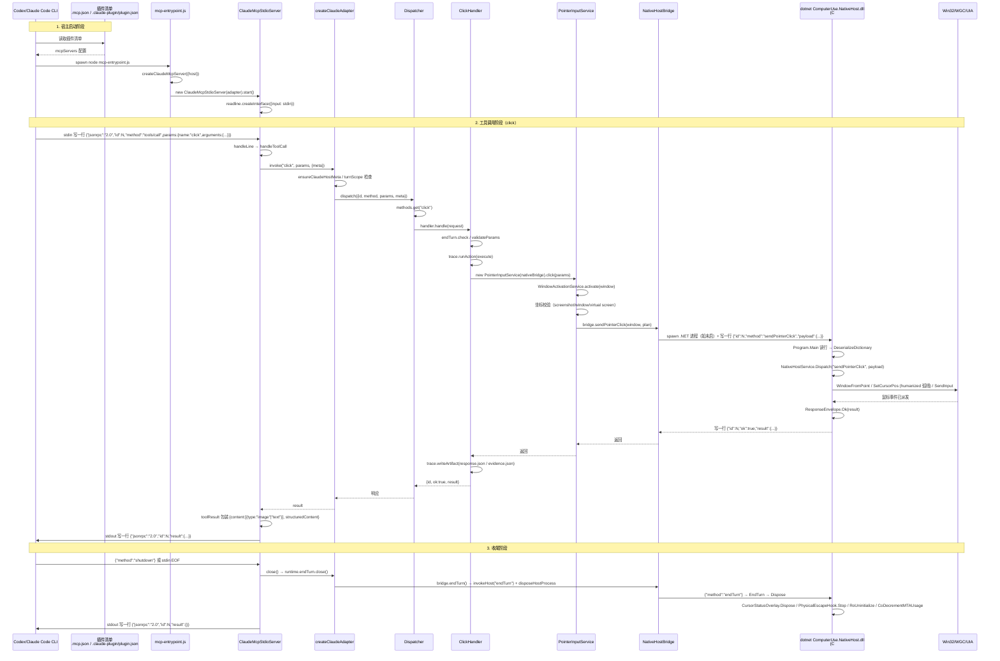

# computer-use 全链路架构总览

> 范围：<repo-root> 仓库所有实现源码（不含 tests、dist、node_modules、bin/obj、所有 .md 文档）。
> 入口：本文是「全链路」导读；五个模块文档给出每层的深度细节。

---

## 导读

`computer-use` 是一个本地 Windows 插件，把 LLM 工具调用翻译成真实的桌面操作。它由两类进程协作：

- **TypeScript 进程**（MCP server）：被 Codex CLI 或 Claude Code CLI 拉起，监听 stdio 上的 JSON-RPC，把"模型工具调用"路由到 17 个已注册 capability method；这些 method 由 15 个 handler 类实现，其中 `CommonDialogPathHandler` 被实例化 3 次；`end_turn` 是 adapter 额外暴露的 turn-lifecycle tool。
- **C# 进程**（Native Host）：独立的 .NET 8 控制台程序，接收 TS 端的 JSON-RPC 行，调用 Win32 / WGC / UIA 完成截图、点击、键盘输入、UIA 元素动作、窗口枚举、应用启动等。

两个进程的边界是「line-delimited JSON over stdio」，TS 端的 `windows/bridge/native-host-driver.ts` spawn `.NET` 进程，`.NET` 端的 `Program.cs:16-61` 跑读行循环。

横向还有三个 cross-cutting 子系统贯穿两层：

- **Trace**：每个工具调用产出 `<outputDir>/<sessionId>/<turnId>/<actionId>/{request,response|error,evidence,...}.json`。`<outputDir>` 默认按当前运行进程的 `process.cwd()` 解析为 `.artifacts/computer-use-trace`，打包安装后通常位于 active plugin root；可用 `COMPUTER_USE_TRACE_DIR` 覆盖。
- **Interrupt**：物理 Escape 键经 `PhysicalEscapeHookController`（C#）触发 `interrupted`，并把 marker 写到 `<codexHome>/cache/computer-use/interrupts/{sha256(session)[:16]}/{sha256(turn)[:16]}`；TS 端的 `EndTurnCoordinator` 也读取/写入同一 marker 路径，用于跨进程恢复中断状态。
- **Lifecycle**：每个 turn 结束 Native Host 进程被回收（`endTurn` → `disposeHostProcess`），下次 turn 再启；turn 之间 5s 空闲自动 kill。

---

## 模块文档导航

| 文档 | 范围 | 何时读 |
|---|---|---|
| [external-adapter-and-dispatcher-architecture.md](./external-adapter-and-dispatcher-architecture.md) | 插件清单、Codex/Claude Code 入口、MCP stdio server、Dispatcher + MethodRegistry + CapabilityRegistry、tool-schema 包装 | 想搞清楚「CLI 怎么找到这个 MCP server」「一个 tools/call 怎么变成 handler.handle」时 |
| [capability-handlers-architecture.md](./capability-handlers-architecture.md) | 15 个 handler 类 / 17 个注册 method 的统一形态、入参/出参契约、handler ↔ Windows 服务对应、common-dialog-path 三 tool 一 handler 机制、launch-app policy-hook 拒绝语义 | 想搞清楚「每个工具长什么样」「handler 调了哪个 Windows service」时 |
| [windows-services-and-bridge-architecture.md](./windows-services-and-bridge-architecture.md) | `src/windows/` 9 个子目录、5 种 NativeBridge driver、native-host-driver 的进程模型与 fallback 决策、PowerShell driver 的脚本注入 | 想搞清楚「TS 端怎么落 Windows API」「五种 driver 何时被选用」时 |
| [csharp-native-host-architecture.md](./csharp-native-host-architecture.md) | .NET 8 工程、7 个 partial class 文件分工、20 个 method 的 Dispatch switch、WGC + GDI 回退、UIA Pattern 调用、PhysicalEscapeHookController、CursorStatusOverlay | 想搞清楚「.NET 端怎么落 Win32/WGC/UIA」「物理 Escape 怎么被截到」时 |
| [trace-lifecycle-and-interrupt-architecture.md](./trace-lifecycle-and-interrupt-architecture.md) | TraceManager.runAction 步骤、artifact 目录布局与字段、payload-metrics / trace-summary / window-state-trace 的角色、end_turn 完整调用链 | 想搞清楚「trace 落到哪里、什么字段」「end_turn 怎么关掉一个 turn」「物理 Escape 怎么传到 TS」时 |

---

## 关键事实

### 技术栈

| 维度 | 选择 | 出处 |
|---|---|---|
| TS 运行时 | Node.js 20+、ESM、TypeScript | `package.json:23-25`、`computer_use/package.json:5-9` |
| .NET 目标框架 | `net8.0-windows10.0.19041.0`（启用 UseWPF / UseWindowsForms / ImplicitUsings / Nullable） | `ComputerUse.NativeHost.csproj:4-8` |
| 协议 | line-delimited JSON over stdio，TS↔C# 双侧都是 | `native-host-driver.ts:587`、`Program.cs:16-61` |
| IPC | MCP（JSON-RPC 2.0）over stdio，TS↔CLI 宿主 | `src/adapters/claude-code/mcp-server.ts:42-230` |

### 入口与启动

| 维度 | Codex CLI | Claude Code CLI |
|---|---|---|
| 清单文件 | `.codex-plugin/plugin.json` + `.mcp.json`（两份） | `.claude-plugin/plugin.json`（一份） |
| 启动命令 | `node ./dist/src/adapters/codex/mcp-entrypoint.js` | `node ${CLAUDE_PLUGIN_ROOT}/dist/src/adapters/claude-code/mcp-entrypoint.js` |
| `cwd` | `.`（相对） | `${CLAUDE_PLUGIN_ROOT}` |
| `host` 字段 | `"codex"` | `"claude-code"` |
| 入口实现 | 复用 `createClaudeMcpServer({host: "codex"})` | `createClaudeMcpServer({host: "claude-code"})` |
| Trace 默认开启 | `COMPUTER_USE_TRACE=1` | `COMPUTER_USE_TRACE=1` |
| MCP `initialize` 协议版本 | `2024-11-05`（默认） | 同 |

来源：`.mcp.json:5-13`、`.codex-plugin/plugin.json:1-37`、`.claude-plugin/plugin.json:17-29`、`src/adapters/codex/mcp-entrypoint.ts:7-12`、`src/adapters/claude-code/mcp-entrypoint.ts:7-10`、`src/adapters/claude-code/mcp-server.ts:454-460`。

注意：Codex 还存在另一条 `createCodexAdapter` + `CodexHelperTransport` 的子进程模式分支（`src/adapters/codex/index.ts`、`helper-transport.ts`），被 `createAdapters` 与测试使用，不被 CLI 真实入口使用。详见模块文档 §2.3。

### 17 个 MCP capability tool（+1 end_turn）

| 类别 | method |
|---|---|
| Discovery | `list_windows`、`get_window`、`list_apps`、`launch_app` |
| Action | `get_window_state`、`activate_window`、`click`、`click_element`、`drag`、`perform_secondary_action`、`press_key`、`scroll`、`set_value`、`type_text` |
| Dialog | `select_file_in_dialog`、`select_folder_in_dialog`、`set_save_path_in_dialog` |
| Lifecycle | `end_turn`（由 adapter 自加，不进 CapabilityRegistry） |

来源：`src/core/contracts/{action,capture,discovery}.ts`、`src/core/runtime/tool-disclosure.ts`、`src/index.ts:62-78`（17 个 `register`）、`src/adapters/{codex,claude-code}/index.ts:32-46`（end_turn）。注意：源码 contract 仍保留 `CaptureMethod` / `capture/get-window-state/` 目录；渐进式披露 lane 把 `get_window_state` 归入 Action，作为输入动作前的观察/截图步骤。

### Native Host 的 20 个 method

`NativeHostService.Dispatch`（`NativeHostService.cs:45-104`）的 switch 包含 `beginTurn` / `endTurn` / `updateStatus` / `ping` / `clearStatus` 5 个生命周期/控制方法，加上 `activateWindow`、`sendPointerClick`、`sendPointerScroll`、`sendPointerDrag`、`sendKeyboardInputs`、`sendText`、`getWindowState`、`listWindows`、`getWindow`、`listApps`、`launchApp`、`clickElement`、`setValue`、`performSecondaryAction` 共 15 个能力方法，合计 20 个。

### 五个 NativeBridge driver

| Driver | 触发场景 | 能力 |
|---|---|---|
| `native-host` | win32 默认（`create-native-bridge.ts:48`） | 覆盖 15 个 NativeBridge 平台操作方法；spawn .NET 进程 |
| `powershell` | native-host build/transport 失败时回退 | 仅 `activateWindow` / `sendText` / `sendKeyboardInputs` / `sendPointerClick` |
| `mock` | 非 win32 默认 / 测试 | 返回固定 `demo.exe`，截图/UIA 都是预置值 |
| `null` | 测试基类，被 mock 继承 | 与 mock 类似但 `driverName = "null"` |
| `ffi` / `napi` | 显式 `COMPUTER_USE_DRIVER=ffi` / `=napi`（预留） | 当前未提供独立实现，只是 `NativeHostBridge` 子类覆盖 `driverName` |

来源：`windows/bridge/create-native-bridge.ts:16-50`、`ffi-driver.ts:1-5`、`napi-driver.ts:1-5`、`mocks/native-bridge.mock.ts:1-175`、`null-driver.ts:1-218`。

---

## 全链路调用链（一张图）

下图把 Codex/Claude Code CLI 入口、一个 `tools/call`、C# Native Host 三层串起来，时序按一次具体的 `click` 调用画出。横向相关件用 `Note` 标出，不画进主链路。

---

## 关键工程常量

| 数值 / 字面量 | 含义 | 出处 |
|---|---|---|
| `0xffff` | Win32 SendInput 绝对坐标最大值 | `windows/input/pointer-primitives.ts:1` |
| `1920 × 1080` | 默认虚拟屏尺寸 | `windows/input/pointer-primitives.ts:46-47` |
| `0xc001` | `MOUSEEVENTF_MOVE \| ABSOLUTE \| VIRTUALDESK` | `windows/input/pointer-primitives.ts:2` |
| `20000 ms` | native-host 默认请求超时 | `windows/bridge/native-host-driver.ts:128` |
| `15000 ms` | native-host 默认启动超时 / PowerShell 默认超时 | `windows/bridge/native-host-driver.ts:130` / `windows/bridge/powershell-driver.ts:406` |
| `5000 ms` | native-host 闲置回收超时（`COMPUTER_USE_NATIVE_HOST_IDLE_TIMEOUT_MS`） | `windows/bridge/native-host-driver.ts:963-974` |
| `20` | 前台窗口重试次数 | `windows/bridge/native-host-driver.ts:83` / `windows/bridge/powershell-driver.ts:386` |
| `800 ms`（每 50 ms） | 通用对话框关闭判定超时 | `windows/dialogs/common-dialog-service.ts:17-18` |
| `600 ms` | 启动观察窗口默认超时 | `windows/launch/app-launch-service.ts:52` |
| `net8.0-windows10.0.19041.0` | C# 工程目标框架 | `ComputerUse.NativeHost.csproj:4-8` |
| `"computer-use-trace/v1"` | Trace schema 版本 | `core/trace/tracer.ts:53,181` |
| `"heuristic_mixed_text_v1"` | Token 估算器版本 | `core/trace/payload-metrics.ts:5` |
| `"2024-11-05"` | MCP `initialize` 协议版本默认值 | `adapters/claude-code/mcp-server.ts:454-460` |
| `TASKBAR_APP_ID = "windows.shell.taskbar"` | 任务栏 shell 标识 | `core/hooks/shell/taskbar-target.ts:4-6` |
| 7 个 Chromium IM 进程白名单 | `qq.exe` / `qqnt.exe` / `weixin.exe` / `wechat.exe` / `wxwork.exe` / `feishu.exe` / `lark.exe` | `windows/bridge/native-host-driver.ts:1035-1041` |

---

## 部署链路（与运行链路分开）

仓库根的 `scripts/install-plugin.mjs` 是部署入口（不是运行入口）。`package.json` 的 `install:codex` / `install:claude` / `install:all` / `build:all` 等脚本最终都路由到它（`package.json:9-19`）。该脚本做四件事：

1. 校验必备命令（`node` / `npm` / `codex` 或 `claude`）。
2. `npm --prefix computer_use install` + `npm --prefix computer_use run build`。
3. 跑 `scripts/build-native-host.mjs`，调 `dotnet build` 出 `ComputerUse.NativeHost.dll`。
4. 按目标 host（Codex / Claude Code）执行不同的 marketplace 注册 + smoke 测试 + 安装。

不在本文档展开。详见源码：`scripts/install-plugin.mjs:1-300+`、`scripts/build-native-host.mjs:1-100`、`package.json:7-25`。

---

## 章节索引（5 个模块文档 + 1 个总览）

1. [00-overview-architecture.md](./00-overview-architecture.md)（本文）
2. [external-adapter-and-dispatcher-architecture.md](./external-adapter-and-dispatcher-architecture.md)
3. [capability-handlers-architecture.md](./capability-handlers-architecture.md)
4. [windows-services-and-bridge-architecture.md](./windows-services-and-bridge-architecture.md)
5. [csharp-native-host-architecture.md](./csharp-native-host-architecture.md)
6. [trace-lifecycle-and-interrupt-architecture.md](./trace-lifecycle-and-interrupt-architecture.md)

---

## 已确认 / 已剔除的项

- `scripts/smoke-claude-mcp.mjs` 与 `scripts/smoke-codex-mcp.mjs`：以 `smoke-` 开头且仅在 `install-plugin.mjs` 中作为"安装健康检查"调用，按用户要求"只看实现源码 / 不含测试"未单列文档；其存在信息已在 `install-plugin.mjs` 的部署链路中提及。
- `src/mocks/native-bridge.mock.ts`：作为测试 fixture 由 NullNativeBridge 派生，被 `createScaffoldRuntime` 在 mock 模式下选用。已在 `windows-services-and-bridge-architecture.md` 的 driver 章节覆盖。
- `.git/`、`.gitignore`、`package-lock.json`、`tsconfig.json`：配置文件 / 锁定文件，不展开。
- `computer_use/skills/computer-use/SKILL.md`：作为"agent operating instructions"，按用户"不含文档"排除；它不是源码。
- `.agents/`、`.claude/`、`.claude-plugin/`、`doc/`、`AGENTS.md`、`README*.md`：均按用户排除规则不写文档。
