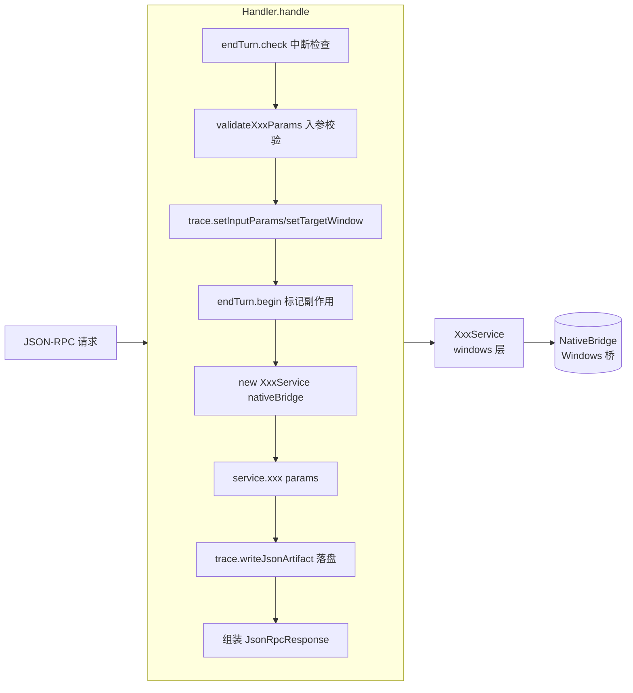
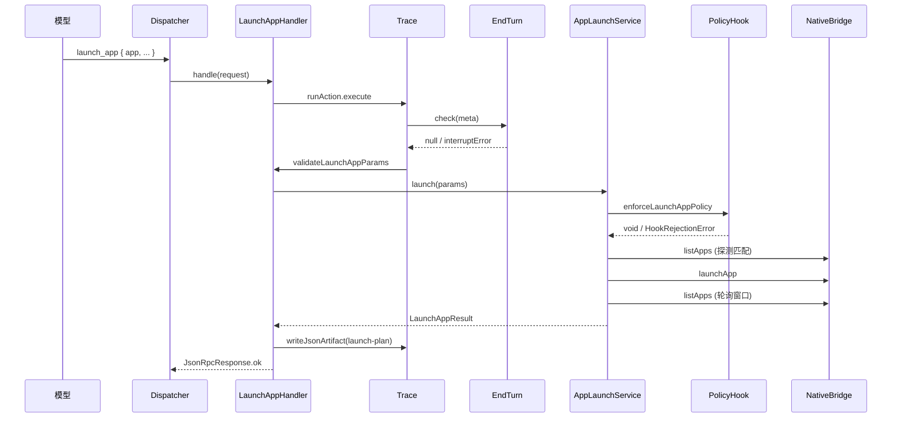
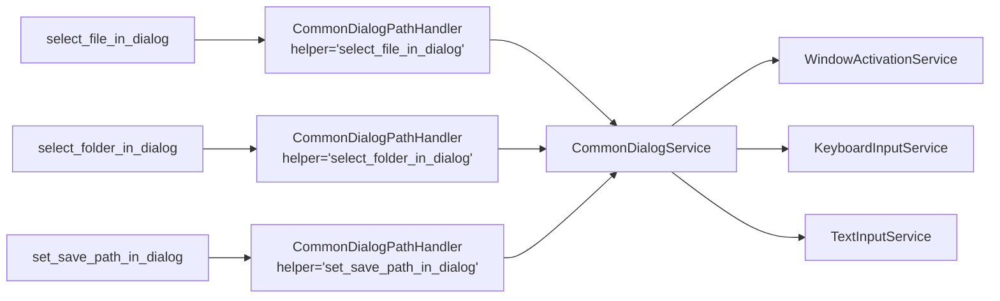
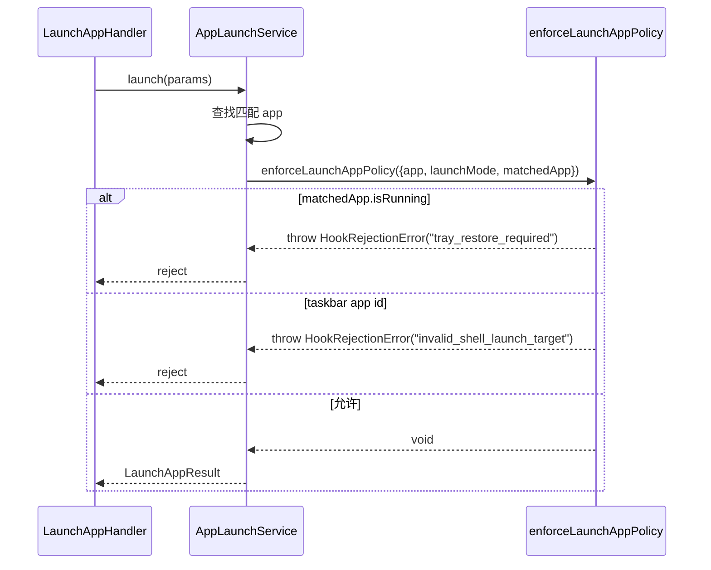

# Capability Handlers + Shared Contracts 架构文档

> 范围：`computer_use/src/core/capabilities/` 下的 15 个 handler 类（装配为 17 个 capability method）+ `computer_use/src/core/contracts/` 共享契约 + `computer_use/src/core/hooks/` 拦截器。
> 不包含：tests、dist、build、node_modules、所有 `.md` 文档、AGENTS/README/.claude/.agents 目录。
> 文中所有结论均回溯到具体 `file:line`，可逐条对照源码。

---

## 导读

computer-use 的能力层由 15 个 handler 类组成，并在 `createRuntime` 中装配为 17 个已注册 capability method。每个注册 method 暴露一个 JSON-RPC method（method 字符串由 `core/contracts/capability.ts` 汇总），用一份共享契约（`core/contracts/`）描述入参 / 出参，调用 Windows 服务层（`computer_use/src/windows/`）完成实际副作用，并把执行轨迹写入 trace。

handler 目录统一为两层文件：`contract.ts` 定义 `CapabilityDefinition` 与参数校验；`handler.ts` 定义 `XxxHandler` 类，含 `readonly definition` 与 `async handle(request)`。`capture/get-window-state/` 额外携带一个 `text-budget.ts`，用于 UIA 文本预算收紧。

Hook 在 capability 路径外独立存在：`launch-app/policy-hook.ts` 由 `windows/launch/app-launch-service.ts` 调用，拒绝两种异常启动请求；`shell/taskbar-target.ts` 提供任务栏 shell target 的常量与构造器；`hook-rejection-error.ts` 携带 `code / guidance` 字段，让拒绝语义直接被 dispatcher 渲染给模型。

---

## 关键事实

### 17 个 method（按目录顺序，15 个 handler 类）

| 类别 | method 字符串 | 目录 | 工具 |
|---|---|---|---|
| Discovery | `list_windows` | `discovery/list-windows/` | `ListWindowsHandler` |
| Discovery | `get_window` | `discovery/get-window/` | `GetWindowHandler` |
| Discovery | `list_apps` | `discovery/list-apps/` | `ListAppsHandler` |
| Discovery | `launch_app` | `discovery/launch-app/` | `LaunchAppHandler` |
| Capture | `get_window_state` | `capture/get-window-state/` | `GetWindowStateHandler` |
| Action | `activate_window` | `actions/activate-window/` | `ActivateWindowHandler` |
| Action | `click` | `actions/click/` | `ClickHandler` |
| Action | `click_element` | `actions/click-element/` | `ClickElementHandler` |
| Action | `common-dialog-path` ×3 | `actions/common-dialog-path/` | `CommonDialogPathHandler` 实例化三次 |
| Action | `drag` | `actions/drag/` | `DragHandler` |
| Action | `perform_secondary_action` | `actions/perform-secondary-action/` | `PerformSecondaryActionHandler` |
| Action | `press_key` | `actions/press-key/` | `PressKeyHandler` |
| Action | `scroll` | `actions/scroll/` | `ScrollHandler` |
| Action | `set_value` | `actions/set-value/` | `SetValueHandler` |
| Action | `type_text` | `actions/type-text/` | `TypeTextHandler` |

`ActionMethod`、`CaptureMethod`、`DiscoveryMethod` 三个 union 拼成 `CapabilityMethod`（`core/contracts/capability.ts:5`、`core/contracts/action.ts:3-15`、`core/contracts/capture.ts:3`、`core/contracts/discovery.ts:4`）。

### 17 份 `CapabilityDefinition` 与 `requiresWindowActivation`

来源：`CapabilityDefinition` 形状在 `core/runtime/capability-registry.ts:3-7`。

- `requiresWindowActivation: false`（6 个）：`list_windows`、`get_window`、`list_apps`、`launch_app`、`get_window_state`、`activate_window`
- `requiresWindowActivation: true`（11 个）：`click`、`click_element`、`select_file_in_dialog`、`select_folder_in_dialog`、`set_save_path_in_dialog`、`drag`、`perform_secondary_action`、`press_key`、`scroll`、`set_value`、`type_text`

注意 `activate_window` 显式标 `false`（`actions/activate-window/contract.ts:12`），它本身就是激活操作，不需要先激活。

### 入口装配点

`src/index.ts:39-104` 的 `createRuntime`：

1. 创建 `ExecutionContext`（`core/runtime/execution-context.ts:8-14`，含 `nativeBridge / lifecycle / interrupts / endTurn / trace`）。
2. 用 17 次 `new XxxHandler(runtime)` 实例化全部 handler；其中 `CommonDialogPathHandler` 实例化三次，分别传入 `"select_file_in_dialog" / "select_folder_in_dialog" / "set_save_path_in_dialog"`（`src/index.ts:46-48`）。
3. 把 17 份 `definition` 注册到 `CapabilityRegistry`（`core/runtime/capability-registry.ts:9-23`），把 17 个 `handle` 方法绑定到 `MethodRegistry` 的 method 字符串上（`src/index.ts:80-96`）。
4. 把 `MethodRegistry` 包成 `Dispatcher`（`src/index.ts:102`）返回给上层 adapter。

`requiresWindowActivation` 字段当前并未在 `createRuntime` 中读取——它登记到 `CapabilityRegistry`，由上层适配层消费。

---

## Handler 的统一形态

每个能力目录内只有两类文件（除 `get-window-state` 的 `text-budget.ts`）。

### contract.ts

```ts
export const xxxCapability: CapabilityDefinition = {
  method: "xxx",
  summary: "...",
  requiresWindowActivation: true | false
};

export function validateXxxParams(params: XxxParams): XxxParams {
  // 调用 core/contracts/validation.ts 里的 ensure* 函数
  // 对允许字段名单 ensureNoUnknownKeys
  // 对 window 字段 ensureWindowRef
  // 必要时归一化默认值
}
```

代表：`actions/click/contract.ts:13-51`、`actions/click-element/contract.ts:13-41`、`discovery/list-windows/contract.ts:8-23`。

`click-element` 多导出一个 `validateElementParams`（`actions/click-element/contract.ts:43-53`），被 `set-value`（`actions/set-value/contract.ts:13`）和 `perform-secondary-action`（`actions/perform-secondary-action/contract.ts:15`）复用。

### handler.ts

```ts
export class XxxHandler {
  readonly definition = xxxCapability;
  constructor(private readonly context: ExecutionContext) {}

  async handle(request: JsonRpcRequest<XxxParams>): Promise<JsonRpcResponse<XxxResult>> {
    return this.context.trace.runAction({
      actionType: this.definition.method,
      request,
      execute: async (trace) => {
        const interruptError = this.context.endTurn.check(request.meta);
        if (interruptError) {
          return { id: request.id, ok: false, code: "interrupted", error: interruptError };
        }

        const params = validateXxxParams(request.params);
        trace.setInputParams(params);
        trace.setTargetWindow(params.window);

        this.context.endTurn.begin(request.meta);
        const service = new XxxService(this.context.nativeBridge);
        const execution = await service.xxx(params);
        await trace.writeJsonArtifact(...);

        return { id: request.id, ok: true, result: ... };
      }
    });
  }
}
```

代表：`actions/activate-window/handler.ts:7-39`、`actions/click/handler.ts:9-62`、`discovery/get-window/handler.ts:8-40`。

每一份 handler 的执行骨架完全一致：

1. `trace.runAction` 包裹整个副作用（`execution-context.ts:13` 中的 `TraceManager.runAction`）。
2. `endTurn.check` 检查 turn 中断（`activate-window/handler.ts:17-20`）。
3. 调用 `validateXxxParams` 校验入参，并 `trace.setInputParams / setTargetWindow` 上报。
4. `endTurn.begin` 标记副作用开始。
5. 实例化 Windows service 并执行；调用 `nativeBridge.getWindowState` 取 before / after 快照（仅对部分 handler）。
6. `trace.writeJsonArtifact` 落 trace 工件。
7. 组装 `JsonRpcResponse`，通过 dispatcher 回到 adapter。

### 形态抽象图



---

## Discovery 类 handler

四个 discovery handler 的入参对象都比 action 简单，因为它们不面向单个 window 句柄做副作用。

### list_windows

- **入参**：`DiscoveryRequestMap.list_windows` = `ListWindowsParams = {}`（`core/contracts/discovery.ts:6`）。
- **出参**：`DiscoveryResultMap.list_windows = readonly WindowRef[]`（`core/contracts/discovery.ts:96`）。
- **校验**：`validateListWindowsParams` 允许空对象且无允许键列表（`discovery/list-windows/contract.ts:14-23`）。
- **执行**：`WindowDiscoveryService.listWindows`（`windows/discovery/window-discovery-service.ts:16-19`），最终落到 `port.listWindows()`。

### get_window

- **入参**：`GetWindowParams { id: number; app?: AppIdentifier }`（`core/contracts/discovery.ts:8-11`）。
- **出参**：`DiscoveryResultMap.get_window = WindowRef`（`core/contracts/discovery.ts:97`）。
- **校验**：接受扁平 `{ id, app }` 也接受嵌套 `{ window: { id, app } }`；最终输出扁平形式（`discovery/get-window/contract.ts:16-34`）。
- **执行**：`WindowDiscoveryService.getWindow`（`window-discovery-service.ts:21-24`）。

### list_apps

- **入参**：`ListAppsParams`（`core/contracts/discovery.ts:13-29`）含 `name_contains / id_contains / id_includes / running_only / has_windows / limit`。
- **出参**：`DiscoveryResultMap.list_apps = ListAppsResult`（`core/contracts/discovery.ts:72-93`）。
- **校验**：默认 `limit = DEFAULT_LIST_APPS_LIMIT = 60`，上限 `MAX_LIST_APPS_LIMIT = 500`（`discovery/list-apps/contract.ts:8-9、17-37`）。
- **执行**：`WindowDiscoveryService.listApps`，输出 `apps + diagnostics + runtime` 三段（`window-discovery-service.ts:26-43`）。

### launch_app

- **入参**：`LaunchAppParams { app, launch_mode?, observe_timeout_ms? }`（`core/contracts/discovery.ts:33-37`）。
- **出参**：`DiscoveryResultMap.launch_app = LaunchAppResult`（`core/contracts/discovery.ts:39-50`），含 `strategy / launchMode / disposition / message / observedWindows / followUpActions`。
- **校验**：`launch_mode ∈ {"reuse_or_launch", "force_new"}`；`observe_timeout_ms` 限制在 `[0, 5000]`（`discovery/launch-app/contract.ts:16-48`）。
- **执行**：`AppLaunchService.launch`（`windows/launch/app-launch-service.ts:29-65`）。在调用前由 policy hook 拦截异常启动请求（详见 Hook 章节）。



---

## Capture 类 handler

### get_window_state

- **入参**：`WindowStateParams`（`core/contracts/capture.ts:7-15`）：`window` 必填；`include_screenshot / include_text / jpeg_quality / max_elements / role_filter / name_contains` 可选。
- **出参**：`WindowStateResult`（`core/contracts/capture.ts:80-109`），含 `window / screenshot? / text? / capture / trace?` 四到五段。
- **校验**：`jpeg_quality ∈ [1, 100]`、`max_elements ∈ [1, 10000]`、`role_filter` 全为非空字符串（`capture/get-window-state/contract.ts:15-50`）。
- **执行**：
  1. `WindowStateService.getWindowState`（`windows/capture/window-state-service.ts`，通过 `handler.ts:32-33` 注入）。
  2. `writeWindowStateTraceArtifacts` 写截图、原始 PNG、响应 JSON、UIA 树四个 trace 文件（`core/trace/window-state-trace.ts`，由 `handler.ts:35-37` 调用）。
  3. `compactWindowStateTextForResponse`（`capture/get-window-state/text-budget.ts:15-55`）：当 `JSON.stringify(state.text)` 超过 `DEFAULT_TEXT_CHAR_BUDGET = 20000` 时，把完整 UIA 树写到 `textArtifactPath`，响应中只保留 `summaryRoot` 与 `AccessibilityTextSummary` 元数据。
  4. `stripTraceOnlyWindowStateFields`（`core/trace/window-state-trace.ts`，由 `handler.ts:53` 调用）去掉只用于 trace 的字段。

`text-budget.ts` 的关键阈值常量：`DEFAULT_TEXT_CHAR_BUDGET = 20000`、`DEFAULT_SUMMARY_NODE_LIMIT = 80`、`STRING_VALUE_LIMIT = 160`（`capture/get-window-state/text-budget.ts:11-13`）。

---

## Action 类 handler

10 个 action handler 共享同一骨架，主要差别是调用的 Windows service 与是否取 before/after 快照。

### activate_window

- 入参：`ActivateWindowParams = { window }`（`core/contracts/action.ts:141-143`）。
- 出参：`ActivateWindowResult`（`core/contracts/action.ts:145-152`）。
- Windows service：`WindowActivationService.activateWithReport`（`windows/activation/window-activator.ts`，通过 `actions/activate-window/handler.ts:27-28`）。
- 不取 before/after 快照（仅落 activation-plan 工件）。

### click

- 入参：`ClickParams`（`core/contracts/action.ts:34-42`）。
- 出参：`ClickResult`（`core/contracts/action.ts:82-96`）。
- 校验：`coordinateSpace = "screenshot"` 时强制要求 `window.rect / screenshotWindowRegion / screenshotCoordinateScale`，错误形态为带 `code / details / guidance` 的自定义异常 `MissingScreenshotCoordinateMetadataError`（`actions/click/contract.ts:53-105`）。
- Windows service：`PointerInputService.click`（`windows/input/pointer-input-service.ts`，通过 `actions/click/handler.ts:43-47`）。`ClickHandler` 是唯一进行 `WindowFromPoint` 命中测试并产生 `postInputFocus / hitTest` 字段的 handler（`actions/click/handler.ts:65-72`）。

### click_element

- 入参：`ClickElementParams = { window, element_index, click_count?, mouse_button?, screenshotId? }`（`core/contracts/action.ts:154-163`）。
- 出参：`ClickElementResult`（`core/contracts/action.ts:165-172`）。
- 校验：`click_count ?? 1`、`mouse_button ?? "left"`（`actions/click-element/contract.ts:36-40`）。
- Windows service：`ElementInteractionService.clickElement`（`windows/uia/element-interaction-service.ts`，通过 `actions/click-element/handler.ts:33-36`）。
- 取 before/after `getWindowState` 快照并落 `state-diff`（`handler.ts:37-60`）。

### drag

- 入参：`DragParams`（`core/contracts/action.ts:213-223`）。
- 出参：`DragResult`（`core/contracts/action.ts:225-240`）。
- 校验：`duration_ms` 截断为非负整数；`steps ∈ [1, 120]`（`actions/drag/contract.ts:46-64`）。
- Windows service：`PointerInputService.drag`（通过 `actions/drag/handler.ts:38-41`）。

### perform_secondary_action

- 入参：`PerformSecondaryActionParams = { window, element_index, action, screenshotId? }`（`core/contracts/action.ts:242-244`）。
- 出参：`PerformSecondaryActionResult`（`core/contracts/action.ts:246-255`）。
- 校验：`action` 必须是非空字符串（`actions/perform-secondary-action/contract.ts:24-30`）。
- Windows service：`ElementInteractionService.performSecondaryAction`（`windows/uia/element-interaction-service.ts`，通过 `actions/perform-secondary-action/handler.ts:40-43`）。

### press_key

- 入参：`PressKeyParams = { window, key }`（`core/contracts/action.ts:105-108`）。
- 出参：`PressKeyResult`（`core/contracts/action.ts:110-120`），`dispatched.kind = "keyboard_chord"`。
- Windows service：`KeyboardInputService.pressKey`（`windows/input/keyboard-input-service.ts`，通过 `actions/press-key/handler.ts:28-33`）。

### scroll

- 入参：`ScrollParams`（`core/contracts/action.ts:174-181`）。
- 出参：`ScrollResult`（`core/contracts/action.ts:183-195`）。
- 校验：至少 `scroll_x` 或 `scroll_y` 非零（`actions/scroll/contract.ts:33-36`）。
- Windows service：`PointerInputService.scroll`（通过 `actions/scroll/handler.ts:37-40`）。

### set_value

- 入参：`SetValueParams = { window, element_index, value, screenshotId? }`（`core/contracts/action.ts:197-199`）。
- 出参：`SetValueResult`（`core/contracts/action.ts:201-211`）。
- 校验：`value` 必须是字符串（`actions/set-value/contract.ts:18-19`）。
- Windows service：`ElementInteractionService.setValue`（通过 `actions/set-value/handler.ts:34-37`）。
- trace 上报时把 `value` 替换为 `<text:N chars>` 以避免把完整字符串落到 trace（`handler.ts:29`）。

### type_text

- 入参：`TypeTextParams = { window, text }`（`core/contracts/action.ts:122-125`）。
- 出参：`TypeTextResult`（`core/contracts/action.ts:127-139`），`dispatched.kind = "text"`，`inputMethod ∈ {"sendText", "unicodeKeyboardInputs"}`。
- 校验：拒绝控制字符 `[-]`（`actions/type-text/contract.ts:15-27`）。
- Windows service：`TextInputService.typeText`（`windows/input/text-input-service.ts`，通过 `actions/type-text/handler.ts:28-30`）。

### common-dialog-path（一个 handler，三个 MCP tool）

源码：`actions/common-dialog-path/handler.ts`、`actions/common-dialog-path/contract.ts`、`windows/dialogs/common-dialog-service.ts`。

为什么一个 handler 类能产生三个 MCP tool？看入口装配：

```ts
// src/index.ts:46-48
const selectFileInDialog = new CommonDialogPathHandler(runtime, "select_file_in_dialog");
const selectFolderInDialog = new CommonDialogPathHandler(runtime, "select_folder_in_dialog");
const setSavePathInDialog = new CommonDialogPathHandler(runtime, "set_save_path_in_dialog");
```

每个实例接收一个 `CommonDialogHelper` 字面量（`windows/dialogs/common-dialog-service.ts:12-15`），并把它保存到 `private readonly helper`（`actions/common-dialog-path/handler.ts:28`）。`resolveDefinition`（`handler.ts:61-70`）按 helper 字符串返回对应的 `CapabilityDefinition`，`runHelper`（`handler.ts:72-85`）按 helper 字符串选择 `CommonDialogService.selectFile / selectFolder / setSavePath`。

`CommonDialogService.completeDialog`（`windows/dialogs/common-dialog-service.ts:39-57`）是三者的共同实现：先 `pressKey "Alt+N"`，再 `typeText path`，再 `pressKey "Return"`，然后轮询窗口是否存在以推断 `dialogClosed`。

入参：`CommonDialogPathParams = { window, path }`（`core/contracts/action.ts:257-260`）。
出参：`CommonDialogPathResult = { ok, path, dialogClosed, helper }`（`core/contracts/action.ts:262-267`），其中 `helper` 字段回填本次走的辅助方法名。

校验：`validateCommonDialogPathParams` 同时接受三个 method 名（`actions/common-dialog-path/contract.ts:29-40`），并调用 `ensureNonEmptyString` 强制 `path` 非空。文件系统层面的"存在性"由 `assertExistingPath`（`common-dialog-service.ts:81-94`）在 Windows service 内再次确认。



---

## Hook 的位置与拒绝语义

hook 文件夹位于 `core/hooks/`，**不**在 capability 目录内。三个文件各自职责清晰：

### hook-rejection-error.ts

定义 `HookRejectionError`（`core/hooks/hook-rejection-error.ts:3-20`），含 `code / details / guidance`，与 `JsonRpcErrorResponse` 字段对齐（`core/contracts/rpc.ts:51-59`）。`guidance` 与 dispatcher 直接渲染的 `ToolGuidance` 同型。

### shell/taskbar-target.ts

定义 `TASKBAR_APP_ID = "windows.shell.taskbar"`、`TASKBAR_DISPLAY_NAME = "Windows Taskbar"`、`TASKBAR_WINDOW_TITLE = "Windows Taskbar"`（`core/hooks/shell/taskbar-target.ts:4-6`），并导出 `isTaskbarAppId / createTaskbarWindow / createTaskbarApp` 三个工厂函数。

`createTaskbarWindow / createTaskbarApp` 被 `windows/bridge/null-driver.ts:12、115` 用于在缺失 Windows 桥时构造任务栏假数据；`isTaskbarAppId` 被 `policy-hook.ts` 与 `null-driver.ts` 复用。

### launch-app/policy-hook.ts

由 `windows/launch/app-launch-service.ts:9` 导入，在 `AppLaunchService.launch` 第 35-39 行调用 `enforceLaunchAppPolicy`。

拒绝两条规则（`core/hooks/launch-app/policy-hook.ts:16-88`）：

1. `invalid_shell_launch_target`：`launchMode !== "force_new"` 且 `isTaskbarAppId(context.app)` 为真时拒绝。建议改用 `get_window_state / click / scroll` 操作任务栏窗口，`suggested_tool_call` 给 `list_apps`。
2. `tray_restore_required`：`launchMode !== "force_new"` 且 `matchedApp.isRunning` 时拒绝。`details` 携带 `matchedAppId / matchedDisplayName / matchedExecutablePath / matchedProcessIds / existingWindowIds / taskbarLabelHint / detectedState`，`followUpActions` 给出 `restoreFromTaskbar` 与 `pollListApps` 两种后续动作。

注意：policy hook 不在 capability handler 内执行，而是在 `AppLaunchService` 这一 Windows service 内执行。Hook 的拒绝语义通过 `HookRejectionError` 抛到 service，service 不捕获，于是错误向上冒泡到 handler 的 `runAction` 块，并由 dispatcher 渲染为 `JsonRpcErrorResponse`。



---

## Handler 与 Windows 服务的对应表

每个 handler 只调一个 Windows service（除了 `common-dialog-path` 与 `get-window-state` 这种本身就包装多个步骤的情况）：

| Handler | Windows service | 主要副作用 |
|---|---|---|
| `activate_window` | `WindowActivationService` (`windows/activation/window-activator.ts`) | 前台化目标窗口 |
| `click` | `PointerInputService` | 单击 + 命中测试 + 后置焦点检查 |
| `click_element` | `ElementInteractionService` (`windows/uia/element-interaction-service.ts`) | UIA InvokePattern |
| `drag` | `PointerInputService` | 多步拖动 |
| `perform_secondary_action` | `ElementInteractionService` | UIA 副动作（raise/scroll/expand/collapse） |
| `press_key` | `KeyboardInputService` (`windows/input/keyboard-input-service.ts`) | 键盘 chord |
| `scroll` | `PointerInputService` | 滚轮输入 |
| `set_value` | `ElementInteractionService` | UIA ValuePattern |
| `type_text` | `TextInputService` (`windows/input/text-input-service.ts`) | sendText / Unicode 输入 |
| `common-dialog-path` | `CommonDialogService` (`windows/dialogs/common-dialog-service.ts`) | Alt+N → 输入路径 → Enter |
| `get_window_state` | `WindowStateService` (`windows/capture/window-state-service.ts`) | WGC 截图 + UIA 树 |
| `list_windows` | `WindowDiscoveryService` (`windows/discovery/window-discovery-service.ts`) | 枚举可见窗口 |
| `get_window` | `WindowDiscoveryService` | 复水化 WindowRef |
| `list_apps` | `WindowDiscoveryService` | 枚举 app + 过滤 + 排序 |
| `launch_app` | `AppLaunchService` (`windows/launch/app-launch-service.ts`) | 启动/恢复应用 + 观察窗口 |

`WindowActivationService` 在 `actions/` 下被 9 个 handler 共同使用：每次 handler 进入 `handle` 都新建一个实例（`actions/click/handler.ts:36`、`actions/drag/handler.ts:39`、`actions/click-element/handler.ts:34` 等），由它负责前置激活。

`pointer-input-service.ts` 与 `keyboard-input-service.ts` 在构造时都接收 `WindowActivationService` 作为第一个参数（`actions/click/handler.ts:43-46`、`actions/press-key/handler.ts:28-33`），意味着每次输入都先走激活再走派发。

---

## 引用列表（按文件聚合）

### contracts/

- `core/contracts/action.ts:3-15` `ActionMethod` union（12 个 method）
- `core/contracts/action.ts:34-42` `ClickParams`
- `core/contracts/action.ts:82-96` `ClickResult`
- `core/contracts/action.ts:105-108` `PressKeyParams`
- `core/contracts/action.ts:110-120` `PressKeyResult`
- `core/contracts/action.ts:122-139` `TypeTextParams / TypeTextResult`
- `core/contracts/action.ts:141-152` `ActivateWindowParams / ActivateWindowResult`
- `core/contracts/action.ts:154-172` `ClickElementParams / ClickElementResult`
- `core/contracts/action.ts:174-195` `ScrollParams / ScrollResult`
- `core/contracts/action.ts:197-211` `SetValueParams / SetValueResult`
- `core/contracts/action.ts:213-240` `DragParams / DragResult`
- `core/contracts/action.ts:242-255` `PerformSecondaryActionParams / PerformSecondaryActionResult`
- `core/contracts/action.ts:257-267` `CommonDialogPathParams / CommonDialogPathResult`
- `core/contracts/action.ts:269-297` `ActionRequestMap / ActionResultMap`
- `core/contracts/app.ts:1-20` `AppIdentifier / AppDescriptor`
- `core/contracts/capability.ts:1-5` `CapabilityMethod` union
- `core/contracts/capture.ts:3` `CaptureMethod`
- `core/contracts/capture.ts:7-15` `WindowStateParams`
- `core/contracts/capture.ts:80-109` `WindowStateResult`
- `core/contracts/capture.ts:131-138` `CaptureRequestMap / CaptureResultMap`
- `core/contracts/discovery.ts:4` `DiscoveryMethod`
- `core/contracts/discovery.ts:6-29` `ListWindowsParams / GetWindowParams / ListAppsParams`
- `core/contracts/discovery.ts:33-50` `LaunchAppParams / LaunchAppResult`
- `core/contracts/discovery.ts:52-63` `LaunchFollowUpAction`
- `core/contracts/discovery.ts:65-100` `DiscoveryRequestMap / DiscoveryResultMap`
- `core/contracts/result.ts:1-16` `CapabilityResult / ComputerUseContractError`
- `core/contracts/rpc.ts:1-20` `TurnMetadata / JsonRpcMeta`
- `core/contracts/rpc.ts:22-43` `JsonRpcRequest / ApprovalRequest / ToolGuidance`
- `core/contracts/rpc.ts:45-63` `JsonRpcSuccessResponse / JsonRpcErrorResponse`
- `core/contracts/validation.ts:1-88` 七个 `ensure*` 校验函数
- `core/contracts/window.ts:3-43` `WindowRect / WindowHealth / WindowRef`

### capabilities/

- `actions/activate-window/contract.ts:9-23` `activateWindowCapability / validateActivateWindowParams`
- `actions/activate-window/handler.ts:7-55` `ActivateWindowHandler`
- `actions/click/contract.ts:13-117` `clickCapability / validateClickParams / ensureScreenshotCoordinateMetadata`
- `actions/click/handler.ts:9-98` `ClickHandler / toClickResult`
- `actions/click-element/contract.ts:13-53` `clickElementCapability / validateClickElementParams / validateElementParams`
- `actions/click-element/handler.ts:12-77` `ClickElementHandler`
- `actions/common-dialog-path/contract.ts:11-40` 三个 `*Capability` / `validateCommonDialogPathParams`
- `actions/common-dialog-path/handler.ts:20-85` `CommonDialogPathHandler / resolveDefinition / runHelper`
- `actions/drag/contract.ts:12-64` `dragCapability / validateDragParams`
- `actions/drag/handler.ts:13-96` `DragHandler`
- `actions/perform-secondary-action/contract.ts:6-31` `performSecondaryActionCapability / validatePerformSecondaryActionParams`
- `actions/perform-secondary-action/handler.ts:19-86` `PerformSecondaryActionHandler`
- `actions/press-key/contract.ts:10-25` `pressKeyCapability / validatePressKeyParams`
- `actions/press-key/handler.ts:8-53` `PressKeyHandler`
- `actions/scroll/contract.ts:11-53` `scrollCapability / validateScrollParams / normalizeAmount`
- `actions/scroll/handler.ts:13-89` `ScrollHandler`
- `actions/set-value/contract.ts:6-22` `setValueCapability / validateSetValueParams`
- `actions/set-value/handler.ts:13-81` `SetValueHandler`
- `actions/type-text/contract.ts:9-28` `typeTextCapability / validateTypeTextParams`
- `actions/type-text/handler.ts:8-54` `TypeTextHandler`
- `capture/get-window-state/contract.ts:9-98` `getWindowStateCapability / validateWindowStateParams` 与各 `normalize*` 函数
- `capture/get-window-state/handler.ts:12-58` `GetWindowStateHandler`
- `capture/get-window-state/text-budget.ts:11-13` 三个预算常量
- `capture/get-window-state/text-budget.ts:15-55` `compactWindowStateTextForResponse`
- `capture/get-window-state/text-budget.ts:57-167` 摘要生成 + 节点克隆 + 截断
- `discovery/get-window/contract.ts:10-34` `getWindowCapability / validateGetWindowContractParams`
- `discovery/get-window/handler.ts:8-40` `GetWindowHandler`
- `discovery/launch-app/contract.ts:10-48` `launchAppCapability / validateLaunchAppParams`
- `discovery/launch-app/handler.ts:7-38` `LaunchAppHandler`
- `discovery/list-apps/contract.ts:8-67` `listAppsCapability / DEFAULT_LIST_APPS_LIMIT / MAX_LIST_APPS_LIMIT / validateListAppsParams`
- `discovery/list-apps/handler.ts:7-38` `ListAppsHandler`
- `discovery/list-windows/contract.ts:8-23` `listWindowsCapability / validateListWindowsParams`
- `discovery/list-windows/handler.ts:8-39` `ListWindowsHandler`

### hooks/

- `core/hooks/hook-rejection-error.ts:3-20` `HookRejectionError`
- `core/hooks/launch-app/policy-hook.ts:16-88` `enforceLaunchAppPolicy`（两条拒绝规则）
- `core/hooks/shell/taskbar-target.ts:4-28` `TASKBAR_APP_ID / TASKBAR_DISPLAY_NAME / TASKBAR_WINDOW_TITLE / isTaskbarAppId / createTaskbarWindow / createTaskbarApp`

### windows / 入口装配

- `src/index.ts:39-104` `createRuntime` 装配全部 17 个 handler 实例（CommonDialog 三次）
- `core/runtime/capability-registry.ts:3-23` `CapabilityDefinition / CapabilityRegistry`
- `core/runtime/execution-context.ts:8-36` `ExecutionContext / createDefaultRuntime`
- `windows/activation/window-activator.ts`（被 9 个 action handler 使用）
- `windows/dialogs/common-dialog-service.ts:12-94` `CommonDialogHelper / CommonDialogService / assertExistingPath`
- `windows/discovery/window-discovery-service.ts:5-92` 内部 `TASKBAR_APP_ID` 副本与排序规则
- `windows/launch/app-launch-service.ts:9-65` 调用 `enforceLaunchAppPolicy` + 委托到 `port.launchApp`
- `windows/uia/element-interaction-service.ts`（被 `click_element / set_value / perform_secondary_action` 使用）
- `windows/input/pointer-input-service.ts`（被 `click / drag / scroll` 使用）
- `windows/input/keyboard-input-service.ts`（被 `press_key` 与 `CommonDialogService` 使用）
- `windows/input/text-input-service.ts`（被 `type_text` 与 `CommonDialogService` 使用）
- `windows/capture/window-state-service.ts`（被 `get_window_state` 使用）
- `windows/bridge/null-driver.ts:12、115` 复用 `createTaskbarApp / createTaskbarWindow / isTaskbarAppId`

---

## 未确认 / 留待核实

1. `windows/discovery/window-discovery-service.ts:5` 自行定义了一份 `const TASKBAR_APP_ID = "windows.shell.taskbar"` 用于排序逻辑。`core/hooks/shell/taskbar-target.ts:4` 才是单一来源。两者字面值一致，但目前 `window-discovery-service.ts` 没有 import 那份常量——若改动 `TASKBAR_APP_ID`，这一处副本不会同步。文档按现有事实陈述。
2. `requiresWindowActivation` 字段在 `createRuntime`（`src/index.ts`）中**未被读取**，仅注册到 `CapabilityRegistry`；其下游消费点未在本任务范围内追溯，未确认。
3. `CapabilityResult<TPayload>` / `ComputerUseContractError`（`core/contracts/result.ts:1-16`）在本任务范围内未在 15 个 handler 类中直接使用，调用面不在本次范围内核实。
