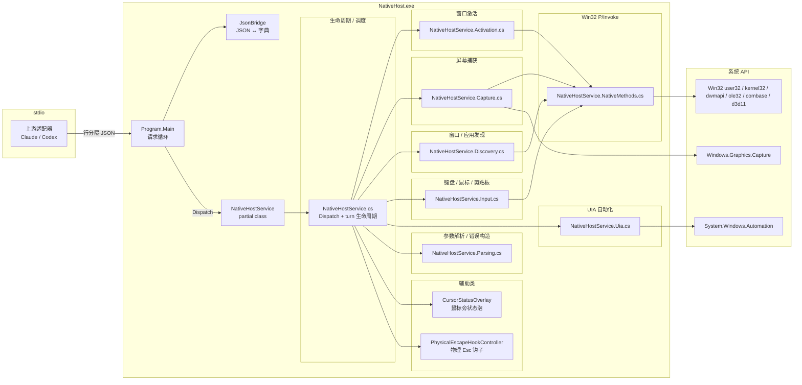
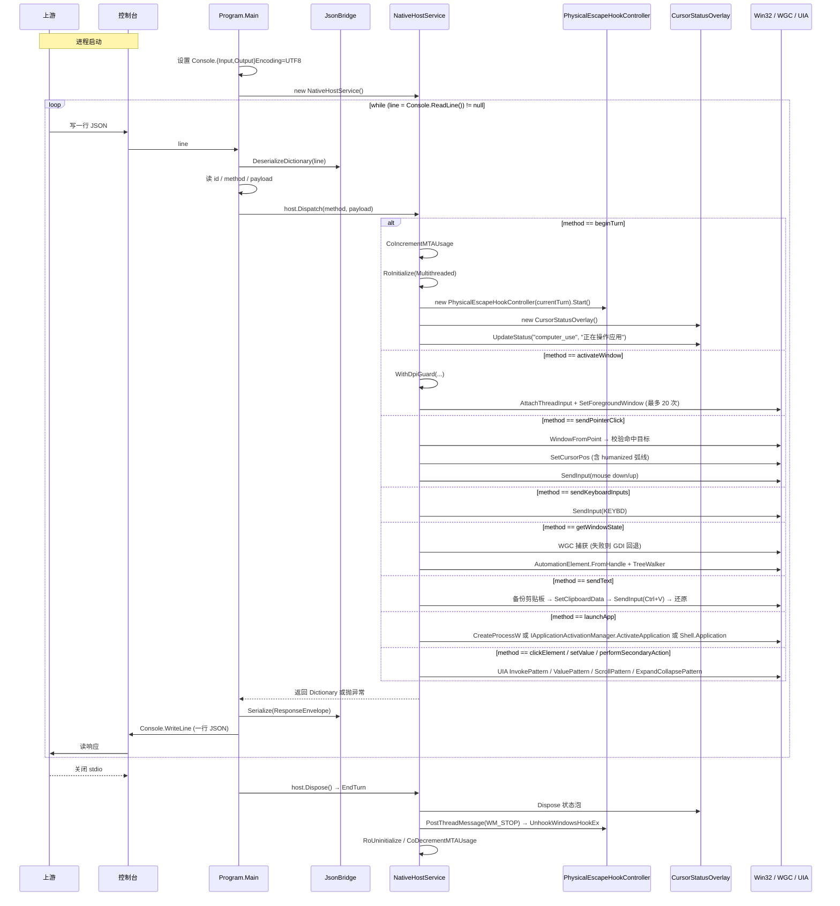

# C# 原生宿主（Native Host）架构文档

## 导读

C# 原生宿主是 `computer-use` 体系里负责把"模型触发的桌面操作意图"翻译成 Windows API 调用的进程。它是一个独立的 .NET 8 控制台程序，通过 stdio 上的行分隔 JSON 与上游（Claude / Codex 适配器）通信，对外暴露 20 个 `method` 名（`beginTurn`、`activateWindow`、`sendPointerClick`、`getWindowState` 等，见 `NativeHostService.cs:49-101` 的 `Dispatch` switch）。

进程内只有一个核心类 `NativeHostService`，由 7 个 `partial class` 文件按能力切片：入口与生命周期、主循环与 JSON 桥、窗口激活、屏幕捕获、窗口与进程发现、键盘/鼠标/剪贴板输入、UIA 自动化，再加上两个独立辅助类（`CursorStatusOverlay`、`PhysicalEscapeHookController`）和一组共享契约类型。

文档基于仓库 `<repo-root>\computer_use\native-host\ComputerUse.NativeHost\` 目录下的源码（已排除 `bin/`、`obj/`）。每个论断都附 `file:line`，自检章节列出核对过的字面常量。

---

## 关键事实

### 工程与依赖

- **目标框架**：`net8.0-windows10.0.19041.0`，开启 `UseWPF`、`UseWindowsForms`、`ImplicitUsings`、`Nullable`（`ComputerUse.NativeHost.csproj:4-8`）。
- **程序集名 / 根命名空间**：`ComputerUse.NativeHost`（`ComputerUse.NativeHost.csproj:9-10`）。
- **NuGet 依赖**：csproj 不声明任何 `<PackageReference>`，依赖全部走 SDK / 框架内建程序集（`ComputerUse.NativeHost.csproj` 全文 12 行）。运行时可见的程序集通过 `global using` 拉入（见下）。
- **global using 引入的命名空间**：`System`、`System.Collections`、`System.Collections.Generic`、`System.ComponentModel`、`System.Diagnostics`、`System.Drawing*`、`System.IO`、`System.Runtime.InteropServices`、`System.Security.Cryptography`、`System.Text`、`System.Text.Json`、`System.Threading`、`System.Windows.Automation`（UIA 客户端 API），以及 WinRT / Windows SDK 命名空间：`Windows.Foundation`、`Windows.Graphics.Capture`、`Windows.Graphics.DirectX`、`Windows.Graphics.DirectX.Direct3D11`、`Windows.Graphics.Imaging`、`Windows.Storage.Streams`、`WinRT`（`GlobalUsings.cs:1-23`）。
- **构建脚本**：`scripts/build-native-host.mjs` 解析 `COMPUTER_USE_DOTNET_PATH` 或默认 `C:\Program Files\dotnet\dotnet.exe`，调用 `dotnet build <csproj> -c ${COMPUTER_USE_NATIVE_CONFIGURATION ?? "Release"} --nologo`（`scripts/build-native-host.mjs:22,44-46`）。

### 主要 Win32 API（按用途分组）

| 分组 | API | 出处 |
|---|---|---|
| 窗口 / Z-order | `IsWindow`, `IsWindowVisible`, `IsIconic`, `ShowWindow`, `BringWindowToTop`, `SetForegroundWindow`, `SetFocus`, `GetForegroundWindow`, `GetWindowThreadProcessId`, `WindowFromPoint`, `GetAncestor`, `IsHungAppWindow`, `GetLastInputInfo`, `AttachThreadInput`, `GetWindow`, `GetParent`, `GetWindowRect`, `GetSystemMetrics` | `NativeHostService.NativeMethods.cs:5-108` |
| 文本 / 剪贴板 | `OpenClipboard`, `CloseClipboard`, `EmptyClipboard`, `GetClipboardData`, `SetClipboardData`, `IsClipboardFormatAvailable`, `CountClipboardFormats`, `keybd_event`, `GlobalAlloc`, `GlobalLock`, `GlobalUnlock`, `GlobalFree` | `NativeHostService.NativeMethods.cs:50-152`、`NativeHostService.Input.cs:604-655` |
| 指针 / 输入 | `SendInput`, `SetCursorPos`, `GetCursorPos` | `NativeHostService.NativeMethods.cs:48,71-75`、`NativeHostService.Input.cs:40,148,353,401,468` |
| 窗口枚举 / 文本 | `EnumWindows`, `FindWindow`, `GetWindowTextLengthW`, `GetWindowTextW`, `GetClassNameW`, `OpenInputDesktop`, `SwitchDesktop`, `CloseDesktop` | `NativeHostService.NativeMethods.cs:83-117` |
| DWM / 主题 | `DwmGetWindowAttribute`（多次重载，含扩展边框 / cloaked） | `NativeHostService.NativeMethods.cs:119-123`、`NativeHostService.Discovery.cs:1499,1506` |
| 进程 / 模块 | `GetCurrentThreadId`, `QueryFullProcessImageNameW`, `OpenProcess`, `CloseHandle`, `CreateProcessW`, `GetModuleHandle` | `NativeHostService.NativeMethods.cs:125-166`、`PhysicalEscapeHookController.cs:202-206` |
| COM / WinRT 公寓 | `CoIncrementMTAUsage`, `CoDecrementMTAUsage`, `RoInitialize`, `RoUninitialize`, `WindowsCreateString`, `WindowsDeleteString`, `RoGetActivationFactory` | `NativeHostService.NativeMethods.cs:168-187` |
| Direct3D / DXGI | `D3D11CreateDevice`, `CreateDirect3D11DeviceFromDXGIDevice` | `NativeHostService.NativeMethods.cs:189-204` |
| 应用激活（COM） | `IGraphicsCaptureItemInterop`、`IApplicationActivationManager`（通过 `ApplicationActivationManager` CoClass 调用） | `NativeHostService.NativeMethods.cs:206-257` |
| 全局键盘钩子 | `SetWindowsHookEx`, `UnhookWindowsHookEx`, `CallNextHookEx`, `GetMessage`, `PeekMessage`, `PostThreadMessage` | `PhysicalEscapeHookController.cs:184-200` |

### IPC 协议常量

- **请求**：`{ id: int, method: string, payload?: object }`（`Program.cs:23-37`，`ResponseEnvelope`/`NativeHostException` 字段定义见 `NativeHostContracts.cs:92-163`）。
- **成功响应**：`{ id, ok: true, result }`（`NativeHostContracts.cs:108-116,137-162`）。
- **失败响应**：`{ id, ok: false, error, code, details?, guidance? }`（`NativeHostContracts.cs:118-135,137-162`）。
- **错误码**：`INVALID_REQUEST` / `LIFECYCLE_ERROR` / `NATIVE_EXECUTION_ERROR` / `interrupted`（`NativeHostContracts.cs:29-89`）。
- **ping 能力**：`{ driver: "native-host", turnInitialized, supportsDesktopSwitching: true, supportsPhysicalEscapeHook: true, providesVirtualScreenMetrics: true, supportsCursorStatusOverlay: true }`（`NativeHostService.cs:111-121`）。

---

## 内部组件框架图



> `NativeHostService.cs` 是 partial class 的"主入口"，只持有 `Dispatch` 方法、`BeginTurn`/`EndTurn` 生命周期、ping、`UpdateStatus` 调度；其余 `.Activation.cs / .Capture.cs / .Discovery.cs / .Input.cs / .Uia.cs / .Parsing.cs / .NativeMethods.cs` 是 partial 的同名 partial 声明。`Program.Main` 在 `Program.cs:5-69`，`JsonBridge` 在 `JsonBridge.cs:3-72`，契约类型在 `NativeHostContracts.cs`。

---

## JSON-RPC over stdio 时序图



读图要点：
- `Program.cs:16-61` 是这个循环的全部代码；`Console.ReadLine()` 一次性读到一整行 JSON。
- `Dispatch` 是一个 20 分支的 `switch`（`NativeHostService.cs:45-104`，含 `default` 抛 `INVALID_REQUEST`），所有分支都通过 `NativeHostService.Parsing.cs` 提供的 `ReadRequiredInt / ReadRequiredString / ReadOptionalDictionary / ...` 读取参数。
- 异常路径统一通过 `ResponseEnvelope.Failure(id, error.Message, error.Code, error.Details, error.Guidance)` 回包（`Program.cs:41-60`）。
- `Esc` 中断由 `PhysicalEscapeHookController` 主动抛 `NativeHostException.Interrupted()`，code = `interrupted`（`PhysicalEscapeHookController.cs:45-51`、`NativeHostContracts.cs:39-42`）。

---

## 模块切片（partial class 文件分工）

| 文件 | 命名空间内职责 | 主要入口（line） |
|---|---|---|
| `NativeHostService.cs` | 主类壳：常量、字段、`Dispatch` switch（20 个 case）、`BeginTurn` / `EndTurn` / `Dispose`、ping | `Dispatch` `:45-104`；`BeginTurn` `:123-156`；`EndTurn` `:158-192`；`EnsureEscapeHook` `:202-217`；`EnsureStatusOverlay` `:219-241` |
| `NativeHostService.Activation.cs` | 激活目标窗口：还原最小化、`TrySwitchToInputDesktop`、`AttachThreadInput`、20 次重试 | `ActivateWindow` `:5-116`；`BuildActivationResult` `:118-131`；`EnsureWindow` `:132-144` |
| `NativeHostService.Capture.cs` | 屏幕截图：WGC 路径 + GDI 回退、屏幕坐标合法性、`SoftwareBitmap` → JPEG | `GetWindowState` `:5-109`；`CaptureWindowJpeg` `:123-153`；`TryCaptureWindowWithWindowsGraphicsCapture` `:155-171`；`CaptureWindowJpegWithWindowsGraphicsCapture` `:173-263` |
| `NativeHostService.Discovery.cs` | 窗口枚举、应用发现、launch_app（executable / Packaged AppUserModelId / Shell `InvokeVerb`） | `ListWindows` `:24-28`；`GetWindow` `:30-50`；`ListApps` `:52-154`；`LaunchApp` `:195-261`；`EnumerateWindows` `:595-635`；`BuildWindowPayload` `:637-692`；`BuildWindowStatePayload` `:714-765` |
| `NativeHostService.Input.cs` | 键盘 / 鼠标 / 滚轮 / 拖拽 / 文本粘贴 / 剪贴板备份还原 / humanized 光标移动 | `SendKeyboardInputs` `:5-50`；`SendText` `:52-99`；`SendPointerClick` `:101-168`；`MoveCursorHumanized` `:298-371`；`SendPointerScroll` `:373-411`；`SendPointerDrag` `:413-479`；`CaptureClipboardSnapshot` `:559-578`；`SetClipboardUnicodeText` `:604-655` |
| `NativeHostService.Uia.cs` | UIA 自动化树、`clickElement` / `setValue` / `performSecondaryAction` 的 pattern 调用 | `ClickElement` `:5-42`；`SetValue` `:44-62`；`PerformSecondaryAction` `:64-100`；`BuildAccessibilityTree` `:101-123`；`ResolveElementByIndex` `:316-346`；`ReadPatternNames` `:473-505` |
| `NativeHostService.Parsing.cs` | 请求参数读取（强类型 / 弱类型）、HRESULT 判断、Win32 错误包装、各种 `guidance` 工厂 | `EnsureTurnInitialized` `:5-11`；`ThrowIfInterrupted` `:13-19`；`WithDpiGuard` `:21-40`；`ReadRequiredDictionary` `:42-57`；`ParseTurnContext` `:277-299`；`CreatePointerTargetMismatchGuidance` `:419-439` |
| `NativeHostService.NativeMethods.cs` | 全部 Win32 P/Invoke + WGC `IGraphicsCaptureItemInterop` + `IApplicationActivationManager` + 私有常量（DPI 上下文、DWM 属性、driver type） | 几乎所有 `[DllImport]`；`IGraphicsCaptureItemInterop` `:206-216`；`IApplicationActivationManager` `:230-257` |

> 公开 partial class 头声明位于 `NativeHostService.cs:3`：`internal sealed partial class NativeHostService : IDisposable`。每个 partial 文件都以同样的签名开头（例 `NativeHostService.Activation.cs:3`）。

---

## 入口与生命周期

### 进程入口

`Program.Main` 在 `Program.cs:5-69`：

1. 切换 `Console.InputEncoding` / `Console.OutputEncoding` 为 UTF-8，避免跨平台编码差异。
2. 实例化 `JsonBridge` 与 `NativeHostService`。
3. 进入 `while ((line = Console.ReadLine()) != null)`，每行作为一条请求。
4. 解析失败抛 `NativeHostException.InvalidRequest`；任何未捕获的 `Exception` 都被包装成 `ResponseEnvelope.Failure(id, ..., "INTERNAL_ERROR", { type }, null)`。
5. `finally` 中 `host.Dispose()`，对应 `NativeHostService.Dispose → EndTurn`。

### Turn 生命周期（`NativeHostService.cs:123-192`）

`beginTurn` 是真正的"打开"动作，幂等：第二次调用只重新解析 `currentTurn`、重建 `escapeHook` 与 `statusOverlay`：

- **首次 beginTurn**：
  - `CoIncrementMTAUsage(out mtaCookie)`（P/Invoke `ole32!CoIncrementMTAUsage`，`NativeMethods.cs:168-169`），失败抛 `NATIVE_EXECUTION_ERROR`。
  - `RoInitialize(RoInitMultithreaded)`（P/Invoke `combase!RoInitialize`，`NativeMethods.cs:174-178`），`hr != 0 && hr != 1` 视为失败，并在失败路径回滚 MTA cookie。
  - 置 `turnInitialized = true`。
- **每个 beginTurn**：
  - `ParseTurnContext(payload)`（`Parsing.cs:277-299`）读取 `meta.codexTurnMetadata.session_id` / `turn_id` 与 `CODEX_HOME`（默认 `~/.codex`，`Parsing.cs:312-324`）。
  - `EnsureEscapeHook` 创建并启动 `PhysicalEscapeHookController`（`NativeHostService.cs:202-217`）。
  - `EnsureStatusOverlay` 创建 `CursorStatusOverlay`（`NativeHostService.cs:219-241`），构造抛异常时设置 `statusOverlayUnavailable = true` 永久跳过。

`endTurn` 是反向动作：先 dispose 状态泡与钩子、清空 `currentTurn`，然后仅当 `turnInitialized` 为真时执行 `RoUninitialize` + `CoDecrementMTAUsage`，并把 cookie 归零（`NativeHostService.cs:158-192`）。这与 `README.md:114` 中"native host is turn-scoped"的描述对应：每个 turn 都完整地初始化 / 释放 WinRT 公寓。

`Dispatch` 路由的方法对应到 `NativeHostService.cs:45-104` 的 20 个分支：5 个控制 / lifecycle 分支（`beginTurn`、`endTurn`、`clearStatus`、`updateStatus`、`ping`）和 15 个平台操作分支。超过 `EnsureTurnInitialized` 的入口（`activateWindow`、`sendText`、`getWindowState`、`sendKeyboardInputs`、`sendPointerClick`、`sendPointerScroll`、`sendPointerDrag`、`launchApp`、`getWindow`、`listApps`、`listWindows`、`getVirtualScreenMetrics`、`clickElement`、`setValue`、`performSecondaryAction`）会通过 `Parsing.cs:5-11` 抛 `LIFECYCLE_ERROR`，明确告诉调用方"先 beginTurn"。

---

## 屏幕捕获（Capture）

### Capture 是否使用 Windows.Graphics.Capture (WGC)？

**是**。`Capture.cs:173-263` 完整实现了 WGC 路径，文件路径要点（带 file:line）：

- `GraphicsCaptureSession.IsSupported()` 判定系统是否支持（`:175`）。
- `CreateGraphicsCaptureItemForWindow(hwnd)` 通过 `RoGetActivationFactory` 拿到 `IGraphicsCaptureItemInterop` COM 接口，调用 `CreateForWindow`（`:280-334`）。
- `CreateDirect3DDevice()`：先尝试 `D3D_DRIVER_TYPE_HARDWARE`，失败回退到 `D3D_DRIVER_TYPE_WARP`，再 `Marshal.QueryInterface` 取 `IDXGIDevice`，最后用 `CreateDirect3D11DeviceFromDXGIDevice` 包成 WinRT `IDirect3DDevice`（`:336-427`）。
- `Direct3D11CaptureFramePool.CreateFreeThreaded(device, DirectXPixelFormat.B8G8R8A8UIntNormalized, 1, item.Size)` + `session.StartCapture()`，注册 `FrameArrived` 事件，3 秒超时（`:197-218`）。
- `SoftwareBitmap.CreateCopyFromSurfaceAsync` 取帧后，用 `BitmapEncoder.JpegEncoderId` 编码 JPEG（`:220-228, 498-520`）。

### GDI 回退路径

`CaptureWindowJpeg` 是入口：先尝试 WGC，失败时**先**用 `statusOverlay.SuspendForScreenCapture()` 隐藏状态泡，再走 `CaptureWindowJpegWithGdi`（`Bitmap` + `Graphics.CopyFromScreen`）。返回的 payload 携带 `"degradedReason": "wgc_failed"` 与 `"gdiFallbackAt"` 时间戳（`:140-153`）。

### GetWindowState 的合并输出

`Capture.cs:5-109` 把窗口状态、截图、UIA 文本三种数据合并到一次响应：

- `BuildWindowStatePayload` 来自 `Discovery.cs:714-765`（窗口句柄 / 进程路径 / DWM 边框 / 焦点 / 健康状态）。
- `capture.screenshotRequested` / `screenshotSource` / `screenshotDegradedReason` 字段透传截图元数据。
- `capture.textSource` 枚举 `"uia" / "uia_empty" / "uia_blocked_chromium_im" / "app_hung"`，并写入 `degradedReasons`（`:58-106`）。
- "危险 Chromium IM" 白名单见 `Discovery.cs:1688-1703`（QQ / QQNT / Weixin / WeChat / WXWork / Feishu / Lark），命中且非 `#32770` 标准对话框则屏蔽 UIA。

---

## UIA 自动化（Uia）

`NativeHostService.Uia.cs` 使用 `System.Windows.Automation`（在 `GlobalUsings.cs:15` 全局引用）。

- **构造根节点**：`AutomationElement.FromHandle(hwnd)`（`:106, 323`）。
- **遍历树**：固定用 `TreeWalker.ControlViewWalker` + 先根再深度递归（`:163-176, 198-203, 237-243, 348-370`）。`element_index` 是基于这个遍历的全局编号，snapshot 内唯一。
- **元素 payload**：`index` / `role`（`ControlType` 程序名剥前缀，见 `:530-535`）/ `name` / `description`（UIA 的 `HelpText`）/ `bounds` / `enabled` / `offscreen` / `value` / `patterns` / `secondaryActions`（`:246-291, 507-528`）。
- **可执行 action 与 UIA pattern 的映射**：

| 动作 | 入口 | Pattern |
|---|---|---|
| `clickElement` | `ClickElement` `:5-42` | 优先 `InvokePattern.Invoke()`，否则 `SelectionItemPattern.Select()`；都没有就用 bounding-rect 中心调 `SendPointerClick` |
| `setValue` | `SetValue` `:44-62` | `ValuePattern.SetValue(string)` |
| `performSecondaryAction` 名为 `raise` | `:64-100` | `element.SetFocus()` |
| 名为 `scroll up/down/left/right` | `:80-89` | `ScrollPattern.Scroll(horizontal, vertical)`，常量是 `ScrollAmount.SmallIncrement/SmallDecrement/NoAmount` |
| 名为 `expand` / `collapse` | `:91-95` | `ExpandCollapsePattern.Expand() / Collapse()` |
| 元素值读取 | `ReadElementValue` `:440-471` | 先 `ValuePattern.Current.Value`，再 `TextPattern.DocumentRange.GetText(4096)` |
| 模式清单 | `ReadPatternNames` `:473-505` | 把 `Pattern` 对象映射成 `"InvokePattern" / "SelectionItemPattern" / "ValuePattern" / "ScrollPattern" / "ExpandCollapsePattern" / "TextPattern"` |

`element_index` 是 snapshot-scoped：`ResolveElementByIndex` 在找不到时抛 `NATIVE_EXECUTION_ERROR`，附带 `CreateUiaRefreshGuidance` 引导调用方"重新调一次 `get_window_state`，从那次响应里挑 `element_index`"（`Parsing.cs:463-471`）。

---

## 窗口激活（Activation）

`NativeHostService.Activation.cs:5-116` 把目标窗口拉到前台，核心循环：

1. `EnsureWindow` 校验 hwnd 仍存在。
2. 如果 `IsIconic`，`ShowWindow(hwnd, 9)`（`SW_RESTORE`）+ 50 ms 等待。
3. `TrySwitchToInputDesktop()` 切到当前 session 的输入桌面（`NativeHostService.Discovery.cs:1478-1494`，OpenInputDesktop → SwitchDesktop → CloseDesktop）。
4. 解析 `GetWindowThreadProcessId` 对当前线程 / 目标窗口 / 前台窗口分别 `AttachThreadInput`（`Activation.cs:152-182`）。
5. 最多 **20 次重试**：
   - 已前台就返回 `BuildActivationResult`。
   - 否则 `BringWindowToTop` + `SetForegroundWindow` + `SetFocus`，等 50 ms。
   - 偶数次：`TrySwitchToInputDesktop` + `SendEscapeUnlock`（按一下再松开 `0x1B`，`Input.cs:497-501`）。
   - 奇数次：`SendAltUnlock`（用 `SendInput` 按下/松开 `0x12`，`Input.cs:503-540`）。
6. `finally` 按反序撤销 `AttachThreadInput`。
7. 全部失败抛 `NATIVE_EXECUTION_ERROR`，带 `guidance.should_retry = true` 和 `model_action` 指引模型"刷新窗口后重试，或直接用 window-relative 坐标点击"（`Activation.cs:86-104`）。

---

## 窗口 / 应用发现（Discovery）

`NativeHostService.Discovery.cs` 是文件最大、字段最丰富的一片（约 1705 行）。关键能力：

### 窗口枚举与过滤

- `EnumerateWindows` 用 `EnumWindows` + `BuildWindowPayload` 回调（`:595-635`）。
- `BuildWindowPayload` 过滤顺序：`!IsWindowVisible` / `IsWindowCloaked` / `IsFilteredClassName` / `IsIconic` / 进程路径为空 / 标题等于 `CursorStatusOverlayWindowTitle` 一律返回 null（`:637-692`）。
- 隐藏类名单 `HiddenClassNames` 在 `NativeHostService.cs:26-35`：`Progman`、`Button`、`Shell_TrayWnd`、`Shell_SecondaryTrayWnd`、`Windows.UI.Core.CoreWindow`、`ToolTips_Class32`、`IME`。
- 任务栏窗口（`Shell_TrayWnd` / `Shell_SecondaryTrayWnd`）通过 `FindWindow` 单独识别（`:156-165`），作为 `app == "windows.shell.taskbar"` 的伪应用注入到 `listApps`（`:135-139, 167-179`）。
- 进程路径用 `OpenProcess(ProcessQueryLimitedInformation, ...)` + `QueryFullProcessImageNameW` 解析（`:1559-1583`）。

### listApps 的合并策略（`:52-154`）

- 三路数据源：当前 session 的窗口列表 + 当前 session 的进程列表 + `Shell.Application` 的 `AppsFolder` 列举。
- 优先级：`shellApps` 先行；窗口未匹配到且进程路径未被 claim 的，作为 `executable_path` 模型补齐；纯运行进程未匹配到也补齐。
- "已运行则拒绝冷启动"：`LaunchApp` 在 `reuse_or_launch` 模式下，若 `IsExistingSessionRunning`（即进程仍在运行），抛 `PolicyViolation("tray_restore_required", ...)`，要求调用方走 `list_apps` → `windows.shell.taskbar` → 点击对应图标恢复（`:213-216, 559-594`）。
- 启动分支：
  - `LooksLikeExecutablePath`（`.exe` 后缀 + 路径已 root）→ `ValidateExecutableLaunchTarget` 检查文件与 cwd → `LaunchProcess`（`CreateProcessW` with `CreateNewConsole`，`:1404-1451`）。
  - AppUserModelId（包含 `!`，`:278-281`）→ `LaunchPackagedApp` 用 COM `ApplicationActivationManager.ActivateApplication`（`:317-353`）。
  - 兜底：`Shell.Application` → `AppsFolder.Items` 匹配 `Name` / `Path` / `System.AppUserModel.ID` / `System.Link.TargetParsingPath`，命中后 `InvokeVerb("open")`（`:355-469`）。

### 虚拟屏幕指标

`GetVirtualScreenMetrics` 通过 `GetSystemMetrics(76~79)` 拿到 `originX / originY / width / height`，标 `source: "native"`（`:5-22`）。这些指标同时被 `IsRectOnVirtualScreen` 用于校验窗口 rect 是否仍在虚拟屏内（`Capture.cs:110-121`）。

---

## 输入（键盘 / 鼠标 / 剪贴板 / 文本粘贴）

### 鼠标点击与 humanized 移动（`Input.cs:101-371`）

- **命中校验**：点击前先 `BuildPointerHitTest`，用 `WindowFromPoint` + `GetAncestor(2)`（`GA_ROOT`）拿到"屏幕坐标处真正命中的根窗口"，与 `targetWindow.id` 对比；若不匹配且 `targetWindow` 已提供，抛 `point_hits_other_window`（`Input.cs:194-296`、`Parsing.cs:419-439`）。
- **humanized 移动**（`MoveCursorHumanized`，`:298-371`）：
  - 距离 < 2 直接 `SetCursorPos`。
  - 否则按距离生成 `steps = clamp(6,30, ceil(distance/22))`、`durationMs = clamp(90,220, round(80 + distance*0.35))`，用余弦缓动 + 垂直于位移的弧线偏移绘制弧形轨迹，每步 `Thread.Sleep(stepDelayMs)`。
  - 最后回到目标点 + 18 ms 停顿。
- **点击**：通过 `SendInput(INPUT[])` 写入 `MOUSEINPUT`，按下抬起 flag 是 `0x0002/0x0004`（左）、`0x0008/0x0010`（右）、`0x0020/0x0040` 中键（`:120-156`）。
- **响应反馈**：`BuildPointerClickFeedback` 返回 `postInputFocus` 与 `hitTest`（`:170-192`）。

### 拖拽与滚轮（`Input.cs:373-479`）

- **滚轮**：`SetCursorPos` → `SendInput` 写 `MOUSEEVENTF_WHEEL` (`0x0800`) / `MOUSEEVENTF_HWHEEL` (`0x1000`)，单位 `* 120`（`:391-401`）。
- **拖拽**：起点 `SetCursorPos` → 按下 → `drag.Steps` 个绝对坐标 `MOUSEINPUT`（`MOUSEEVENTF_ABSOLUTE | MOUSEEVENTF_VIRTUALDESK | MOUSEEVENTF_MOVE`，flag = `0x0001 | 0x8000 | 0x4000`）→ 抬起，按 `DurationMs / Steps` 间隔发送（`:450-477`）。
- **绝对坐标归一化**：`NormalizeAbsolute(coord, origin, size) = round((coord-origin) * 0xffff / (size-1))`（`:750-758`）。

### 键盘 / 文本粘贴

- `SendKeyboardInputs` 把 `vkCode/scanCode/flags` 直接包成 `KEYBDINPUT` 一次性 `SendInput`（`:5-50`）。
- `SendText` 走剪贴板而非字符事件：
  1. `CaptureClipboardSnapshot` 记录原文本。
  2. 若当前剪贴板"只有非文本数据"（`FormatCount > 0 && !HadUnicodeText`），抛 `NATIVE_EXECUTION_ERROR`，引导调用方改用 `press_key` 或 `set_value`（`:64-77`）。
  3. `SetClipboardUnicodeText`：用 `GlobalAlloc(GMEM_MOVEABLE)` 分配 + `GlobalLock` + `Marshal.Copy` 写入 UTF-16 + 末尾 `\0`，`SetClipboardData(CF_UNICODETEXT, ...)`（`:604-655`）。
  4. 20 ms 后 `SendPasteShortcut`（Ctrl `0x11` + V `0x56` 四次 `SendInput`，`:542-557`）。
  5. `finally` 里 `TryRestoreClipboardUnicodeText` 还原，必要时 `TryClearClipboard`。
- `OpenClipboard` 失败会按 20 ms 间隔重试 5 次（`:687-700`）。
- "解锁前台的辅助 key"：`SendEscapeUnlock`（`keybd_event(0x1B,0,0)` + `keybd_event(0x1B,0,KEYUP)`，`Input.cs:497-501`）；`SendAltUnlock`（`:503-540`）。

---

## 状态泡 `CursorStatusOverlay` 与 `computer-use-status` meta 字段

`CursorStatusOverlay` 在 `CursorStatusOverlay.cs`（约 1190 行），是一个独立的 STA 线程 + WinForms `Form`：

- **创建**：`CursorStatusOverlay` 构造函数（`:13-31`）启动后台 STA 线程运行 `StatusForm`，等最多 3 秒看 `started` 信号；超时抛 `InvalidOperationException("Timed out while starting the cursor status overlay.")`。
- **线程入口**：`Run`（`:136-165`）先把线程 DPI 上下文设为 `PerMonitorV2`，再 `Application.SetHighDpiMode(PerMonitorV2)` + `EnableVisualStyles()` + `Application.Run(form)`。
- **窗口特性**（`CreateParams`，`:296-314`）：`WS_EX_TOPMOST | WS_EX_TOOLWINDOW | WS_EX_TRANSPARENT | WS_EX_NOACTIVATE | WS_EX_LAYERED`。`ShowWithoutActivation` 返回 `true`（`:291-294`）。
- **渲染**：使用 `UpdateLayeredWindow` + 自建 `BITMAPINFOHEADER` 的 `DIB section`，通过 `graphics` 画圆角矩形、阴影、渐变、状态点、文字（`DrawOverlay` `:513-572`、`UpdateLayeredWindowFromBitmap` `:574-618`）。
- **位置跟随**：`followTimer.Interval = 33`，每 33 ms 调 `RepositionNearCursor`，把胶囊形 overlay 放在光标上方 `MarginToCursorDip = 18` DIP 处（`:273-280, 749-768`）。
- **截图排除**：`ApplyCaptureExclusion`（`:420-436`）调 `SetWindowDisplayAffinity(Handle, WdaExcludeFromCapture = 0x11)`；`COMPUTER_USE_STATUS_OVERLAY_DEBUG=1` 时关闭这一层。
- **被屏幕截图暂停**：`SuspendForScreenCapture`（`:81-102`）→ `StatusForm.SuspendForScreenCapture`（`:346-401`）临时 `Hide()` 并返回 `IDisposable`，`Dispose` 时恢复；`Capture.cs:143-149` 在 GDI 回退前调用它，避免把 overlay 拍进 GDI 截图。
- **Title 归一化**：`NormalizeStatusTitle`（`:890-983`）把"click / send_pointer_click / get_window_state"等几十种别名映射到 `Click / View State / Focus Window / Type Text / Press Key / Scroll / Drag / Find Windows / Resolve Window / Find Apps / Launch App / Set Value / Action / Screen / Done / Work` 等展示词。
- **与 `computer-use-status` 的关系**：所有 `Dispatch` 调用经过 `Parsing.cs:13-19` 的 `ThrowIfInterrupted` 之外，`UpdateStatus` / `clearStatus` 单独路由到 statusOverlay；这是给"宿主层 cursor 旁的可视化提示"用的，本地并不写 meta 字段；状态 overlay 是状态回显，而非对外 JSON-RPC 响应字段。回应侧的 `details / guidance` 字段（如 `degradedReasons`）由调用方读取。

> `supportsCursorStatusOverlay: true` 在 `NativeHostService.cs:119` 的 ping payload 中明确暴露。

---

## `PhysicalEscapeHookController` 与物理 Escape 拦截

`PhysicalEscapeHookController.cs` 实现一个 WH_KEYBOARD_LL 全局钩子，专门把"用户按了物理 Esc 键"翻译成"中断当前 turn"：

### 工作线程与钩子安装

- 常量：`WhKeyboardLl = 13`、`WmKeyDown = 0x0100`、`WmSysKeyDown = 0x0104`、`VkEscape = 0x1B`、`LlkhfInjected = 0x10`、`WmStopLoop = 0x8001`（`:5-11`）。
- `Start` 启动一个名为 `computer-use-escape-hook` 的后台线程，等最多 3 秒看 `started` 信号；超时抛 `InvalidOperationException("Timed out while starting the physical Escape hook.")`（`:27-43`）。
- `Run`（`:68-105`）：
  1. `threadId = GetCurrentThreadId()`，把自己记下来，便于外部 `PostThreadMessage`。
  2. `hookProc = KeyboardHook; hookHandle = SetWindowsHookEx(WH_KEYBOARD_LL, hookProc, GetModuleHandle(null), 0)`，失败抛 `Win32Exception(Marshal.GetLastWin32Error(), "Failed to install the physical Escape hook.")`。
  3. `PeekMessage(PM_NOREMOVE)` 用于让钩子线程进入消息循环（否则 `GetMessage` 不阻塞），置 `started`。
  4. 主循环 `GetMessage`，遇到自定义 `WM_STOP_LOOP = 0x8001` 退出。
  5. `finally` 中 `UnhookWindowsHookEx`。

### KeyboardHook 命中判定

`KeyboardHook`（`:107-124`）：
- 仅当 `code >= 0` 才处理。
- 仅当消息是 `WM_KEYDOWN` / `WM_SYSKEYDOWN`。
- 解出 `KBDLLHOOKSTRUCT`，要求 `vkCode == 0x1B` 且 `(flags & LLKHF_INJECTED) == 0`——也就是说**只拦截真实物理按键，不拦截 `SendInput` 注入的 Esc**（这与 `SendEscapeUnlock` 内部用 `keybd_event` 不冲突，因为它走的是 `keybd_event`，但 `Input.cs:497-501` 是这条路径）。
- 命中后 `Trigger()`，并且**返回 `IntPtr(1)` 吃掉这条消息**（`:117-119`）。

### Trigger：写入中断 marker + 停消息循环

`Trigger`（`:126-139`）：
1. 置 `triggered = true`（volatile 字段，`:20`）。
2. `WriteInterruptMarker()` 把 `{codexHome}/cache/computer-use/interrupts/{hash(sessionId)}/{hash(turnId)}` 这个路径用 `File.Create` 创建为空文件——这就是 README 与契约里说的"interrupt-files"。
3. `PostThreadMessage(threadId, WM_STOP_LOOP, 0, 0)` 通知钩子线程退出。

### interrupt-files 路径与摘要

`BuildInterruptPath`（`:155-165`）固定为：

```
{CODEX_HOME}/cache/computer-use/interrupts/{first8bytesOfSha256(sessionId)}/{first8bytesOfSha256(turnId)}
```

`HashSegment` 取 SHA-256 前 8 字节的 hex 字符串（`:167-180`）。`CODEX_HOME` 解析在 `NativeHostService.Parsing.cs:312-324`：`getenv("CODEX_HOME")` 非空就用它，否则 `~/.codex`。

### 调用方如何感知

`NativeHostService.Parsing.cs:13-19` 提供 `ThrowIfInterrupted`：

```csharp
private void ThrowIfInterrupted()
{
    if (escapeHook != null) escapeHook.ThrowIfTriggered();
}
```

`PhysicalEscapeHookController.ThrowIfTriggered`（`:45-51`）在 `triggered` 为真时抛 `NativeHostException.Interrupted()`——这个异常一路冒泡到 `Program.Main`，被捕获并打包成 `{ ok: false, code: "interrupted", error: "Computer Use was stopped by the user with the physical Escape key. ..." }`（`NativeHostContracts.cs:5-8, 39-42`）。

`ThrowIfInterrupted` 在所有"做副作用"的方法入口被调用：`activateWindow` / `sendText` / `sendKeyboardInputs` / `sendPointerClick` / `sendPointerScroll` / `sendPointerDrag` / `getWindowState` / `clickElement` / `setValue` / `performSecondaryAction` / `getWindow` / `listApps` / `launchApp` / `EnumerateWindows` 内层循环 / UIA `FindElementByIndex` 等。

---

## `JsonBridge` 与 `NativeHostContracts` 的序列化约定

### JsonBridge（`JsonBridge.cs:3-72`）

- `DeserializeDictionary(string json)` 用 `JsonDocument.Parse` 把根对象转成 `Dictionary<string, object>`：
  - 字符串 → `string`
  - 数字 → 优先 `int`，再 `long`，再 `double`
  - 布尔 → `bool`
  - 数组 → `ArrayList`
  - 嵌套对象 → 递归得到 `Dictionary<string, object>`
  - 字典使用 `StringComparer.OrdinalIgnoreCase`，**键名大小写不敏感**（这条贯穿全代码，所有 `ReadRequiredString` 之类的 helper 都按不区分大小写查）。
- `Serialize(object value)` 用一个空的 `JsonSerializerOptions`（即 PascalCase 与属性原样），把 `Dictionary<string, object>` 直接序列化——所以**线协议键名由填充字典时写入的字符串原样决定**，都是小写加下划线（`"id"`、`"method"`、`"payload"`、`"ok"`、`"result"`、`"error"`、`"code"`、`"details"`、`"guidance"`、`"window"`、`"screenshot"`、`"capture"` … 见 `NativeHostContracts.ResponseEnvelope.ToDictionary` `:137-162` 和各方法构造 payload 时的小写键）。

### ResponseEnvelope（`NativeHostContracts.cs:92-163`）

- 字段：`Id` / `Ok` / `Result` / `Error` / `Code` / `Details` / `Guidance`。
- `Success(id, result)`：构造 `{ id, ok: true, result }`。
- `Failure(id, error, code, details, guidance)`：构造 `{ id, ok: false, error, code, details?, guidance? }`，仅当 `details.Count > 0` / `guidance != null` 时输出对应键。
- `NativeHostException`（`:3-89`）：错误码常量 `INVALID_REQUEST` / `LIFECYCLE_ERROR` / `NATIVE_EXECUTION_ERROR` / `interrupted`（来自 `Interrupted()`），`PolicyViolation` 工厂允许自定义 code（`launch_app` 拒重复时用 `"tray_restore_required"`，`Discovery.cs:589`）。

### 共享 DTO（`NativeHostContracts.cs:165-307`）

- `KeyboardInputDto`：`VkCode / ScanCode / Flags`
- `PointerClickDto` / `PointerScrollDto` / `PointerDragDto`：窗口坐标 + 按钮字符串 + click count / duration / steps
- `AccessibilityCaptureOptions` / `AccessibilityCaptureResult`：含 `MaxElements`、归一化后的 `RoleFilter` HashSet、`ReturnedCount/MatchedCount/TotalCount/Truncated/LastReturnedIndex`
- `AppDescriptorDto` / `RunningProcessInfo` / `TurnContext`：应用发现与 turn 元数据
- `ThreadAttachment` / `ClipboardSnapshot`：激活与剪贴板备份用

### Win32 结构体（`NativeHostContracts.cs:324-435`）

`INPUT` / `INPUTUNION` / `KEYBDINPUT` / `MOUSEINPUT` / `RECT` / `STARTUPINFO` / `PROCESS_INFORMATION` / `POINT` / `LASTINPUTINFO` / `MSG` / `KBDLLHOOKSTRUCT` —— 都按 `[StructLayout(LayoutKind.Sequential)]` 布局；`INPUTUNION` 用 `[FieldOffset(0)]` 把 `KEYBDINPUT` 和 `MOUSEINPUT` 放在同一偏移。`EnumWindowsProc` 是 `delegate bool EnumWindowsProc(IntPtr, IntPtr)`，跟 `user32!EnumWindows` 签名对齐。

---

## 进程间通信总览

```mermaid
flowchart LR
    Host["Claude / Codex 适配器"] -- "stdout 行<br/>JSON RPC" -->|stdin| Proc["ComputerUse.NativeHost.exe"]
    Proc -- "stdout 行<br/>ResponseEnvelope" -->|stdout| Host

    subgraph "一个 turn 的资源生命周期"
        T1[beginTurn<br/>CoIncrementMTAUsage<br/>RoInitialize<br/>install EscapeHook<br/>spawn CursorStatusOverlay]
        T2[... N 次 dispatch<br/>每条都 ThrowIfInterrupted]
        T3[endTurn<br/>Dispose Overlay<br/>Dispose Hook<br/>RoUninitialize<br/>CoDecrementMTAUsage]
    end

    T1 --> T2 --> T3
```

要点：

- 一个进程只服务一个 turn 的请求集合。`BeginTurn` / `EndTurn` 是显式的资源获取与释放，符合 README `computer-use/README.md:114` "native host is turn-scoped"。
- `CoIncrementMTAUsage` + `RoInitialize(Multithreaded)` 是为了让 WGC、`IApplicationActivationManager`、UIA COM 等都需要 STA/MTA 的 API 共存；先 increment 再 decrement，保证 RoInitialize 的引用计数平衡。
- `Program.Main` 的 `finally { host.Dispose(); }` 在 stdio 关闭时也会触发 `EndTurn`，覆盖"宿主正常完成 / 适配器关闭 / 进程退出"三种退出语义。

---

## 引用列表

### csproj / global using / 入口

- `<repo-root>\computer_use\native-host\ComputerUse.NativeHost\ComputerUse.NativeHost.csproj:1-12` —— `<TargetFramework>net8.0-windows10.0.19041.0</TargetFramework>`、UseWPF/UseWindowsForms/Nullable/ImplicitUsings。
- `<repo-root>\computer_use\native-host\ComputerUse.NativeHost\GlobalUsings.cs:1-23` —— 全局 using 列表。
- `<repo-root>\computer_use\native-host\ComputerUse.NativeHost\Program.cs:5-69` —— Main 入口与请求循环。
- `<repo-root>\scripts\build-native-host.mjs:1-131` —— `dotnet build <csproj> -c ${COMPUTER_USE_NATIVE_CONFIGURATION ?? Release} --nologo`，平台校验 `win32`。

### 主类与生命周期

- `<repo-root>\computer_use\native-host\ComputerUse.NativeHost\NativeHostService.cs:3` —— `internal sealed partial class NativeHostService : IDisposable`。
- `<repo-root>\computer_use\native-host\ComputerUse.NativeHost\NativeHostService.cs:45-104` —— `Dispatch` 20 分支。
- `<repo-root>\computer_use\native-host\ComputerUse.NativeHost\NativeHostService.cs:106-109` —— `Dispose → EndTurn`。
- `<repo-root>\computer_use\native-host\ComputerUse.NativeHost\NativeHostService.cs:111-121` —— `ping` 能力清单。
- `<repo-root>\computer_use\native-host\ComputerUse.NativeHost\NativeHostService.cs:123-156` —— `BeginTurn`（MTA / RoInitialize / 启动钩子与状态泡）。
- `<repo-root>\computer_use\native-host\ComputerUse.NativeHost\NativeHostService.cs:158-192` —— `EndTurn`。
- `<repo-root>\computer_use\native-host\ComputerUse.NativeHost\NativeHostService.cs:194-200` —— `ClearStatus` 复位状态泡到 `"computer_use" / "正在操作应用"`。
- `<repo-root>\computer_use\native-host\ComputerUse.NativeHost\NativeHostService.cs:202-217` —— `EnsureEscapeHook`。
- `<repo-root>\computer_use\native-host\ComputerUse.NativeHost\NativeHostService.cs:219-241` —— `EnsureStatusOverlay`，构造失败则置 `statusOverlayUnavailable = true`。
- `<repo-root>\computer_use\native-host\ComputerUse.NativeHost\NativeHostService.cs:243-253` —— `UpdateStatus`，默认 `title="computer_use"` / `detail="正在操作应用"`。

### Win32 P/Invoke

- `<repo-root>\computer_use\native-host\ComputerUse.NativeHost\NativeHostService.NativeMethods.cs:5-117` —— 窗口 / Z-order / 枚举 / 桌面。
- `<repo-root>\computer_use\native-host\ComputerUse.NativeHost\NativeHostService.NativeMethods.cs:48,71-75,80-87,101-117` —— 输入与桌面相关。
- `<repo-root>\computer_use\native-host\ComputerUse.NativeHost\NativeHostService.NativeMethods.cs:119-123` —— DWM API。
- `<repo-root>\computer_use\native-host\ComputerUse.NativeHost\NativeHostService.NativeMethods.cs:125-166` —— 内核 / 进程 / 模块 / `CreateProcessW`。
- `<repo-root>\computer_use\native-host\ComputerUse.NativeHost\NativeHostService.NativeMethods.cs:168-187` —— COM / WinRT API。
- `<repo-root>\computer_use\native-host\ComputerUse.NativeHost\NativeHostService.NativeMethods.cs:189-204` —— D3D11 / DXGI。
- `<repo-root>\computer_use\native-host\ComputerUse.NativeHost\NativeHostService.NativeMethods.cs:206-216` —— `IGraphicsCaptureItemInterop`。
- `<repo-root>\computer_use\native-host\ComputerUse.NativeHost\NativeHostService.NativeMethods.cs:224-257` —— `ApplicationActivationManager` + `IApplicationActivationManager`。
- `<repo-root>\computer_use\native-host\ComputerUse.NativeHost\PhysicalEscapeHookController.cs:184-206` —— 钩子 / 消息循环相关 P/Invoke。
- `<repo-root>\computer_use\native-host\ComputerUse.NativeHost\CursorStatusOverlay.cs:182-192, 1089-1142` —— 状态泡额外 P/Invoke（FindWindow/PostMessage/SetThreadDpiAwarenessContext/SetWindowDisplayAffinity/DwmSetWindowAttribute/GetDC/SetWindowPos/ReleaseDC/CreateCompatibleDC/DeleteDC/SelectObject/DeleteObject/CreateDIBSection/UpdateLayeredWindow）。

### Capture（WGC + GDI）

- `<repo-root>\computer_use\native-host\ComputerUse.NativeHost\NativeHostService.Capture.cs:5-109` —— `GetWindowState`。
- `<repo-root>\computer_use\native-host\ComputerUse.NativeHost\NativeHostService.Capture.cs:110-121` —— 虚拟屏内坐标校验。
- `<repo-root>\computer_use\native-host\ComputerUse.NativeHost\NativeHostService.Capture.cs:123-153` —— `CaptureWindowJpeg`（WGC 优先 → GDI 回退）。
- `<repo-root>\computer_use\native-host\ComputerUse.NativeHost\NativeHostService.Capture.cs:155-171` —— WGC 异常诊断 `[WGC-DIAG]`。
- `<repo-root>\computer_use\native-host\ComputerUse.NativeHost\NativeHostService.Capture.cs:173-263` —— WGC 完整路径（`GraphicsCaptureSession.IsSupported` → `CreateGraphicsCaptureItemForWindow` → `CreateDirect3DDevice` → `Direct3D11CaptureFramePool` → `SoftwareBitmap` → JPEG）。
- `<repo-root>\computer_use\native-host\ComputerUse.NativeHost\NativeHostService.Capture.cs:265-278` —— GDI `Graphics.CopyFromScreen` 回退。
- `<repo-root>\computer_use\native-host\ComputerUse.NativeHost\NativeHostService.Capture.cs:280-334` —— `CreateGraphicsCaptureItemForWindow`（RoGetActivationFactory + IGraphicsCaptureItemInterop.CreateForWindow）。
- `<repo-root>\computer_use\native-host\ComputerUse.NativeHost\NativeHostService.Capture.cs:336-427` —— `CreateDirect3DDevice`（HARDWARE → WARP → IDXGIDevice → CreateDirect3D11DeviceFromDXGIDevice）。

### UIA

- `<repo-root>\computer_use\native-host\ComputerUse.NativeHost\NativeHostService.Uia.cs:5-42` —— `ClickElement`。
- `<repo-root>\computer_use\native-host\ComputerUse.NativeHost\NativeHostService.Uia.cs:44-62` —— `SetValue`。
- `<repo-root>\computer_use\native-host\ComputerUse.NativeHost\NativeHostService.Uia.cs:64-100` —— `PerformSecondaryAction`。
- `<repo-root>\computer_use\native-host\ComputerUse.NativeHost\NativeHostService.Uia.cs:101-123` —— `BuildAccessibilityTree`。
- `<repo-root>\computer_use\native-host\ComputerUse.NativeHost\NativeHostService.Uia.cs:136-176, 178-244` —— 全树 / 过滤树遍历。
- `<repo-root>\computer_use\native-host\ComputerUse.NativeHost\NativeHostService.Uia.cs:246-291` —— `CreateAccessibilityNodePayload`。
- `<repo-root>\computer_use\native-host\ComputerUse.NativeHost\NativeHostService.Uia.cs:316-370` —— `ResolveElementByIndex` + `FindElementByIndex`。
- `<repo-root>\computer_use\native-host\ComputerUse.NativeHost\NativeHostService.Uia.cs:372-505` —— Pattern helpers（Invoke / SelectionItem / Scroll / ExpandCollapse / Value / Text）。
- `<repo-root>\computer_use\native-host\ComputerUse.NativeHost\NativeHostService.Uia.cs:507-528` —— `secondaryActions` 列表映射。
- `<repo-root>\computer_use\native-host\ComputerUse.NativeHost\NativeHostService.Uia.cs:530-535` —— `ControlType` 程序名剥前缀。

### Activation / Discovery

- `<repo-root>\computer_use\native-host\ComputerUse.NativeHost\NativeHostService.Activation.cs:5-116` —— `ActivateWindow` 20 次重试循环。
- `<repo-root>\computer_use\native-host\ComputerUse.NativeHost\NativeHostService.Activation.cs:118-131` —— `BuildActivationResult`。
- `<repo-root>\computer_use\native-host\ComputerUse.NativeHost\NativeHostService.Activation.cs:132-144` —— `EnsureWindow`。
- `<repo-root>\computer_use\native-host\ComputerUse.NativeHost\NativeHostService.Activation.cs:152-182` —— `TryAttachThreadInput`。
- `<repo-root>\computer_use\native-host\ComputerUse.NativeHost\NativeHostService.Discovery.cs:5-22` —— `GetVirtualScreenMetrics`。
- `<repo-root>\computer_use\native-host\ComputerUse.NativeHost\NativeHostService.Discovery.cs:24-50` —— `ListWindows` / `GetWindow`。
- `<repo-root>\computer_use\native-host\ComputerUse.NativeHost\NativeHostService.Discovery.cs:52-154` —— `ListApps` 三路合并。
- `<repo-root>\computer_use\native-host\ComputerUse.NativeHost\NativeHostService.Discovery.cs:156-188` —— 任务栏窗口识别。
- `<repo-root>\computer_use\native-host\ComputerUse.NativeHost\NativeHostService.Discovery.cs:195-261` —— `LaunchApp` 主入口与四路分支。
- `<repo-root>\computer_use\native-host\ComputerUse.NativeHost\NativeHostService.Discovery.cs:278-353` —— AppUserModelId / packaged app 启动。
- `<repo-root>\computer_use\native-host\ComputerUse.NativeHost\NativeHostService.Discovery.cs:355-469` —— Shell `AppsFolder` 列举与 `InvokeVerb("open")`。
- `<repo-root>\computer_use\native-host\ComputerUse.NativeHost\NativeHostService.Discovery.cs:471-490` —— `NormalizeLaunchMode`。
- `<repo-root>\computer_use\native-host\ComputerUse.NativeHost\NativeHostService.Discovery.cs:546-594` —— `IsExistingSessionRunning` + `CreateTrayRestoreRequiredException`。
- `<repo-root>\computer_use\native-host\ComputerUse.NativeHost\NativeHostService.Discovery.cs:595-635` —— `EnumerateWindows`。
- `<repo-root>\computer_use\native-host\ComputerUse.NativeHost\NativeHostService.Discovery.cs:637-692` —— `BuildWindowPayload` 过滤。
- `<repo-root>\computer_use\native-host\ComputerUse.NativeHost\NativeHostService.Discovery.cs:694-712` —— `IsCursorStatusOverlayWindow` 与 `COMPUTER_USE_STATUS_OVERLAY_DEBUG`。
- `<repo-root>\computer_use\native-host\ComputerUse.NativeHost\NativeHostService.Discovery.cs:714-765` —— `BuildWindowStatePayload`。
- `<repo-root>\computer_use\native-host\ComputerUse.NativeHost\NativeHostService.Discovery.cs:789-858` —— `EnumerateShellApps`。
- `<repo-root>\computer_use\native-host\ComputerUse.NativeHost\NativeHostService.Discovery.cs:927-958` —— `EnrichAppIdentity`。
- `<repo-root>\computer_use\native-host\ComputerUse.NativeHost\NativeHostService.Discovery.cs:1282-1337` —— `EnumerateRunningProcesses`（仅当前 session）。
- `<repo-root>\computer_use\native-host\ComputerUse.NativeHost\NativeHostService.Discovery.cs:1404-1477` —— `LaunchProcess` / `ValidateExecutableLaunchTarget`。
- `<repo-root>\computer_use\native-host\ComputerUse.NativeHost\NativeHostService.Discovery.cs:1478-1494` —— `TrySwitchToInputDesktop`。
- `<repo-root>\computer_use\native-host\ComputerUse.NativeHost\NativeHostService.Discovery.cs:1496-1539` —— `IsWindowCloaked` / `TryGetWindowBounds` / `TryGetInteractiveWindowBounds`。
- `<repo-root>\computer_use\native-host\ComputerUse.NativeHost\NativeHostService.Discovery.cs:1559-1583` —— `GetProcessPath`。
- `<repo-root>\computer_use\native-host\ComputerUse.NativeHost\NativeHostService.Discovery.cs:1607-1626` —— `IsFilteredClassName` / `GetWindowClassName`。
- `<repo-root>\computer_use\native-host\ComputerUse.NativeHost\NativeHostService.Discovery.cs:1655-1703` —— `ShouldBlockAccessibilityText` / `IsRiskyChromiumImExecutable`。

### Input

- `<repo-root>\computer_use\native-host\ComputerUse.NativeHost\NativeHostService.Input.cs:5-50` —— `SendKeyboardInputs`。
- `<repo-root>\computer_use\native-host\ComputerUse.NativeHost\NativeHostService.Input.cs:52-99` —— `SendText` 剪贴板路径。
- `<repo-root>\computer_use\native-host\ComputerUse.NativeHost\NativeHostService.Input.cs:101-168` —— `SendPointerClick`。
- `<repo-root>\computer_use\native-host\ComputerUse.NativeHost\NativeHostService.Input.cs:170-296` —— Hit-test 与 target mismatch 异常。
- `<repo-root>\computer_use\native-host\ComputerUse.NativeHost\NativeHostService.Input.cs:298-371` —— `MoveCursorHumanized` 余弦缓动 + 弧线偏移。
- `<repo-root>\computer_use\native-host\ComputerUse.NativeHost\NativeHostService.Input.cs:373-411` —— `SendPointerScroll`。
- `<repo-root>\computer_use\native-host\ComputerUse.NativeHost\NativeHostService.Input.cs:413-479` —— `SendPointerDrag`。
- `<repo-root>\computer_use\native-host\ComputerUse.NativeHost\NativeHostService.Input.cs:497-557` —— `SendEscapeUnlock` / `SendAltUnlock` / `SendPasteShortcut`。
- `<repo-root>\computer_use\native-host\ComputerUse.NativeHost\NativeHostService.Input.cs:559-700` —— 剪贴板快照 / 写文本 / 还原 / 重试 OpenClipboard。
- `<repo-root>\computer_use\native-host\ComputerUse.NativeHost\NativeHostService.Input.cs:701-758` —— `CreateMouseInput` / `CreateKeyboardInput` / `NormalizeAbsolute`。

### Parsing / Contracts

- `<repo-root>\computer_use\native-host\ComputerUse.NativeHost\NativeHostService.Parsing.cs:5-40` —— `EnsureTurnInitialized` / `ThrowIfInterrupted` / `WithDpiGuard`。
- `<repo-root>\computer_use\native-host\ComputerUse.NativeHost\NativeHostService.Parsing.cs:42-200` —— 参数读取与 DTO 构造。
- `<repo-root>\computer_use\native-host\ComputerUse.NativeHost\NativeHostService.Parsing.cs:277-299, 312-324` —— `ParseTurnContext` / `ResolveCodexHome`。
- `<repo-root>\computer_use\native-host\ComputerUse.NativeHost\NativeHostService.Parsing.cs:351-483` —— `CreateGuidance` 与 7 类 guidance 工厂。
- `<repo-root>\computer_use\native-host\ComputerUse.NativeHost\JsonBridge.cs:3-72` —— `DeserializeDictionary` / `Serialize`，键名 OrdinalIgnoreCase。
- `<repo-root>\computer_use\native-host\ComputerUse.NativeHost\NativeHostContracts.cs:3-89` —— `NativeHostException` 与错误码常量。
- `<repo-root>\computer_use\native-host\ComputerUse.NativeHost\NativeHostContracts.cs:92-163` —— `ResponseEnvelope.ToDictionary`。
- `<repo-root>\computer_use\native-host\ComputerUse.NativeHost\NativeHostContracts.cs:165-323` —— DTO 与 `TurnContext`。
- `<repo-root>\computer_use\native-host\ComputerUse.NativeHost\NativeHostContracts.cs:324-435` —— Win32 结构体 + `EnumWindowsProc`。

### 辅助类

- `<repo-root>\computer_use\native-host\ComputerUse.NativeHost\CursorStatusOverlay.cs:13-134` —— 构造 / `UpdateStatus` / `Hide` / `SuspendForScreenCapture` / `Dispose`。
- `<repo-root>\computer_use\native-host\ComputerUse.NativeHost\CursorStatusOverlay.cs:136-165` —— STA 线程 + DPI 上下文。
- `<repo-root>\computer_use\native-host\ComputerUse.NativeHost\CursorStatusOverlay.cs:215-280, 282-345` —— `StatusForm` 构造与属性。
- `<repo-root>\computer_use\native-host\ComputerUse.NativeHost\CursorStatusOverlay.cs:346-401` —— 截图时临时隐藏与恢复。
- `<repo-root>\computer_use\native-host\ComputerUse.NativeHost\CursorStatusOverlay.cs:420-436` —— `ApplyCaptureExclusion`（SetWindowDisplayAffinity WDA_EXCLUDEFROMCAPTURE）。
- `<repo-root>\computer_use\native-host\ComputerUse.NativeHost\CursorStatusOverlay.cs:574-618` —— `UpdateLayeredWindowFromBitmap` 渲染。
- `<repo-root>\computer_use\native-host\ComputerUse.NativeHost\CursorStatusOverlay.cs:749-781` —— `RepositionNearCursor` 与 33 ms 跟随 timer。
- `<repo-root>\computer_use\native-host\ComputerUse.NativeHost\CursorStatusOverlay.cs:890-1026` —— `NormalizeStatusTitle` 别名表。
- `<repo-root>\computer_use\native-host\ComputerUse.NativeHost\PhysicalEscapeHookController.cs:5-43` —— 常量与 `Start`。
- `<repo-root>\computer_use\native-host\ComputerUse.NativeHost\PhysicalEscapeHookController.cs:45-66` —— `ThrowIfTriggered` / `Dispose`。
- `<repo-root>\computer_use\native-host\ComputerUse.NativeHost\PhysicalEscapeHookController.cs:68-105` —— 钩子安装与消息循环。
- `<repo-root>\computer_use\native-host\ComputerUse.NativeHost\PhysicalEscapeHookController.cs:107-124` —— `KeyboardHook` 命中判定（`vkCode == 0x1B && (flags & LLKHF_INJECTED) == 0`）。
- `<repo-root>\computer_use\native-host\ComputerUse.NativeHost\PhysicalEscapeHookController.cs:126-180` —— `Trigger` / `WriteInterruptMarker` / `BuildInterruptPath` / `HashSegment`。

### README 交叉引用

- `<repo-root>\README.md:114` —— "The Windows native host is turn-scoped. Normal completion, adapter close/shutdown, host stdio disconnect, process cleanup hooks, and a short native-host idle timeout release Computer Use resources; the host is restarted on demand because post-build startup is lightweight compared with desktop operations."
