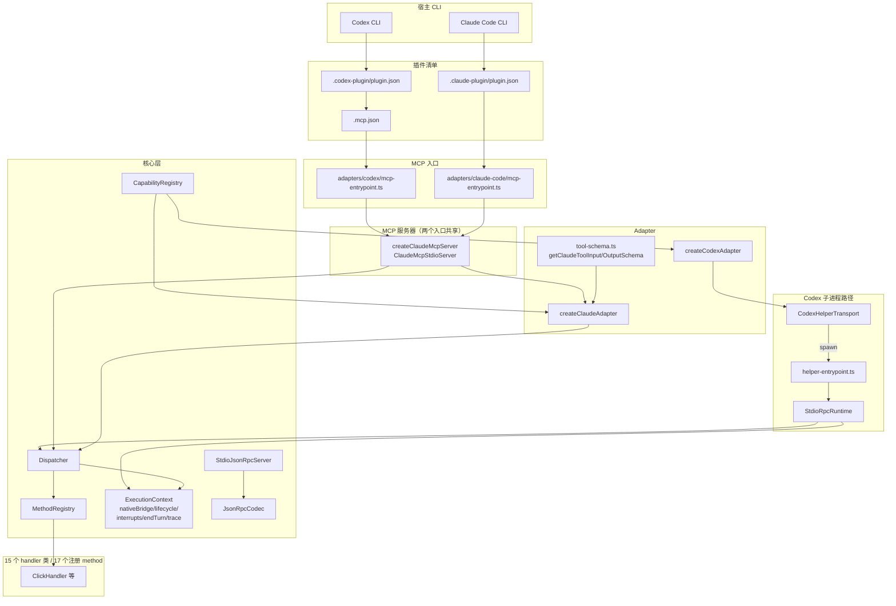
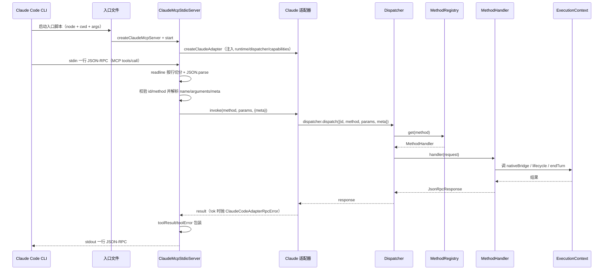
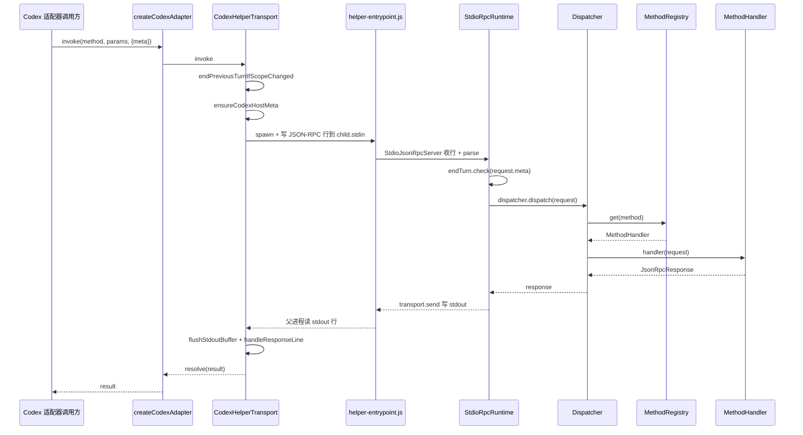

# 外部适配层 + 调度层 架构文档

## 导读

本仓库 `computer-use` 是一个本地 Windows 计算机使用插件，暴露给两类宿主 CLI：Codex CLI 与 Claude Code CLI。两者都通过 MCP（Model Context Protocol）stdin/stdout JSON-RPC 与插件对话，但它们发现和加载插件的方式不一样：Codex 通过 `.mcp.json` 引用一个独立的启动文件，Claude Code 通过 `.claude-plugin/plugin.json` 中的 `mcpServers` 配置直接挂载入口。

无论哪条 CLI 路径，入口脚本最终都会构造一个 `ClaudeMcpStdioServer`，它把 MCP 协议（`initialize` / `tools/list` / `tools/call` / `shutdown` / `close`）映射到内部的 `Dispatcher` 调用。Dispatcher 维护一张 `MethodRegistry`，17 个 capability method 各自挂载一个 `MethodHandler`，并保留两个特殊方法名 `end_turn` 与 `close`。

文档回答的核心问题：
1. Codex CLI 与 Claude Code CLI 如何分别发现并启动这个 MCP server？两者的差异是什么？
2. JSON-RPC 帧怎么从 stdin 流到 dispatcher？一层一层追到 `dispatcher.dispatch`。
3. `createCodexAdapter`（helper-transport 子进程模式）与 `createClaudeAdapter`（进程内 stdio 模式）的设计差异。
4. Dispatcher + MethodRegistry + CapabilityRegistry 的关系及执行路径。
5. `tool-schema.ts` 如何把 internal capability 包装成 MCP `tools/list` 输出。

---

## 关键事实

| 项目 | 值 | 来源 |
|---|---|---|
| Codex CLI 启动命令 | `node ./dist/src/adapters/codex/mcp-entrypoint.js` | `.mcp.json:5-6` |
| Claude Code CLI 启动命令 | `node ${CLAUDE_PLUGIN_ROOT}/dist/src/adapters/claude-code/mcp-entrypoint.js` | `.claude-plugin/plugin.json:24-25` |
| Codex 插件清单引用 MCP 配置 | `mcpServers: "./.mcp.json"` | `.codex-plugin/plugin.json:17` |
| 插件名 / 版本 | `computer-use` / `1.0.1` | `.codex-plugin/plugin.json:2-3`、`.claude-plugin/plugin.json:3-5` |
| 注入环境变量 | `COMPUTER_USE_TRACE = "1"` | `.mcp.json:8-10`、`.claude-plugin/plugin.json:20-22` |
| Mock 桥接开关 env | `COMPUTER_USE_TEST_USE_MOCK_BRIDGE` | `src/adapters/claude-code/mcp-server.ts:15`、`src/adapters/codex/helper-entrypoint.ts:8` |
| Codex 回退 session/turn id | `codex-mcp-${process.pid}` / `request-${String(requestId)}` | `src/adapters/claude-code/mcp-server.ts:299-301` |
| Adapter 自加方法 | `end_turn` | `src/adapters/codex/index.ts:32-37`、`src/adapters/claude-code/index.ts:38-46` |
| Dispatcher 内置方法 | `end_turn`, `close` | `src/core/dispatcher/method-registry.ts:7` |
| Capability 方法总数 | 17 = 12 Action + 1 Capture + 4 Discovery | `src/core/contracts/{action,capture,discovery}.ts` |
| MCP `initialize` 协议版本 | `2024-11-05`（默认） | `src/adapters/claude-code/mcp-server.ts:454-460` |
| MCP serverInfo | `name: "computer-use"`, `version: "1.0.1"` | `src/adapters/claude-code/mcp-server.ts:143-146` |

---

## 一、Codex CLI 与 Claude Code CLI 怎么发现 / 启动 MCP server

### 1.1 Codex CLI 路径

Codex 插件分两层文件：

- `.codex-plugin/plugin.json` 是插件元数据（`name = "computer-use"`、`version = "1.0.1"`、`mcpServers = "./.mcp.json"`），其中 `mcpServers` 字段引用同目录下的 `.mcp.json`。
- `.mcp.json` 才是实际的启动配置：`mcpServers.computer-use.command = "node"`、`args = ["./dist/src/adapters/codex/mcp-entrypoint.js"]`、`env.COMPUTER_USE_TRACE = "1"`、`cwd = "."`。

Codex CLI 读这两份文件后，会以 `node ./dist/src/adapters/codex/mcp-entrypoint.js` 拉起 MCP server 进程。该入口文件对应 `src/adapters/codex/mcp-entrypoint.ts`，它的实现只有三行有意义的代码：调用 `createClaudeMcpServer({host: "codex", useMockBridge: ...})` 然后启动、注册进程清理钩子。Codex 入口复用 Claude Code 的 MCP server 实现，仅在 `host` 字段上区别。

### 1.2 Claude Code CLI 路径

Claude Code 插件只有一份清单 `.claude-plugin/plugin.json`，把启动配置直接写进 `mcpServers.computer-use`：`command = "node"`、`cwd = "${CLAUDE_PLUGIN_ROOT}"`、`args = ["${CLAUDE_PLUGIN_ROOT}/dist/src/adapters/claude-code/mcp-entrypoint.js"]`、`env.COMPUTER_USE_TRACE = "1"`。

对应入口文件 `src/adapters/claude-code/mcp-entrypoint.ts`：同样调 `createClaudeMcpServer({host: "claude-code", useMockBridge: ...})`，再 `start()` 与 `installProcessCleanupHooks`。

### 1.3 差异总结

| 维度 | Codex | Claude Code |
|---|---|---|
| 清单文件数量 | 两份（plugin.json + mcp.json） | 一份（plugin.json） |
| 启动入口 | `dist/src/adapters/codex/mcp-entrypoint.js` | `${CLAUDE_PLUGIN_ROOT}/dist/src/adapters/claude-code/mcp-entrypoint.js` |
| `cwd` | 相对路径 `.` | 模板变量 `${CLAUDE_PLUGIN_ROOT}` |
| `host` 字段值 | `"codex"` | `"claude-code"` |
| 入口背后实现 | `createClaudeMcpServer({host: "codex"})` | `createClaudeMcpServer({host: "claude-code"})` |

两份入口的实现底层都走 `ClaudeMcpStdioServer`，因此两路 CLI 在「MCP 协议解析与回包」层完全一致，只有 `host` 标记和注入的元数据不同。

引用：
- `.mcp.json:1-14`
- `.codex-plugin/plugin.json:1-37`
- `.claude-plugin/plugin.json:1-29`
- `src/adapters/codex/mcp-entrypoint.ts:1-26`
- `src/adapters/claude-code/mcp-entrypoint.ts:1-25`

---

## 二、JSON-RPC 帧怎么从 stdin 流到 dispatcher

### 2.1 Codex CLI 真实入口的传输路径

虽然 `.mcp.json` 指定 Codex 入口是 `codex/mcp-entrypoint.js`，但该文件实际调的是 `createClaudeMcpServer({host: "codex"})`（`src/adapters/codex/mcp-entrypoint.ts:7-12`），与 Claude Code 路径共用一套 MCP 服务器实现。

`createClaudeMcpServer`（`src/adapters/claude-code/mcp-server.ts:42-63`）：
- 用 `createWindowsRuntime()`（默认）或 `createScaffoldRuntime()`（mock 模式）构造 scaffold（运行时骨架）。
- 调 `createClaudeAdapter(scaffold.runtime, scaffold.dispatcher, scaffold.capabilities, {host: options.host})` 拿到 adapter。
- 构造 `ClaudeMcpStdioServer(adapter, options)`。

`ClaudeMcpStdioServer.start()`（`mcp-server.ts:84-96`）：用 `readline.createInterface({input: this.input ?? process.stdin})` 监听 stdin，每读到一行就把前一行的处理串成 promise chain 处理（保证请求顺序）。

`handleLine(line)`（`mcp-server.ts:111-178`）：逐行处理 MCP 请求。`tools/call` 路径走 `handleToolCall`，后者把 `params.name` 作为 method，校验 `adapter.capabilities` 是否含此 method，然后调 `adapter.invoke(method, payload.params, {meta: payload.meta})`。

`adapter.invoke(method, params, options)`（`src/adapters/claude-code/index.ts:56-82`）：若是 `end_turn` 直接调 `runtime.endTurn.close()`；否则先做 turn scope 切换判断，调 `ensureClaudeHostMeta` 注入 `host`，再调 `dispatcher.dispatch({id, method, params, meta})`（其中 `id` 由 adapter 自维护 `nextRequestId` 计数）。失败时 `throw new ClaudeCodeAdapterRpcError(response)`。

`Dispatcher.dispatch(request)`（`src/core/dispatcher/dispatch.ts:7-18`）：用 `methods.get(request.method)` 查 `MethodRegistry`，找不到则回 `{ok: false, code: "unknown_method", error}`；找到则 `return handler(request)`。

最终回包由 `mcp-server.ts:216-229` 的 `writeResult` / `writeError` 写一行 `{jsonrpc: "2.0", id, result}` 或 `{jsonrpc: "2.0", id, error: {...}}` 到 stdout。

### 2.2 完整帧流（一行行追）

stdin 字节流 →
`readline` 按 `\n` 切行（`mcp-server.ts:85`）→
`handleLine` `JSON.parse(trimmed)`（`mcp-server.ts:118-119`）→
校验 `id` 与 `method`（`mcp-server.ts:129-131`）→
`switch (request.method)`（`mcp-server.ts:134`）→
命中 `tools/call` →
`handleToolCall` 解析 `call.name` 与 `call.arguments`（`mcp-server.ts:185-195`）→
`adapter.invoke(method, payload.params, {meta})`（`mcp-server.ts:197-199`）→
adapter 调 `dispatcher.dispatch({id, method, params, meta})`（`claude-code/index.ts:69-74`）→
`Dispatcher.dispatch` `methods.get(method)`（`dispatch.ts:8`）→
`MethodHandler.handle(request)`（`dispatch.ts:17`）→
返回 `JsonRpcResponse` →
adapter `if (!response.ok) throw new ClaudeCodeAdapterRpcError(response)`（`claude-code/index.ts:76-78`）→
`mcp-server.ts` `toolResult` / `toolError` 包装（`mcp-server.ts:200-213`）→
`writeResult(id, result)` 写 stdout（`mcp-server.ts:216-218`）。

### 2.3 CodexHelperTransport 子进程路径（另一条入口）

`createCodexAdapter`（`src/adapters/codex/index.ts`）走的是 helper-transport 子进程模式，与 §2.1 的进程内路径是平行分支。它被 `createAdapters`（`src/index.ts:106-113`）与测试调用。

`createCodexAdapter.invoke` →
`CodexHelperTransport.invoke`（`helper-transport.ts:58-74`）→
`send` 序列化为 `{id, method, params, meta}` 写一行到 child.stdin（`helper-transport.ts:113-138`）→
子进程 `helper-entrypoint.js` 的 `StdioJsonRpcServer`（`src/core/transport/stdio-server.ts:26-50`）→
按行 `JSON.parse` →
emit `request` →
`StdioRpcRuntime.handleRequest`（`stdio-server.ts:132-158`）→
`runtime.endTurn.check(request.meta)` →
`dispatcher.dispatch(request)` →
回包经 `transport.send`（`stdio-server.ts:52-77`）写一行 stdout →
父进程 `CodexHelperTransport.flushStdoutBuffer`（`helper-transport.ts:186-201`）→
`handleResponseLine` 解 `pending`（`helper-transport.ts:203-232`）。

引用：
- `src/adapters/claude-code/mcp-server.ts:42-230`
- `src/adapters/claude-code/index.ts:15-120`
- `src/core/dispatcher/dispatch.ts:1-19`
- `src/core/transport/stdio-server.ts:1-218`
- `src/adapters/codex/helper-transport.ts:32-341`
- `src/adapters/codex/helper-entrypoint.ts:1-61`

---

## 三、Codex 用 helper-transport 子进程模式、Claude Code 用进程内 stdio 模式

### 3.1 `createClaudeAdapter`：进程内 stdio

`createClaudeAdapter.invoke` 不持有任何子进程，直接 `dispatcher.dispatch({...})`（`src/adapters/claude-code/index.ts:69-74`）。Turn scope 切换、host 注入、失败转 `ClaudeCodeAdapterRpcError` 都在同一进程同一栈帧里完成。它的宿主是 `ClaudeMcpStdioServer`，后者再用 `readline` 监听 stdin。

### 3.2 `createCodexAdapter`：helper-transport 子进程

`createCodexAdapter` 默认构造 `new CodexHelperTransport()`（`src/adapters/codex/index.ts:24`）。`invoke` 全部转发给 `transport.invoke`，由它把请求写成 JSON 行喂给子进程。子进程启动逻辑 `resolveHelperLaunch`（`helper-transport.ts:293-325`）按以下顺序解析启动命令：
1. 优先用 `options.command / args / cwd`（测试注入用，`helper-transport.ts:298-304`）。
2. 否则优先尝试同目录的 `./helper-entrypoint.js`（`helper-transport.ts:306-313`）。
3. 否则退到 `./helper-entrypoint.ts` + `tsx`（`helper-transport.ts:315-322`）。

子进程入口 `createCodexHelperServer`（`helper-entrypoint.ts:17-45`）独立跑一份 scaffold + `StdioJsonRpcServer` + `StdioRpcRuntime`。父进程只通过 `pending` Map 把请求 id 与 Promise 配对，靠 stdout 行回包唤醒。

### 3.3 设计差异与各自边界

| 维度 | `createClaudeAdapter` | `createCodexAdapter` |
|---|---|---|
| 调度目标 | 进程内 `dispatcher` | 子进程 `dispatcher`（经 JSON-RPC） |
| 进程拓扑 | 单一进程 | 父子两进程 |
| Turn scope 追踪 | adapter 内 `currentTurnMeta` | transport 内 `currentTurnMeta`，每次 invoke 前 `endPreviousTurnIfScopeChanged` |
| `end_turn` 实现 | `runtime.endTurn.close()` | `transport.invoke("end_turn", {}, {meta})` 走 JSON-RPC |
| 失败传播 | `throw ClaudeCodeAdapterRpcError` | `pending.reject(new CodexAdapterRpcError(...))` |
| 主要消费者 | CLI MCP 入口、测试 | 测试、`createAdapters` |

两份 adapter 都实现了 `host: "codex"` / `"claude-code"` 注入（前者 `helper-transport.ts:258-263` 的 `ensureCodexHostMeta`，后者 `claude-code/index.ts:122-134` 的 `ensureClaudeHostMeta`），但执行模型不同：Claude Code 把 MCP server 与 capability 执行放在同一进程，Codex 通过子进程隔离出独立的运行时骨架，方便做 turn / lifecycle 隔离与中断处理。

引用：
- `src/adapters/claude-code/index.ts:15-120`
- `src/adapters/codex/index.ts:15-58`
- `src/adapters/codex/helper-transport.ts:32-325`
- `src/adapters/codex/helper-entrypoint.ts:17-61`

---

## 四、Dispatcher + MethodRegistry + CapabilityRegistry 的关系与执行路径

### 4.1 三个组件的职责

`src/core/runtime/capability-registry.ts` 的 `CapabilityRegistry` 是「capability 描述」的注册表，存的是 `CapabilityDefinition { method, summary, requiresWindowActivation }`。它提供 `register / get / list` 三个方法。`list()` 返回所有注册的 `CapabilityDefinition[]`，被 adapter 用来派生对外暴露的 descriptor。

`src/core/dispatcher/method-registry.ts` 的 `MethodRegistry` 是「method → MethodHandler」的注册表，存的是 `MethodHandler = (req: JsonRpcRequest) => Promise<JsonRpcResponse>`。它有一个常量 `BUILT_IN_METHODS = new Set(["end_turn", "close"])`，注册时遇到内置方法会抛错（`method-registry.ts:13-15`），而 `has(method)` 对内置方法也返回 true（`method-registry.ts:24-26`）。

`src/core/dispatcher/dispatch.ts` 的 `Dispatcher` 持有一个 `MethodRegistry` 引用。`dispatch(request)` 做的事就是查表 + 调用：`methods.get(request.method)` 找不到则回 `{id, ok: false, code: "unknown_method", error}`；找到则 `return handler(request)`。

### 4.2 三者的装配

`src/index.ts:39-104` 的 `createRuntime(nativeBridge)`：
1. `createDefaultRuntime({nativeBridge, trace})` 构造 `ExecutionContext { nativeBridge, lifecycle, interrupts, endTurn, trace }`（详见 `src/core/runtime/execution-context.ts:16-36`）。
2. `new CapabilityRegistry()` 与 `new MethodRegistry()`。
3. 实例化 17 个 handler 对象（由 15 个 handler 类构成，`CommonDialogPathHandler` 三次实例化），每个对象暴露一个 `.definition`（`CapabilityDefinition`）与一个 `.handle(request)`（`MethodHandler`）。
4. 双重注册：`capabilities.register(handler.definition)` + `methods.register(handler.definition.method, handler.handle.bind(handler))`。
5. 返回 `{runtime, capabilities, methods, dispatcher: new Dispatcher(methods)}`。

`ExecutionContext.endTurn` 是 `EndTurnCoordinator` 实例（`src/core/runtime/execution-context.ts:27`、`src/core/interrupt/end-turn.ts:15-92`），它持有 `LifecycleManager` 与 `InterruptState`，提供 `begin / close / check / trigger` 等 turn 协调能力，被 dispatcher 与 transport 用来响应 `end_turn` 与 ESC 中断。

### 4.3 执行路径（从 `tools/call` 到 handler）

`ClaudeMcpStdioServer.handleLine` →
`adapter.invoke(method, params, {meta})` →
adapter 调 `dispatcher.dispatch({id, method, params, meta})` →
`Dispatcher.dispatch` `methods.get(method)` →
`MethodHandler.handle(request)`（17 个已注册 capability method 之一）→
handler 内部通常用 `runtime`（ExecutionContext）做事，可能调 `nativeBridge` 真实驱动 Windows 自动化 →
返回 `JsonRpcResponse` →
adapter 失败则 `throw ClaudeCodeAdapterRpcError`、成功则 `return response.result` →
MCP server 把结果包装成 MCP `tools/call` 响应，写 stdout。

引用：
- `src/core/runtime/capability-registry.ts:1-23`
- `src/core/dispatcher/method-registry.ts:1-31`
- `src/core/dispatcher/dispatch.ts:1-19`
- `src/core/runtime/execution-context.ts:1-36`
- `src/core/runtime/lifecycle-manager.ts:1-40`
- `src/core/interrupt/end-turn.ts:1-92`
- `src/index.ts:39-104`

---

## 五、tool-schema.ts 如何把 internal capability 包装成 MCP tools/list 输出

### 5.1 adapter 端：每个 capability 自带 input/output schema

`createClaudeAdapter`（`src/adapters/claude-code/index.ts:29-46`）遍历 `capabilities.list()`，对每个 `CapabilityDefinition` 派生出 `ClaudeCodeCapabilityDescriptor`：
- `name = item.method`、`rpcMethod = item.method`、`summary = item.summary`、`requiresWindowActivation = item.requiresWindowActivation`
- `inputSchema = getClaudeToolInputSchema(item.method)`
- `outputSchema = getAdvertisedOutputSchema(item.method)`

末尾再追加一个 `end_turn` descriptor（`index.ts:38-46`），它的 `inputSchema = getClaudeToolInputSchema("end_turn")`，`outputSchema = getClaudeToolOutputSchema("end_turn")`。

### 5.2 `getClaudeToolInputSchema` 的两层结构

`getClaudeToolInputSchema(method)`（`tool-schema.ts:489-494`）先调 `getBaseToolInputSchema(method)`，再用 `withInvocationMetadata` 在外面包一层，强制 `type: "object"`、`additionalProperties: false`，并往 `properties` 注入：
- `meta`（`metaSchema`）
- `claudeTurnMetadata`（`turnMetadataSchema`）
- `codexTurnMetadata`（`turnMetadataSchema`）
- `computerUseStatus`（`statusSchema`）
- `computerUseTrace`（`traceSchema`）

`withInvocationMetadata` 源码在 `tool-schema.ts:422-436`。

`getBaseToolInputSchema` 是一个大 switch（`tool-schema.ts:855+`），每个方法各自描述自己的 `properties` / `required` / `additionalProperties: false`。例如：
- `click`：`window / x / y / coordinateSpace / click_count / mouse_button / screenshotId`（`tool-schema.ts:565-647`）。
- `end_turn`：`emptyObjectSchema("Call once before the final answer ...")`（`tool-schema.ts:1184-1186`）。

### 5.3 `getClaudeToolOutputSchema` 与 `getAdvertisedOutputSchema`

`getClaudeToolOutputSchema(method)`（`tool-schema.ts:496+`）只为一部分方法返回 schema：`list_apps`、`list_windows`、`activate_window`、`get_window`、`launch_app`、`get_window_state`，其它方法返回 `undefined`（switch 落到 default）。

`getAdvertisedOutputSchema`（`claude-code/index.ts:136-144`）进一步把 `get_window_state` 强制为 `undefined`，其余走 `getClaudeToolOutputSchema`。

### 5.4 MCP server 端：`tools/list` 的输出形状

`ClaudeMcpStdioServer.handleLine` 收到 `tools/list` 时（`mcp-server.ts:154-158`）：
```ts
case "tools/list":
  this.writeResult(request.id, {
    tools: this.adapter.capabilities.map(toMcpToolDescriptor)
  });
  return;
```

`toMcpToolDescriptor`（`mcp-server.ts:243-254`）构造 `{name, description, inputSchema}`，若 `outputSchema` 存在则附 `outputSchema`。最终一行 `{jsonrpc: "2.0", id, result: {tools: [...]}}` 写 stdout。

引用：
- `src/adapters/claude-code/index.ts:29-46`、`136-144`
- `src/adapters/claude-code/tool-schema.ts:422-436`
- `src/adapters/claude-code/tool-schema.ts:489-494`
- `src/adapters/claude-code/tool-schema.ts:855-1187`
- `src/adapters/claude-code/mcp-server.ts:154-158`、`243-254`

---

## 六、组件框架图



---

## 七、时序图：两条路径

### 7.1 路径 A — Claude Code（进程内 stdio）



### 7.2 路径 B — Codex（helper-transport 子进程）



注：当前 Codex CLI 的真实 MCP 入口（`.mcp.json` → `codex/mcp-entrypoint.js`）实际走的是与路径 A 相同的 `createClaudeMcpServer`（进程内 stdio）。路径 B 是 `createCodexAdapter` 这条独立分支的执行模型，被 `createAdapters`（`src/index.ts:106-113`）与测试使用。

---

## 已确认 / 自检结论

- `getAdvertisedOutputSchema`（`claude-code/index.ts:136-144`）把 `get_window_state` 强制 `undefined`，而 `getClaudeToolOutputSchema("get_window_state")` 在 `tool-schema.ts:736+` 保留了内部 schema 定义。这里不是冲突：生产对外 advertised 行为以 adapter 为准，`get_window_state` 在 MCP `tools/list` 输出中无 `outputSchema` 字段；运行时 `toolResult` 也对 `get_window_state` 禁用 `structuredContent`，只通过 image/text content 返回截图与红acted JSON（`mcp-server.ts:379-383`）。
- Codex CLI 真实启动链路 vs `createCodexAdapter` 链路：实际生产 Codex MCP server 是 `mcp-entrypoint.ts`（复用 `createClaudeMcpServer`），而 `createCodexAdapter` + `CodexHelperTransport` 是另一条独立路径，被测试与 `createAdapters` 使用。文档已在 §1、§3、§7.2 中明确这一区分。
- `claude-code/index.ts:44` 把 `end_turn` 的 `outputSchema` 设为 `getClaudeToolOutputSchema("end_turn")`。`getClaudeToolOutputSchema` 在 `tool-schema.ts:1184-1186` 有 `case "end_turn": return emptyObjectSchema("Call once before the final answer...")`。因此 `end_turn` 的 `outputSchema` 是 `emptyObjectSchema(...)`（一个有 description 但无 properties 的 object schema），不是 `undefined`。初稿曾误判 switch 不含 `end_turn`，已修正。
