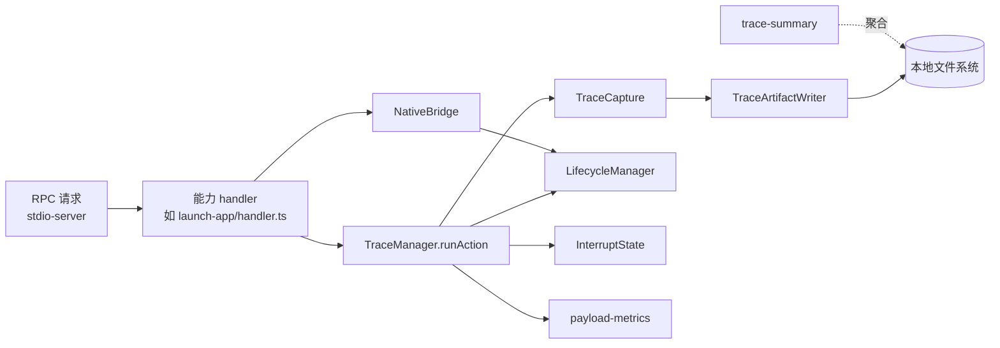
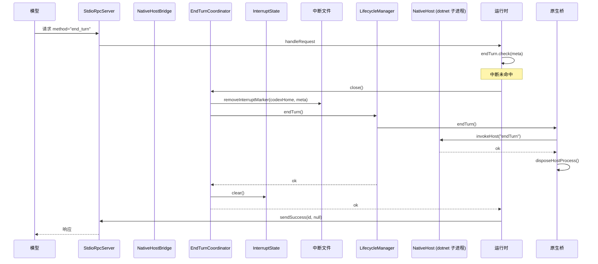
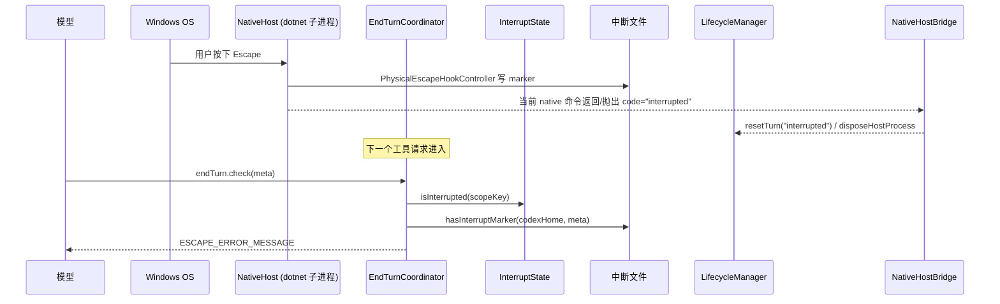

# Trace / Lifecycle / Interrupt 架构文档

## 导读

本仓库的"computer-use"是一个把 LLM 工具调用翻译为 Windows 原生操作的桥接器。三个横切关注点贯穿整套能力：

- **Trace 子系统**：为每个被执行的工具调用写出可重放的请求 / 响应 / 证据磁盘文件，存放在本地 artifact 目录；可在证据之上聚合统计指标。
- **Interrupt 子系统**：让"物理 Escape 键"或外部信号能立刻冻结当前 turn，并把冻结状态以磁盘 marker 文件 + 内存 scope key 两种方式持久化；下一次请求进入时能自动恢复拒绝路径。
- **Runtime / Lifecycle**：把 turn 视作 Native Host（dotnet 子进程）的生命周期单位；每个 turn 结束 Native Host 都会被回收，下个 turn 再启。

本文档按这三个子系统逐节展开，并在关键路径处给出 mermaid 图。

---

## 关键事实

### 环境变量与默认值

| 变量 | 用途 | 默认 |
|---|---|---|
| `COMPUTER_USE_TRACE` | trace 启用开关 | `false` |
| `COMPUTER_USE_TRACE_DIR` | 覆盖 trace 输出目录 | 默认按当前运行进程的 `process.cwd()` 解析为 `.artifacts/computer-use-trace`；打包安装后通常是 active plugin root 下的 `.artifacts/computer-use-trace` |
| `COMPUTER_USE_NATIVE_HOST_IDLE_TIMEOUT_MS` | Native host 闲置回收超时 | 由 `readIdleHostTimeoutMs` 解析 |
| `COMPUTER_USE_DOTNET_PATH` | dotnet 可执行文件路径 | 系统 PATH |
| `COMPUTER_USE_TEST_USE_MOCK_BRIDGE` | helper 测试时使用 mock bridge | — |
| `CODEX_HOME` | 中断 marker 文件的根目录 | `<homedir>/.codex` |

`COMPUTER_USE_TRACE` 与 `COMPUTER_USE_TRACE_DIR` 的定义在 `trace/trace-config.ts:4-5`，默认值由 `trace-config.ts:21-23` 给出。`codexHome` 由 `interrupt/end-turn.ts:94-96` 解析。

### 常量字面量

- Trace schema 版本：`"computer-use-trace/v1"`（`trace/tracer.ts:53, 181`）。
- Token 估算器版本：`"heuristic_mixed_text_v1"`（`trace/payload-metrics.ts:5`）。
- `BUILT_IN_METHODS = new Set(["end_turn", "close"])` — 这两个方法名在 `method-registry.ts:7` 中被保留，业务侧不能 register 覆盖。
- Escape 中断消息：`"Computer Use was stopped by the user with the physical Escape key. Stop your work, do not call further Computer Use tools in this turn, and send a final message noting that the user stopped Computer Use."`（`interrupt/interrupt-error.ts:1-4`）。
- Taskbar shell 标识：`TASKBAR_APP_ID = "windows.shell.taskbar"`、`TASKBAR_DISPLAY_NAME = "Windows Taskbar"`（`hooks/shell/taskbar-target.ts:4-6`）。

### Trace artifact 目录布局

写入路径由 `TraceArtifactWriter.createActionLocation` 拼接（`trace/artifact-writer.ts:23-42`）：

```
<outputDir>/
  <sanitized(sessionId)>/
    <sanitized(turnId)>/
      <sanitized(actionId)>/
        request.json            (kind="request")
        response.json           (kind="response"，仅成功)
        error.json              (kind="error"，仅抛错)
        evidence.json           (kind="evidence"，一定)
        launch-plan.json        (kind="launch"，launch-app 业务)
        activation-plan.json    (kind="activation"，activate/click-element)
        windows.json            (kind="windows"，list-windows)
        click-element.json      (kind="uia"，click-element)
        state-diff.json         (kind="state-diff"，click-element)
        window-state.json       (kind="<label>-window-state")
        uia-tree.json           (kind="<label>-uia")
        window-state.jpg        (kind="<label>-screenshot")
        window-state-raw.png    (kind="<label>-raw-screenshot")
        <label>-capture-error.json  (kind="<label>-capture-error")
```

`<sanitized>` 通过 `sanitizePathSegment` 实现：把 `[<>:"/\\|?*\x00-\x1f]` 替换为 `-`，空字符串 fallback `"unknown"`（`trace/artifact-writer.ts:106-109`）。`<outputDir>` 来自 `ResolvedTraceOptions.outputDir`，由 `TraceArtifactWriter(rootDir)` 在 `TraceCapture` 构造时保存（`trace/tracer.ts:258-260`）。

### 内置 trace 开关与目录的解析优先级

`resolveTraceOptions` 同时记录 `enabled` 与 `outputDir` 两个值，并附 `enabledSource` / `outputDirSource` 标签（`trace-config.ts:25-70`）。命中顺序：

1. `request.meta.computerUseTrace`（最高，`"request_meta"`）
2. 构造 `TraceManager` 时传入的 `config` 选项（`"config"`）
3. 环境变量（`"env"`）
4. 默认值（`"default"`）

Trace 启用判断值：`1` / `true` / `yes` / `on` 为 true；`0` / `false` / `no` / `off` 为 false；其他值返回 undefined 视为未设置（`trace-config.ts:72-91`）。

---

## Trace 子系统

### 框架图



### 一个工具调用被 trace 时的步骤

入口位于每个 capability handler，例如 `core/capabilities/discovery/launch-app/handler.ts:13-37`。`TraceManager.runAction` 是统一的外壳（`trace/tracer.ts:125-230`），每次执行固定产出以下动作：

1. `resolveTraceOptions({ config, meta })` 合并配置与请求 meta，决定本调用是否启用 trace 与输出目录。`trace/tracer.ts:130-133`、`trace/trace-config.ts:25-70`
2. `captureState()` 取 `beforeState`（interrupted 标志、当前 turn meta 的 clone）。`trace/tracer.ts:135, 232-238`
3. 构造 `actionId = ${actionType}-${requestId}-${randomUUID8}`、`sessionId`、`turnId`。`trace/tracer.ts:136-138, 363-373`
4. 构造 `TraceCapture`，把 `params` 与 `params.window`（若有）记录下来。`trace/tracer.ts:139-144`
5. 组装 `requestEnvelope = { id, method, meta, params }`。`trace/tracer.ts:149-154`
6. 若启用 → `writeJsonArtifact("request", "request.json", requestEnvelope)`。`trace/tracer.ts:156-160`
7. `await execute(capture)`：handler 内部逻辑在此运行，期间可向 capture 写入任意中间 artifact（如 `launch-plan.json`、`activation-plan.json`、`window-state.json`）。`trace/tracer.ts:162-164`
8. `finally`：
   - `captureState()` 取 `afterState`。`trace/tracer.ts:170`
   - 视成功 / 失败写 `response.json` 或 `error.json`。`trace/tracer.ts:172-178`
   - 拼装 `ActionTraceEvidence` 对象并写 `evidence.json`。`trace/tracer.ts:180-227`
9. 每次写盘都被 `safeTraceWrite` 包住，吞掉异常、不影响主路径。`trace/tracer.ts:464-470`

`TraceCapture` 在 `resolved.enabled` 时才持有 `TraceArtifactWriter`；所有 `write*Artifact` 都先调 `getLocation()` 懒创建 action 目录（`trace/tracer.ts:258-260, 350-360`）。

### 三种 trace helper 的角色

**payload-metrics（`trace/payload-metrics.ts`）**

为四种粒度（请求信封、请求参数、响应信封、响应体、抛出的错误）各算一份 `{ charCount, utf8Bytes, estimatedTokens, estimator }`。Token 估算按字符分类（`trace/payload-metrics.ts:18-76`）：

- 空白跳过。
- CJK code point（`0x3400-0x4dbf`、`0x4e00-0x9fff`、`0xf900-0xfaff`、`0x3040-0x309f`、`0x30a0-0x30ff`、`0xac00-0xd7af`）→ 1 token。
- ASCII word（数字、大小写字母、`_`）→ 每 4 字符 1 token。
- 其他 word code point（Latin Extended、希腊、西里尔等）→ 每 2 字符 1 token。
- 其他单字符 → 1 token。
- 至少返回 1。

`serializeForMetrics`（`trace/payload-metrics.ts:78-93`）优先 `JSON.stringify`，失败则 `String(value)`，undefined 返回字符串 `"undefined"`。

**trace-summary（`trace/trace-summary.ts`）**

`summarizeTraceEvidence(evidenceList)` 把一批 evidence 按 `actionType` 分桶、桶名按 `localeCompare` 排序后聚合（`trace-summary.ts:23-49`）。每桶输出 13 个指标：`count / successCount / errorCount / errorRate / totalDurationMs / avgDurationMs / p95DurationMs / avgRequestTokens / avgResponseTokens / totalResponseTokens / avgRequestBytes / avgResponseBytes`（`trace-summary.ts:52-106`）。`p95DurationMs` 用 `values[min(len-1, max(0, ceil(len*0.95)-1))]`（`trace-summary.ts:108-115`）。该函数不在 MCP action lane 内自动执行，而是由维护/调试脚本在需要聚合 trace 证据时调用。
生产调用方是 `computer_use/scripts/trace-summary.ts`：脚本递归读取 trace 目录下所有 `evidence.json`，调用 `summarizeTraceEvidence(evidence)`，再向 stdout 输出 `{ traceDir, totalActions, overall, byAction }` JSON。入口由 `computer_use/package.json` 的 `trace:summary` 脚本暴露：`npm --prefix computer_use run trace:summary -- <absolute-trace-dir>`，或在 `computer_use/` 目录内运行 `npm run trace:summary -- <trace-dir>`。使用 `--prefix computer_use` 时，相对参数会按 `computer_use/` 包目录解析；从仓库根调用时优先传绝对 trace 路径。该脚本不在 MCP action lane 内自动执行，而是生产/维护用的 trace 聚合入口。

**window-state-trace（`trace/window-state-trace.ts`）**

辅助把 `WindowStateResult` 拆为 4 类 artifact（`writeWindowStateTraceArtifacts`，`window-state-trace.ts:5-67`）：`window-state.json`（redact 后）、`uia-tree.json`、`window-state-raw.png`、`window-state.jpg`。`redactWindowStatePayloads` 把 screenshot 的 `data` 字段替换成 `<base64:N bytes>` 字符串以避免 trace 文件过大（`window-state-trace.ts:222-240`）。`captureTraceWindowStateSnapshot` 仅在 `trace.isEnabled()` 时调用，捕获失败会写 `<label>-capture-error.json`（`window-state-trace.ts:90-115`）。`summarizeWindowStateDiff` 比较 before/after 的 `window`、`screenshot`、`text` 三组 JSON，输出 `changedFields`（`window-state-trace.ts:117-153`）；`summarizeActionStateDiff` 把它包装成 `ActionStateDiffResult`（`window-state-trace.ts:155-182`）。

### TraceArtifactWriter

不持有 fd。每次 `writeArtifact` 都 `mkdir + writeFile`（`trace/artifact-writer.ts:84-103`）。三类 API 最终都走 `writeArtifact`：

- `writeJson`：`JSON.stringify(payload, null, 2)` + 强制 `.json` 后缀（`trace/artifact-writer.ts:44-57, 116-118`）。
- `writeText`：`Buffer.from(payload, "utf8")` + `mimeType: "text/plain"`（`trace/artifact-writer.ts:59-72`）。
- `writeBinary`：直接透传 `Uint8Array`（`trace/artifact-writer.ts:74-82`）。

返回的 `TraceArtifactReference` 同时携带 `absolutePath` 与 `relativePath`，让 evidence 在被 trace 文件消费时既能定位也能在 artifact root 内做路径展示。

### evidence.json 的字段来源速查

evidence 对象由 `TraceManager.runAction` 在 finally 段组装（`trace/tracer.ts:180-227`）。下表给出字段与出处的一一对应：

| evidence 字段 | 出处 |
|---|---|
| `schemaVersion` | `"computer-use-trace/v1"`，`trace/tracer.ts:53` |
| `actionId` | `buildActionId`，`trace/tracer.ts:363-365` |
| `actionType` | handler 传入的 `CapabilityMethod`，`trace/tracer.ts:183` |
| `requestId` / `sessionId` / `turnId` | `String(request.id)` 与 `resolveSessionId`/`resolveTurnId`，`trace/tracer.ts:367-373` |
| `hostSource` | `request.meta?.host ?? "unknown"`，`trace/tracer.ts:187` |
| `driverName` / `runtime` | 构造 `TraceManager` 时传入，`trace/tracer.ts:188-193` |
| `startedAt` / `endedAt` / `durationMs` | runAction 内部时钟，`trace/tracer.ts:194-196` |
| `status` | `isErrorResponse(response) || error ? "error" : "success"`，`trace/tracer.ts:197` |
| `trace.enabled/outputDir/...` | `ResolvedTraceOptions`，`trace/tracer.ts:198-203` |
| `payloadMetrics.*` | `createPayloadMetrics`，`trace/tracer.ts:204-210` |
| `targetWindow` | `readWindowRef(params.window)`，`trace/tracer.ts:375-391` |
| `inputParams` / `clickCoordinates` / `elementInfo` | `TraceCapture` setter，`trace/tracer.ts:271-289` |
| `beforeState` / `afterState` | `captureState`，`trace/tracer.ts:232-238` |
| `screenshots.before` / `screenshots.after` | `attachBeforeScreenshot` / `attachAfterScreenshot`，`trace/tracer.ts:283-289` |
| `artifacts` | `TraceCapture.artifacts`（按写入顺序追加），`trace/tracer.ts:248, 306/325/346` |
| `response` / `error` | `toResponseInfo` / `toErrorInfo`，`trace/tracer.ts:401-442` |

---

## Interrupt 子系统

### 五个文件的分工

| 文件 | 角色 |
|---|---|
| `interrupt/interrupt-state.ts` | 进程内 `interrupted: boolean` 与 `scopeKey: string \| undefined` |
| `interrupt/interrupt-scope.ts` | turn scope 比较与 key 拼接（`session_id::turn_id`） |
| `interrupt/interrupt-files.ts` | 把 marker 文件写到 `<codexHome>/cache/computer-use/interrupts/...` |
| `interrupt/interrupt-error.ts` | 导出 `ESCAPE_ERROR_MESSAGE` 与 `isEscapeInterruptError` |
| `interrupt/end-turn.ts` | `EndTurnCoordinator`，统一处理 begin / close / check / trigger |

### InterruptState

```ts
class InterruptState {
  private interrupted = false;
  private scopeKey: string | undefined;

  trigger(scopeKey?: string): void { ... }      // interrupt-state.ts:5-8
  clear(scopeKey?: string): void { ... }        // interrupt-state.ts:10-17
  isInterrupted(scopeKey?: string): boolean { ... } // interrupt-state.ts:19-29
  getScopeKey(): string | undefined { ... }     // interrupt-state.ts:31-33
}
```

`clear(scopeKey)` 只在 scopeKey 匹配时清空；`isInterrupted(scopeKey)` 在双方都没有 scopeKey 时视为同一。`interrupt/interrupt-state.ts:1-34`。

### interrupt-scope

- `turnScopeToKey(metadata) = "${session_id}::${turn_id}"`（`interrupt/interrupt-scope.ts:3-5`）。
- `isSameTurnScope(left, right)`：双方 undefined 视为同；否则比较两个字段（`interrupt/interrupt-scope.ts:7-16`）。

### interrupt-files

- 文件路径：`<codexHome>/cache/computer-use/interrupts/<sha256(session_id)[:16]>/<sha256(turn_id)[:16]>`（`interrupt/interrupt-files.ts:16-25`）。
- segment 清洗：SHA-256 hex 取前 16 字节（`interrupt/interrupt-files.ts:8-10`）。这一点与 trace 路径清洗不一样；这里只为了"短、不冲突"，不是 anti-traversal，所以文件路径里 segment 是哈希而不是字面量。
- `hasInterruptMarker` 用 `existsSync`（`interrupt/interrupt-files.ts:27-29`）；`writeInterruptMarker` 写空文件并返回路径（`interrupt/interrupt-files.ts:31-39`）；`removeInterruptMarker` 用 `rm force`（`interrupt/interrupt-files.ts:41-46`）。

### EndTurnCoordinator

构造接受 `LifecycleManager` 与 `InterruptState`，`codexHome` 默认 `process.env.CODEX_HOME ?? <homedir>/.codex`（`interrupt/end-turn.ts:19-25, 94-96`）。初始 `currentTurnMeta` 从 `lifecycle.getCurrentTurn()?.codexTurnMetadata` 拿。

四个公开方法：

- **`begin(meta)`**（`interrupt/end-turn.ts:27-35`）— 若新 meta 与 currentTurnMeta 不是同一 scope → `interrupts.clear()`；更新 currentTurnMeta；调 `lifecycle.beginTurn(meta)`。`LifecycleManager.beginTurn` 内部若检测到 scope 不一致会先 `resetTurn("stale_turn")`。
- **`close()`**（`interrupt/end-turn.ts:37-47`）— 取 meta（优先 `lifecycle.getCurrentTurn()?.codexTurnMetadata`），存在则 `removeInterruptMarker` 与 `closedInterruptScopes.delete(scopeKey)`；然后 `await lifecycle.endTurn()`；最后 `interrupts.clear()` 与清空 currentTurnMeta。
- **`check(meta)`**（`interrupt/end-turn.ts:49-68`）— 主流程的"前置守卫"：
  1. 没有 meta 时直接读 `interrupts.isInterrupted()`，命中返回 `ESCAPE_ERROR_MESSAGE`。
  2. 有 meta 时先看 `interrupts.isInterrupted(scopeKey)` 与磁盘 `hasInterruptMarker`；任一命中 → `interrupts.trigger(scopeKey)`、`closeInterruptedTurn(scopeKey)`、返回 `ESCAPE_ERROR_MESSAGE`。
  3. 否则若 `interrupts.getScopeKey()` 与新 scopeKey 不一致 → `interrupts.clear()`（避免跨 turn 的误命中）。
  4. 返回 null。
- **`trigger(meta)`**（`interrupt/end-turn.ts:70-82`）— `EndTurnCoordinator` 的"主动中断"入口：trigger 内存状态、`closeInterruptedTurn` 强制回收 lifecycle、最后 `writeInterruptMarker` 把 marker 落盘返回路径。

`closeInterruptedTurn(scopeKey)`（`interrupt/end-turn.ts:84-91`）幂等：用 `closedInterruptScopes: Set<string>` 防止同一 scope 被 reset 多次；首次进入则 `lifecycle.resetTurn("interrupted")`。

### interrupt-scope 与 interrupt-files 的对比

- `interrupt-scope` 是**纯函数**，把 `{session_id, turn_id}` 序列化成字符串 key / 比较两个 turn 是否同一个 scope。它不读盘。
- `interrupt-files` 把同一逻辑**落盘**：在 `<codexHome>/cache/computer-use/interrupts/...` 下用哈希化路径建空文件作为 marker。文件存在与否代表"上一进程已经触发中断"。
- 两者由 `EndTurnCoordinator` 组合使用：`check` 时先看内存（`interrupts.isInterrupted`）再看磁盘（`hasInterruptMarker`）；`trigger` 时既改内存又写 marker；`close` 时把磁盘 marker 删掉。
- 所以"何时用哪种"的答案：纯比对（同进程同 scope）只用 scope；跨进程 / 跨重启的恢复必须依赖 files；`trigger`/`close` 是两者兼用。

---

## Hooks（capability 层拦截器）

### HookRejectionError

```ts
class HookRejectionError extends Error {
  readonly code: string;
  readonly details?: Record<string, unknown>;
  readonly guidance?: ToolGuidance;
}
```

`hooks/hook-rejection-error.ts:3-20`。错误对象把 `code` / `details` / `guidance` 作为结构化字段一并抛出，方便上层 RPC 序列化。

### launch-app/policy-hook

`enforceLaunchAppPolicy(context)` 是 `launch_app` capability 在拿到 matched app 之后的拦截器（`hooks/launch-app/policy-hook.ts:16-88`）。三条规则按顺序检查：

1. `launchMode === "force_new"` → 直接放行（用户显式要求冷启动）。`policy-hook.ts:17-19`
2. `isTaskbarAppId(context.app)` → 抛 `HookRejectionError`，`code: "invalid_shell_launch_target"`，guidance 建议改用 `list_apps` + click / scroll。`policy-hook.ts:21-39`
3. `matchedApp?.isRunning` → 抛 `HookRejectionError`，`code: "tray_restore_required"`，details 包含 `matchedAppId`、`matchedDisplayName`、`matchedExecutablePath`、`matchedAliases`、`matchedProcessNames`、`matchedProcessIds`、`taskbarLabelHint`、`detectedState`、`existingWindowIds`、`taskbarAppId`、`followUpActions`（`restoreFromTaskbar` / `pollListApps`）；guidance 建议用任务栏图标恢复而非冷启动。`policy-hook.ts:41-87`

`taskbarLabelHint` 通过 `displayName ?? stripExeExtension(processNames[0]) ?? stripExePath` 生成，格式 `${label} - 1 running window`（`policy-hook.ts:114-117`）。`resolveAppExecutablePath` 在 `app.executablePath` / `app.aliases` / 各 `window.app` 依次查找可执行路径（`policy-hook.ts:90-108`）。

调用点：`windows/launch/app-launch-service.ts:35-39`，紧跟在 `tryFindMatchingApp` 之后。

### shell/taskbar-target

`TASKBAR_APP_ID = "windows.shell.taskbar"`、`TASKBAR_DISPLAY_NAME = "Windows Taskbar"`、`TASKBAR_WINDOW_TITLE = "Windows Taskbar"`（`hooks/shell/taskbar-target.ts:4-6`）。

- `isTaskbarAppId(appId)`：trim + 小写后等于 `TASKBAR_APP_ID`。`taskbar-target.ts:8-10`
- `createTaskbarWindow(windowId)` / `createTaskbarApp(windowId)`：构造一个 `isRunning: true`、`activationModel: "executable_path"` 的 taskbar AppDescriptor。`taskbar-target.ts:12-28`

与 launch-app/policy-hook 的关系：policy-hook 直接 import 这里的 `TASKBAR_APP_ID`、`TASKBAR_DISPLAY_NAME`、`isTaskbarAppId` 作为判定常量（`policy-hook.ts:6-8`），同时把 `taskbarAppId` 写进拒绝错误的 `details.taskbarAppId`，让模型在被拒绝后能用任务栏窗口恢复会话。

---

## Runtime / Lifecycle

### LifecycleManager

```ts
class LifecycleManager {
  private currentTurn: JsonRpcMeta | undefined;
  constructor(private readonly nativeBridge: NativeBridge) {}

  beginTurn(meta?: JsonRpcMeta): void {
    if (this.currentTurn && !isSameTurnScope(...)) this.resetTurn("stale_turn");
    this.currentTurn = meta;
    this.nativeBridge.beginTurn(meta);
  }
  async endTurn(): Promise<void> {
    this.currentTurn = undefined;
    await this.nativeBridge.endTurn();
  }
  resetTurn(reason?: string): void {
    this.currentTurn = undefined;
    if (this.nativeBridge.resetTurn) { this.nativeBridge.resetTurn(reason); return; }
    void this.nativeBridge.endTurn();
  }
  getCurrentTurn(): JsonRpcMeta | undefined { return this.currentTurn; }
}
```

`runtime/lifecycle-manager.ts:5-40`。要点：

- `beginTurn` 检测到 scope 不一致时先 `resetTurn("stale_turn")`（不 await），再覆盖 `currentTurn`。
- `endTurn` 总是在清空 `currentTurn` 后 `await nativeBridge.endTurn()`。
- `resetTurn` 若 `nativeBridge.resetTurn` 存在则调用它（同步）；否则退化到 fire-and-forget `void nativeBridge.endTurn()`，不等待。

### process-cleanup

```ts
function installProcessCleanupHooks(cleanup: () => Promise<void> | void): void {
  let cleaning = false;
  const cleanupOnce = async () => { /* 幂等 */ };
  const exitAfterCleanup = (code: number) => { void cleanupOnce().finally(() => process.exit(code)); };

  process.once("SIGINT", () => exitAfterCleanup(130));
  process.once("SIGTERM", () => exitAfterCleanup(143));
  process.once("beforeExit", () => { void cleanupOnce(); });
  process.once("uncaughtException", (error) => { /* stderr */ exitAfterCleanup(1); });
  process.once("unhandledRejection", (reason) => { /* stderr */ exitAfterCleanup(1); });
}
```

`runtime/process-cleanup.ts:1-40`。所有 hook 都用 `process.once` 注册，所以只生效一次。`cleanupOnce` 通过 `cleaning` 布尔位防止重入。

实际注册点：

- `adapters/claude-code/mcp-entrypoint.ts:24` — `installProcessCleanupHooks(() => instance.server.close())`。
- `adapters/codex/mcp-entrypoint.ts:25` — 同上。
- `adapters/codex/helper-entrypoint.ts:60` — `installProcessCleanupHooks(() => instance.runtime.close())`。

所以进程退出一定会先跑 cleanup：MCP 入口关闭 server；helper 入口关闭 stdio RPC runtime（其内部会再触发 `EndTurnCoordinator.close`）。

### ExecutionContext

```ts
interface ExecutionContext {
  nativeBridge: NativeBridge;
  lifecycle: LifecycleManager;
  interrupts: InterruptState;
  endTurn: EndTurnCoordinator;
  trace: TraceManager;
}
```

`runtime/execution-context.ts:8-14`。`createDefaultRuntime(args)` 把 lifecycle、interrupts、endTurn、trace 一次性组装好（`runtime/execution-context.ts:16-36`）。`endTurn` 字段在每个 handler / transport 中都通过 `this.context.endTurn` 访问（例：`core/capabilities/discovery/launch-app/handler.ts:17, 25`、`core/transport/stdio-server.ts:116, 126, 134, 141`）。

---

## end_turn 调用链

### 时序图：模型工具调用 end_turn



文件出处：

- 入口：`core/transport/stdio-server.ts:140-144`（命中 `end_turn` 分支）。
- `EndTurnCoordinator.close`：`interrupt/end-turn.ts:37-47`。
- `LifecycleManager.endTurn`：`runtime/lifecycle-manager.ts:22-25`。
- `NativeHostBridge.endTurn`：`windows/bridge/native-host-driver.ts:147-178`（其中 `invokeHost("endTurn")` 与 `disposeHostProcess`）。
- 文件清理：`interrupt/interrupt-files.ts:41-46`。

### 时序图：物理 Escape 键触发中断



文件出处：

- 物理 Escape 入口：真实 native-host 路径在 `PhysicalEscapeHookController.cs:126-167` 写 interrupt marker 并让当前命令以 `code="interrupted"` 失败；`core/transport/stdio-server.ts:115-117` 的 `triggerPhysicalEscape` 是 helper/test 路径上的 TS 主动中断入口。
- `EndTurnCoordinator.trigger` / `closeInterruptedTurn`：`interrupt/end-turn.ts:70-91`。
- `LifecycleManager.resetTurn`：`runtime/lifecycle-manager.ts:27-35`。
- `EndTurnCoordinator.check`：`interrupt/end-turn.ts:49-68`。
- `writeInterruptMarker` / `hasInterruptMarker`：`interrupt/interrupt-files.ts:27-39`。
- `ESCAPE_ERROR_MESSAGE` 常量与判定：`interrupt/interrupt-error.ts:1-23`。

### turn-scoped Native Host 释放

`NativeHostBridge` 是默认的 `native-host` driver（`windows/bridge/native-host-driver.ts:74-...`）。其 `endTurn` / `resetTurn` 都把 dotnet 子进程关掉：

```ts
// windows/bridge/native-host-driver.ts:160-178
try {
  await this.enqueue(async () => {
    try {
      if (this.turnStarted) {
        await this.updateCompletionStatus();
        await this.invokeHost("endTurn", { meta: turnMeta ?? null });
      }
    } finally {
      this.turnStarted = false;
      this.disposeHostProcess();          // 关掉 dotnet 子进程
      if (shouldEndFallbackTurn) await this.fallback.endTurn();
    }
  });
} catch (error) {
  this.lifecycleError = normalizeUnknownError(error);
}

// windows/bridge/native-host-driver.ts:180-191
resetTurn(_reason?: string): void {
  ...
  this.disposeHostProcess();              // 直接关，不等 host
  if (shouldEndFallbackTurn) this.fallback.endTurn();
}
```

`disposeHostProcess`（`native-host-driver.ts:752-762`）：清除 idle timer → 取 `hostProcess` → 置 `hostProcess = undefined` → `hostProcess.kill()`。

闲置兜底：`scheduleIdleHostCleanup`（`native-host-driver.ts:764-774`）在动作间无新动作时按 `idleHostTimeoutMs` 回收子进程，并把 timer `.unref?.()` 避免拖住事件循环。`idleHostTimeoutMs` 默认从 `COMPUTER_USE_NATIVE_HOST_IDLE_TIMEOUT_MS` 解析（`native-host-driver.ts:126`）。

失败路径同样会 `disposeHostProcess`：

- `markFallbackActive`（`native-host-driver.ts:475`）：切换到 PowerShell 后备时立刻回收 host。
- 请求超时定时器（`native-host-driver.ts:578`）。
- 子进程 spawn 失败（`native-host-driver.ts:652`）。
- 子进程意外退出（`native-host-driver.ts:665`）。

由此每个 turn 在正常路径上都会被 dispose，下个 turn 由 `beginTurn` 重新走 `enqueue(...)` 链才再 spawn 子进程。

### 辅助入口（helper / adapter 层）

为了让 Codex / Claude Code 在不同 host 间切换时不留尾巴，helper-transport 在 scope 变化时主动收尾：

- `adapters/codex/helper-transport.ts:63-66`（`invoke`）：收到 `end_turn` 直接转发 + `clearTurnMeta`。
- `adapters/codex/helper-transport.ts:93-111`（`endPreviousTurnIfScopeChanged`）：当前 meta 与新 meta 不同时，发一次 `end_turn` 给上一轮 host 再清状态（吞异常）。
- `adapters/claude-code/index.ts:61-64`：与 helper 路径对齐的 `end_turn` 处理。

进程退出时再叠加 `process-cleanup`（`runtime/process-cleanup.ts`）保险，保证 helper / server 在 SIGINT / SIGTERM / beforeExit / uncaught 路径上都能完成 EndTurnCoordinator.close → NativeHost.endTurn → disposeHostProcess。

---

## 引用列表

### Trace 子系统

- `trace/trace-config.ts:4-5` — 环境变量名常量
- `trace/trace-config.ts:21-23` — 默认输出目录
- `trace/trace-config.ts:25-70` — `resolveTraceOptions` 优先级
- `trace/trace-config.ts:72-91` — `parseTraceBoolean`
- `trace/trace-config.ts:93-104` — `normalizeDirectory`
- `trace/payload-metrics.ts:1-16` — `createPayloadMetrics` 输出结构
- `trace/payload-metrics.ts:18-76` — `estimateTokenCount` 算法
- `trace/payload-metrics.ts:78-93` — `serializeForMetrics`
- `trace/payload-metrics.ts:99-130` — code point 判定
- `trace/artifact-writer.ts:20-21` — `TraceArtifactWriter` 构造
- `trace/artifact-writer.ts:23-42` — `createActionLocation`
- `trace/artifact-writer.ts:44-103` — writeJson / writeText / writeBinary / writeArtifact
- `trace/artifact-writer.ts:106-118` — 路径与文件名清洗
- `trace/tracer.ts:21-114` — 接口与 `ActionTraceCapture`
- `trace/tracer.ts:116-238` — `TraceManager` 与 `runAction`
- `trace/tracer.ts:241-361` — `TraceCapture`
- `trace/tracer.ts:363-470` — 辅助函数与 `safeTraceWrite`
- `trace/trace-summary.ts:23-49` — `summarizeTraceEvidence` 与 `groupByAction`
- `trace/trace-summary.ts:52-106` — `summarizeBucket`
- `trace/trace-summary.ts:108-115` — `percentile`
- `trace/window-state-trace.ts:5-67` — `writeWindowStateTraceArtifacts`
- `trace/window-state-trace.ts:76-88` — `stripTraceOnlyWindowStateFields`
- `trace/window-state-trace.ts:90-115` — `captureTraceWindowStateSnapshot`
- `trace/window-state-trace.ts:117-153` — `summarizeWindowStateDiff`
- `trace/window-state-trace.ts:155-182` — `summarizeActionStateDiff`
- `trace/window-state-trace.ts:222-240` — `redactWindowStatePayloads`

### Interrupt 子系统

- `interrupt/interrupt-state.ts:1-34` — `InterruptState`
- `interrupt/interrupt-scope.ts:1-16` — `turnScopeToKey` / `isSameTurnScope`
- `interrupt/interrupt-files.ts:8-46` — marker 路径与读 / 写 / 删
- `interrupt/interrupt-error.ts:1-23` — `ESCAPE_ERROR_MESSAGE` 与 `isEscapeInterruptError`
- `interrupt/end-turn.ts:15-25` — `EndTurnCoordinator` 构造
- `interrupt/end-turn.ts:27-35` — `begin`
- `interrupt/end-turn.ts:37-47` — `close`
- `interrupt/end-turn.ts:49-68` — `check`
- `interrupt/end-turn.ts:70-91` — `trigger` / `closeInterruptedTurn`
- `interrupt/end-turn.ts:94-96` — `resolveCodexHome`

### Hooks

- `hooks/hook-rejection-error.ts:3-20` — `HookRejectionError`
- `hooks/launch-app/policy-hook.ts:6-8` — 依赖 taskbar 常量
- `hooks/launch-app/policy-hook.ts:16-88` — `enforceLaunchAppPolicy`
- `hooks/launch-app/policy-hook.ts:90-126` — 路径解析与 label hint
- `hooks/shell/taskbar-target.ts:4-6` — taskbar 常量
- `hooks/shell/taskbar-target.ts:8-28` — `isTaskbarAppId` / `createTaskbarWindow` / `createTaskbarApp`

### Runtime / Lifecycle

- `runtime/process-cleanup.ts:1-44` — `installProcessCleanupHooks` / `formatCleanupError`
- `runtime/lifecycle-manager.ts:5-40` — `LifecycleManager`
- `runtime/execution-context.ts:8-36` — `ExecutionContext` / `createDefaultRuntime`

### 集成的调用点

- `dispatcher/method-registry.ts:7` — `BUILT_IN_METHODS`
- `dispatcher/dispatch.ts:4-19` — `Dispatcher.dispatch`
- `transport/stdio-server.ts:115-117` — `triggerPhysicalEscape`（helper/test 路径）
- `transport/stdio-server.ts:134-156` — `handleRequest` 的 check / end_turn / close / dispatch 分支
- `core/capabilities/discovery/launch-app/handler.ts:13-37` — 典型 `trace.runAction` 用法
- `windows/launch/app-launch-service.ts:29-39` — `enforceLaunchAppPolicy` 调用点
- `windows/bridge/native-bridge.ts:42-63` — `NativeBridge` 接口
- `windows/bridge/native-host-driver.ts:74-191` — `NativeHostBridge` 的 begin / end / reset
- `windows/bridge/native-host-driver.ts:752-774` — `disposeHostProcess` / `scheduleIdleHostCleanup`
- `adapters/claude-code/mcp-entrypoint.ts:22-25` — `installProcessCleanupHooks`
- `adapters/codex/mcp-entrypoint.ts:23-26` — `installProcessCleanupHooks`
- `adapters/codex/helper-entrypoint.ts:58-61` — `installProcessCleanupHooks`
- `adapters/codex/helper-transport.ts:58-111` — `invoke` / `close` / `endPreviousTurnIfScopeChanged`
- `adapters/claude-code/index.ts:39-64` — `end_turn` capability descriptor 与 invoke 分支

---

## 已确认 / 自检结论

- **trace-summary 生产调用方已确认**。`computer_use/scripts/trace-summary.ts` import 并调用 `summarizeTraceEvidence`；`computer_use/package.json` 通过 `trace:summary` 暴露该脚本。此前只 grep `computer_use/src` 会漏掉这个生产脚本目录。
- **README 已交叉核对**。`computer_use/README.md` 的 Trace / Debug 段落已经声明 `npm run trace:summary -- <trace-dir>`；本文档补充仓库根调用形态 `npm --prefix computer_use run trace:summary -- <absolute-trace-dir>`，避免误以为根 `package.json` 也有同名脚本，或把相对路径误按仓库根解析。
- **`helpers/transport.send` 名称**：`adapters/codex/helper-transport.ts:113-138` 中方法名确实是 `private async send`，与 StdioRpcServer 的 `send` 不同。文档仅在辅助入口段落提及一处调用，未误用为同名方法。
