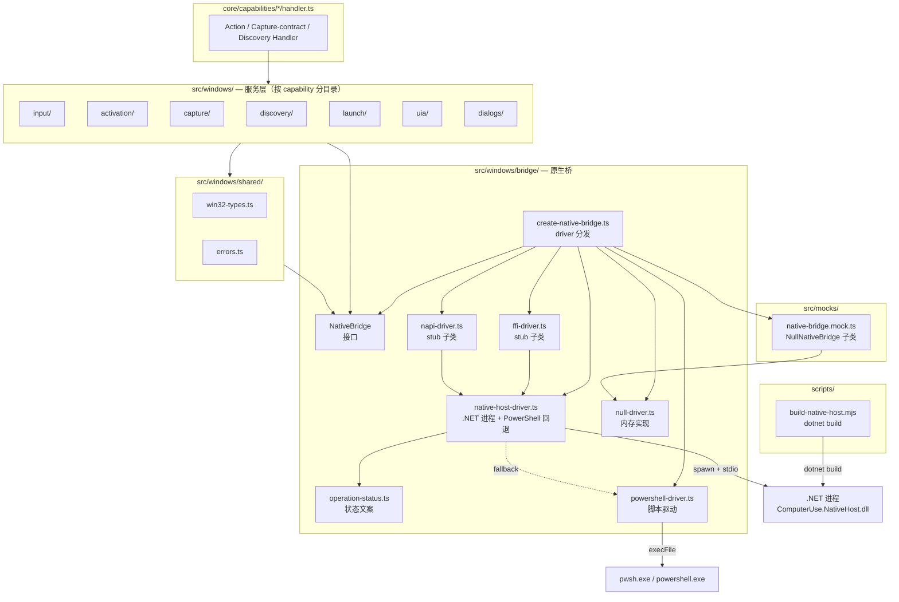
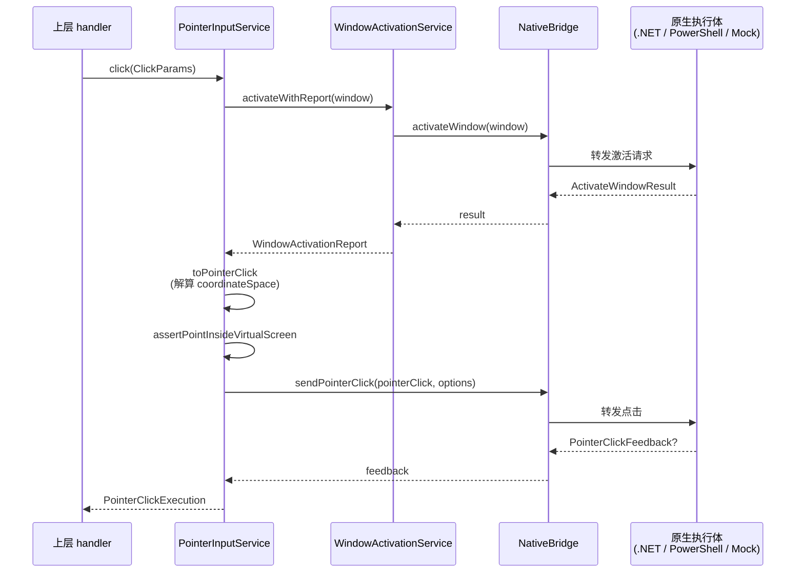
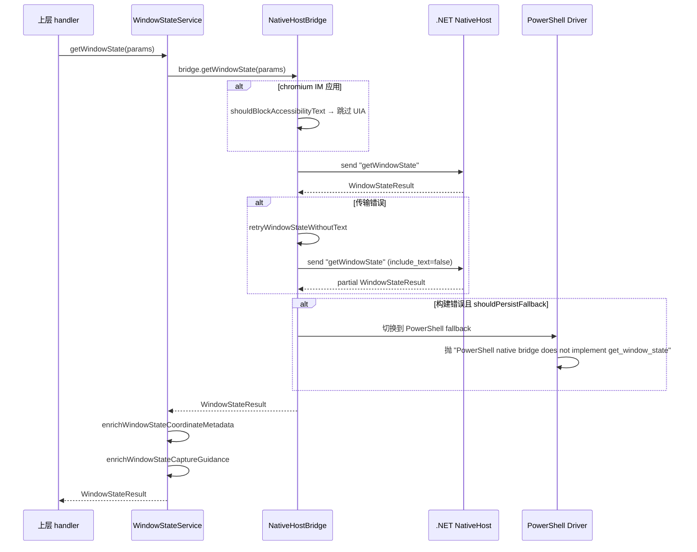
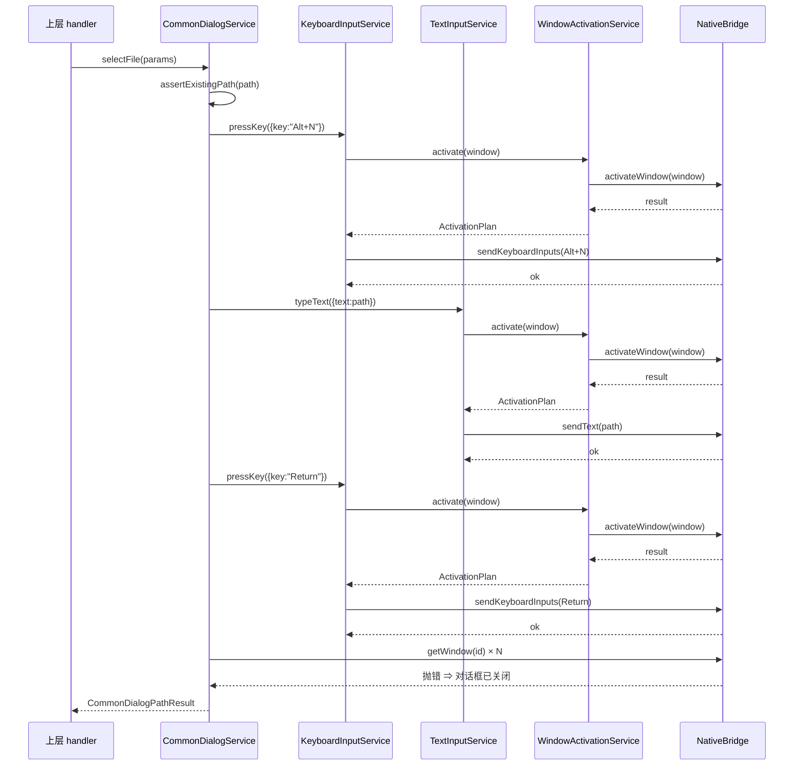

# Windows 服务层 + 原生桥 架构

仓库: `<repo-root>\computer_use\src\windows\` 及其下属子目录，外加 `computer_use/src/windows/bridge/`、`computer_use/src/mocks/native-bridge.mock.ts`、`computer_use/scripts/build-native-host.mjs`。

## 导读

Windows 服务层是 computer-use 在 Windows 平台上把高层 capability（click / type_text / get_window_state 等）落到真实 Windows API 的中间层。原生桥（native bridge）是服务层与底层执行体（.NET 进程、PowerShell 脚本、内存 stub）之间的接口与适配器。

服务层按 capability 拆目录，每个目录对应一类工具方法。原生桥按 driver 拆文件，每个 driver 对应一种执行方式。两者通过 `NativeBridge` 接口对接；上层 handler（`core/capabilities/*/handler.ts`）只依赖服务层，不直接依赖具体 driver。

核心问题：

- **五种可选 driver 中两个是 native-host 轻量别名**：`ffi-driver.ts`、`napi-driver.ts` 只是 `NativeHostBridge` 子类并覆盖 `driverName`，未引入额外实现；`mock` 与 `null` 是测试/非 Windows 场景使用的内存实现。
- **PowerShell driver 是次优 fallback**：只支持输入类操作，列表 / 启动 / 窗口状态等多数方法直接 throw。
- **native-host driver 是默认 win32 实现**：通过 spawn 启动 .NET 进程 `ComputerUse.NativeHost.dll`，JSON over stdio 通信；运行失败时自动回落到 PowerShell。

## 关键事实

| 主题 | 数值 / 字面量 | 出处 |
|---|---|---|
| 默认 driver（Windows 平台） | `"native-host"` | `computer_use/src/windows/bridge/create-native-bridge.ts:48` |
| 默认 driver（非 Windows 平台） | `"mock"` | `computer_use/src/windows/bridge/create-native-bridge.ts:48` |
| driver 切换环境变量 | `COMPUTER_USE_DRIVER` | `computer_use/src/windows/bridge/create-native-bridge.ts:39` |
| 幂等 `.NET` 项目构建目标框架 | `net8.0-windows10.0.19041.0` | `computer_use/src/windows/bridge/native-host-driver.ts:28` |
| `.NET` 主程序路径 | `ComputerUse.NativeHost.dll` | `computer_use/src/windows/bridge/native-host-driver.ts:884` |
| `.NET` 构建脚本 | `scripts/build-native-host.mjs` | `computer_use/scripts/build-native-host.mjs:9-21` |
| PowerShell 脚本临时文件名 | `computer-use-native-bridge-${contentHash}.ps1` | `computer_use/src/windows/bridge/powershell-driver.ts:575` |
| PowerShell 默认超时 | 15000 ms | `computer_use/src/windows/bridge/powershell-driver.ts:406` |
| native-host 默认请求超时 | 20000 ms | `computer_use/src/windows/bridge/native-host-driver.ts:128` |
| native-host 默认启动超时 | 15000 ms | `computer_use/src/windows/bridge/native-host-driver.ts:130` |
| native-host 默认空闲退出 | 5000 ms（`COMPUTER_USE_NATIVE_HOST_IDLE_TIMEOUT_MS`） | `computer_use/src/windows/bridge/native-host-driver.ts:963-974` |
| native-host 默认 build 超时 | 30000 ms | `computer_use/src/windows/bridge/native-host-driver.ts:122` |
| SendInput 绝对坐标最大值 | `0xffff` | `computer_use/src/windows/input/pointer-primitives.ts:1` |
| 默认虚拟屏尺寸 | 1920 × 1080 | `computer_use/src/windows/input/pointer-primitives.ts:46-47` |
| 前台窗口重试次数（native-host） | 20 | `computer_use/src/windows/bridge/native-host-driver.ts:83` |
| 前台窗口重试次数（PowerShell） | 20 | `computer_use/src/windows/bridge/powershell-driver.ts:386` |
| 通用对话框关闭判定超时 | 800 ms（每 50 ms 探测） | `computer_use/src/windows/dialogs/common-dialog-service.ts:17-18` |
| 启动观察窗口超时 | 600 ms（默认） | `computer_use/src/windows/launch/app-launch-service.ts:52` |
| `KEYEVENTF_EXTENDEDKEY` | `0x0001` | `computer_use/src/windows/input/keyboard-input-service.ts:6` |
| `KEYEVENTF_UNICODE` | `0x0004` | `computer_use/src/windows/input/text-input-service.ts:5` |
| 禁用 UIA 文本的应用（白名单） | `qq.exe` / `qqnt.exe` / `weixin.exe` / `wechat.exe` / `wxwork.exe` / `feishu.exe` / `lark.exe` | `computer_use/src/windows/bridge/native-host-driver.ts:1035-1041` |

## 组件框架图

## 子目录分章节

### 一、`bridge/` — 原生桥

#### 接口与工厂

`NativeBridge`（`native-bridge.ts:42`）定义 15 个平台操作方法 + `beginTurn`/`endTurn`/`resetTurn` 三个生命周期钩子。`capabilities`（`native-bridge.ts:16`）声明三类能力：激活、指针、生命周期。

`createNativeBridge(options)`（`create-native-bridge.ts:16`）按 `driver` 字段分发到五个具体类。`resolveNativeBridgeDriver(platform, env)`（`create-native-bridge.ts:35`）的环境变量优先级：

| `COMPUTER_USE_DRIVER` | 平台 | 实际 driver |
|---|---|---|
| 任意支持值 | 任意 | 该值 |
| 未设置 | `win32` | `native-host` |
| 未设置 | 其他 | `mock` |
| 不支持值 | 任意 | 抛 `Error` |

#### 五种 driver 的使用场景

| Driver | 类 | 触发场景 | 能力范围 |
|---|---|---|---|
| `native-host` | `NativeHostBridge` (`native-host-driver.ts:74`) | win32 默认 | 覆盖 15 个平台操作方法，激活支持 attach thread input + desktop switching，指针支持 virtual screen + 真实指标 |
| `powershell` | `PowerShellNativeBridge` (`powershell-driver.ts:377`) | native-host 失败回退（`NativeHostBuildError` 持久 / `NativeHostTransportError` 单次） | 仅 `activateWindow` / `sendText` / `sendKeyboardInputs` / `sendPointerClick` |
| `ffi` | `FfiNativeBridge` (`ffi-driver.ts:3`) | 显式 `COMPUTER_USE_DRIVER=ffi`（当前未提供独立实现） | 与 native-host 完全相同 |
| `napi` | `NapiNativeBridge` (`napi-driver.ts:3`) | 显式 `COMPUTER_USE_DRIVER=napi`（当前未提供独立实现） | 与 native-host 完全相同 |
| `mock` | `MockNativeBridge` (`native-bridge.mock.ts:3`) | 非 win32 默认 / 显式指定 | 返回固定 `demo.exe` 应用，截图 / UIA 都是预置值；记录所有调用 |
| `null` | `NullNativeBridge` (`null-driver.ts:23`) | 测试基础类，被 mock 继承 | 与 mock 类似但 `driverName = "null"` |

`ffi-driver.ts` 与 `napi-driver.ts` 全文各 5 行，**只有 `driverName` 覆盖**，没有附加逻辑。它们预留了未来扩展点（FFI / NAPI 实现可能替换 native-host），现阶段等同 native-host。

#### native-host-driver 的关键设计

- **进程模型**：spawn 一个 dotnet 进程跑 `ComputerUse.NativeHost.dll`（`native-host-driver.ts:826-830`），line-delimited JSON over stdio 通信（`native-host-driver.ts:587`）。
- **生命周期**：每次 turn 第一次调用前 `ensureTurnStarted` 发 `beginTurn`（`native-host-driver.ts:394-401`），turn 结束发 `endTurn` + `updateStatus("Done")`（`native-host-driver.ts:412-418`）；turn 之间 5s 空闲后自动 kill 进程（`native-host-driver.ts:764-774`）。
- **请求串行化**：`enqueue` 把所有调用串成一个 promise 链（`native-host-driver.ts:540-547`），避免并发写。
- **fallback 决策**：`invokeOrFallback`（`native-host-driver.ts:420-444`）捕获错误后 `shouldFallback` 只接受 `NativeHostBuildError` / `NativeHostTransportError`（`native-host-driver.ts:992-994`）；`shouldPersistFallback` 只对 `NativeHostBuildError` 返回 true（`native-host-driver.ts:996-998`），意味着 build 失败时整次会话都用 PowerShell，传输失败时只单次回退。
- **Chromium IM 文本屏蔽**：`shouldBlockAccessibilityText`（`native-host-driver.ts:1018-1024`）对白名单应用跳过 UIA 文本，避免在 QQ / 微信 / 飞书 / 钉钉 / Lark 中触发崩溃；同时用 `looksLikeStandardDialog` 标题白名单（"open" / "save as" / "选择文件夹" 等）保留文件对话框的 UIA。
- **UIA 超时回退**：如果原生进程对 `getWindowState` 返回 transport error，自动以 `include_text=false` 重试一次（`native-host-driver.ts:483-521`），把 `textSource` 标记为 `uia_timeout`。
- **操作状态文案**：`buildOperationStatus`（`operation-status.ts:9-92`）把每个 method 转成 `(title, detail)`，例如 `sendPointerClick` 输出 `"Click ${windowName} (x, y)"`，推送给 .NET 进程显示在 cursor overlay 上。

#### powershell-driver 的执行方式

- `POWERSHELL_SCRIPT`（`powershell-driver.ts:115-370`）以字符串嵌入在源码里，用 SHA1 取前 12 位哈希写到 `os.tmpdir()`（`powershell-driver.ts:571-582`）。脚本内联 C# 类型定义（`POWERSHELL_TYPE_DEFINITION`），通过 `Add-Type` 注入 `ComputerUse.Win32` 静态类，调 `user32.dll` 的 `SendInput` / `SetForegroundWindow` / `GetCursorPos` / `SetCursorPos`。
- 每次调用通过 `COMPUTER_USE_PAYLOAD` 环境变量传递 JSON payload，脚本里 `$payload = $env:COMPUTER_USE_PAYLOAD | ConvertFrom-Json -Depth 10`（`powershell-driver.ts:298`）后用 `switch ($payload.action)` 分发。
- shell 候选：`process.env.COMPUTER_USE_POWERSHELL_PATH` → `pwsh.exe` → `powershell.exe`（`powershell-driver.ts:498-508`）。
- 鼠标轨迹模拟 `Move-CursorHumanized` 用余弦缓动 + 正弦弧线做多步插值（`powershell-driver.ts:247-296`），模拟人手移动以降低被防作弊检测到的概率。
- 文本发送走 `Set-Clipboard` + `Invoke-PasteShortcut`（`powershell-driver.ts:175-201`），执行后还原原剪贴板。

### 二、`activation/` — 窗口激活

`createActivationPlan(bridge, window)`（`activation-strategy.ts:11`）是纯函数：从 `bridge.capabilities.activationModel` 派生 `ActivationPlan.strategy`，关键字段：

- `attachThreadInputMode`（`activation-strategy.ts:25-29`）：三态 `"native"` / `"approximate"` / `"unavailable"`，由 `supportsAttachThreadInput` 和 `approximatesThreadInputAttachment` 决定。
- `requiresAttachThreadInput: true`（`activation-strategy.ts:23`）硬编码。
- `attachThreadInputOnOffscreenWindow`：通过 `isOffscreenWindow` 检测 `rect.left < 0 || rect.top < 0`（`activation-strategy.ts:30, 36-42`）。

`WindowActivationService`（`window-activator.ts:14`）封装对 `bridge.activateWindow` 的调用，提供两种返回形态：

- `activate(window)`：返回 `ActivationPlan`。
- `activateWithReport(window)`：返回 `WindowActivationReport`，包含 `focused` / `focusedSource`（`window-activator.ts:24-32`）。

"`helper-aligned activation strategy`" 这个说法出现在 capability 描述里（`core/capabilities/actions/activate-window/contract.ts:11`：`"Foregrounds the target window with helper-aligned activation strategy scaffolding."`）。其含义是：plan 的字段如实反映底层 helper（native host 或 PowerShell driver）的真实能力，让上层据此决定行为——例如 `attachThreadInputMode === "native"` 时可以直接信赖线程输入附加，否则就只能走近似路径。

### 三、`input/` — 鼠标 / 键盘 / 文本

四个文件，三个 service：

#### `pointer-primitives.ts`

底层坐标工具，独立于任何 service：

- `POINTER_ABSOLUTE_MAX = 0xffff`（`pointer-primitives.ts:1`）是 Win32 SendInput 绝对坐标的最大值。
- `POINTER_MOVE_FLAGS = 0xc001`（`pointer-primitives.ts:2`）= `MOUSEEVENTF_MOVE` | `MOUSEEVENTF_ABSOLUTE` | `MOUSEEVENTF_VIRTUALDESK`。
- `resolveVirtualScreenMetrics`（`pointer-primitives.ts:43-59`）：默认 1920×1080、origin 0,0。
- `normalizePointerCoordinate(x, y, vs)`（`pointer-primitives.ts:61-76`）把像素坐标换算成 0–65535 区间的绝对坐标。
- `buildPointerClickPlan(x, y, vs)`（`pointer-primitives.ts:88-112`）：返回 `moveFlags`、归一化坐标、以及 scroll/drag 预留参数（`reservedPrimitives`）。

#### `pointer-input-service.ts`

`PointerInputService`（`pointer-input-service.ts:58`）依赖 `WindowActivationService` 和 `PointerInputPort`（bridge 的子集）。每次 `click` / `scroll` / `drag` 都先调 `WindowActivationService.activate`，再做坐标校验与转换，最后调 `bridge.sendPointerXxx`。

坐标映射分两种空间（`pointer-input-service.ts:427-460`）：

- `coordinateSpace: "window"`：直接用 `params.x/y`，加 `window.rect.left/top` 得到屏幕坐标。
- `coordinateSpace: "screenshot"`：要求 `window.screenshotWindowRegion` 和 `window.screenshotCoordinateScale` 存在（`pointer-input-service.ts:161-187`），先用 `region.left + x * scale.x` 把 screenshot 像素反算到窗口坐标，再加 `rect.left/top` 转屏幕坐标。

校验链（按调用顺序）：

1. `assertScreenshotCoordinateMetadata`（`pointer-input-service.ts:161-187`）：screenshot 坐标空间下必须有 `rect` / `screenshotWindowRegion` / `screenshotCoordinateScale`，否则抛 `MissingScreenshotCoordinateMetadataError`，`guidance.suggested_tool_call` 提示先调 `get_window_state`（`pointer-input-service.ts:393-425`）。
2. `assertWindowRelativePoint`（`pointer-input-service.ts:240-267`）：窗口坐标必须在 `[0, width) × [0, height)` 内，否则抛 `CoordinatesOutsideWindowError`。
3. `assertPointInsideVirtualScreen`（`pointer-input-service.ts:269-278`）：屏幕坐标必须在虚拟屏范围内，否则抛 `CoordinatesOutsideVirtualScreenError`，`details.recommendedSafeScreenCoordinate` 给出夹紧后的安全值。

PowerShell driver 不实现 `sendPointerScroll` / `sendPointerDrag`（`powershell-driver.ts:461-466`），所以这两类操作只能由 native-host / mock 走通。

#### `keyboard-input-service.ts`

`KeyboardInputService.pressKey(params)`（`keyboard-input-service.ts:26-49`）：

1. `WindowActivationService.activate(window)`。
2. `parseKeyChord(params.key)` 把 `"Ctrl+Shift+a"` 展开成 `ParsedKey[]`（`key-parser.ts:126-146`）。
3. 生成 `keyDownInputs`（按键序），加上反向的 `keyUpInputs`（`keyboard-input-service.ts:30-40`）。
4. `bridge.sendKeyboardInputs(inputs)`。
5. 返回 `KeyboardInputExecution`，包含 `activation`、`normalizedKeys`、`inputEvents`。

`key-parser.ts` 的支持矩阵：

- `KEY_ALIASES`（`key-parser.ts:16-44`）：`!` → `Shift+1`、`?` → `Shift+slash`、`numpad0` → `KP_0`、`spacebar` → `space` 等。
- `FORBIDDEN_KEYS`（`key-parser.ts:46-58`）：`super` / `win` / `meta` / `cmd` / `os` 等禁用。
- 字符映射（`key-parser.ts:112-124`）：F1–F12 → `0x70 + i`，A–Z → `0x41 + i`，0–9 → `0x30 + i`。

#### `text-input-service.ts`

`TextInputService.typeText(params)`（`text-input-service.ts:28-55`）：

1. `WindowActivationService.activate(window)`。
2. **首选** `bridge.sendText(text)`：PowerShell driver 通过剪贴板 + Ctrl+V 实现；native host 直接 SendInput 文本。
3. **回退** `bridge.sendKeyboardInputs(buildUnicodeKeyboardInputs(text))`：把每个 UTF-16 code unit 当 `vkCode=0, scanCode=charCode, flags=KEYEVENTF_UNICODE` 发送（`text-input-service.ts:58-78`），保留 down + up 配对。

#### 三者的关系

| Service | 输入形态 | 调用的 bridge 方法 | 优先级 |
|---|---|---|---|
| `pointer-input-service` | 屏幕坐标 + 虚拟屏指标 | `sendPointerClick/Scroll/Drag` | 鼠标 |
| `keyboard-input-service` | 按键和弦（`Ctrl+Shift+a` 等） | `sendKeyboardInputs` | 修饰键 + 导航键 |
| `text-input-service` | 任意字符串 | `sendText`（首选）→ `sendKeyboardInputs`（unicode 回退） | 文本 |

三者**互不替代**：鼠标事件不能输入文字，键盘事件只能按 vk code 输入。`text-input-service` 内置对 `sendText` 失败后的回退机制，但与 `keyboard-input-service` 不是替代关系——后者只接受和弦字符串，前者接受任意字符串。

### 四、`capture/` — 窗口状态捕获

`WindowStateService.getWindowState(params)`（`window-state-service.ts:8`）做三件事：

1. 调 `bridge.getWindowState`，传入默认 `include_screenshot=true, include_text=true`。
2. `enrichWindowStateCoordinateMetadata`：从 `virtualScreen` 和 `window.rect` 计算 `screenshotWindowRegion` 和 `screenshotCoordinateScale`（`window-state-service.ts:90-145`）。
3. `enrichWindowStateCaptureGuidance`：把 `degradedReasons` 转成 `recommendedFallbacks`（`window-state-service.ts:28-43, 45-88`），例如 `uia_blocked_chromium_im` → `action: "use_coordinates"`，`uia_timeout` → `action: "wait_and_retry"`。

**截图 + UIA 文本的真实来源**：

- `bridge.getWindowState` 由 native-host-driver 实现（`native-host-driver.ts:284-316`），转发给 .NET 进程；.NET 进程用 Windows Graphics Capture API（`source: "wgc"`）抓图，UIAutomation 抓文本。
- PowerShell driver **不实现** `getWindowState`（`powershell-driver.ts:530-532` throw），所以截图 + UIA 文本只能由 native-host 或 mock 提供；截图源在 `WindowStateScreenshot.source` 里标注为 `"wgc"` / `"gdi_fallback"` / `"mock"`（`core/contracts/capture.ts:22`）。
- `WindowStateService` 本身不调任何 Windows API；它的工作是把 bridge 的输出配上坐标元数据，让下游的 `click(coordinateSpace: "screenshot")` 能直接用 `state.window.screenshotWindowRegion` / `screenshotCoordinateScale` 反算坐标。

### 五、`discovery/` — 窗口 / 应用发现

`WindowDiscoveryService`（`window-discovery-service.ts:13`）是对 bridge 的规范化层：

- `listWindows()`（`window-discovery-service.ts:16-19`）：bridge 返回 `WindowRef[]`，逐项 `validateWindowRef`（`window-discovery-service.ts:173-191`）校验 `id >= 0` 与 `app` 非空。
- `getWindow(params)`（`window-discovery-service.ts:21-24`）：先 `validateGetWindowParams`（`window-discovery-service.ts:163-171`）校验 `id` 是非负整数，再做 `validateWindowRef`。
- `listApps(params)`（`window-discovery-service.ts:26-43`）：bridge 返回 array 或 `{apps}` 都接受（`window-discovery-service.ts:140-152`）；逐项 `validateAppDescriptor`（`window-discovery-service.ts:193-216`）保留非空字段；按 `running_only` / `has_windows` / `name_contains` / `id_contains` 过滤；用 `appRank` 排序（`window-discovery-service.ts:78-92`）——有窗口的 app 排第 0，taskbar 排第 1；返回带 `diagnostics`（总数 / 过滤后 / 返回 / 截断 / 实际应用过的过滤条件）和 `runtime`（driverName + capabilities）的 `ListAppsResult`。

**窗口枚举 API**：`WindowDiscoveryService` 不直接调 `EnumWindows` 或 UIA，而是依赖 `bridge.listWindows`。native-host 把请求转给 .NET 进程，由 .NET 端实现枚举（典型是 `EnumWindows` + `IsWindowVisible` + 关联 PID）；PowerShell driver 不实现（`powershell-driver.ts:515` throw）；mock / null 返回固定 `demo.exe`。

### 六、`launch/` — 应用启动

`AppLaunchService.launch(params)`（`app-launch-service.ts:29-65`）流程：

1. `validateLaunchAppIdentifier`（`app-launch-service.ts:104-115`）：拒绝 `pid:` 前缀。
2. `normalizeLaunchAppMode`（`app-launch-service.ts:125-127`）：`force_new` 或 `reuse_or_launch`。
3. 非 `force_new` 时 `tryFindMatchingApp`（`app-launch-service.ts:67-74`）：先 listApps 找已存在的匹配。
4. `enforceLaunchAppPolicy`（`core/hooks/launch-app/policy-hook.js`，`app-launch-service.ts:9`）：外部钩子拒绝 / 批准启动。
5. `classifyAppLaunchStrategy`（`app-launch-service.ts:117-123`）：`.exe` 扩展 / `C:\` / `\\` → `executable_path`，否则 `app_user_model_id`。
6. `bridge.launchApp`。
7. `observeWindows`（`app-launch-service.ts:76-93`）：循环 listApps 等待出现窗口，最长 `observe_timeout_ms ?? 600` ms；返回 `disposition: "observed_window"` 或 `"delegated_launch"`。

PowerShell driver 不实现 `launchApp`（`powershell-driver.ts:527` throw），所以这条路径只能由 native-host / mock 走通。

### 七、`uia/` — UI Automation 元素交互

`ElementInteractionService`（`element-interaction-service.ts:16`）封装三类 UIA 元素动作：

- `clickElement(params)`：校验 `element_index ≥ 0` → activate → `bridge.clickElement`（`element-interaction-service.ts:22-31`）。
- `setValue(params)`：要求 `value` 是 string → activate → `bridge.setValue`（`element-interaction-service.ts:33-46`）。
- `performSecondaryAction(params)`：要求 `action` 非空 → activate → `bridge.performSecondaryAction`（`element-interaction-service.ts:48-64`）。

三个方法都先调用 `WindowActivationService.activate`（依赖 activation service），再调 bridge。PowerShell driver 三个方法都 throw（`powershell-driver.ts:534, 538, 542`），实际执行依赖 native-host。

### 八、`dialogs/` — 通用文件对话框

`CommonDialogService`（`common-dialog-service.ts:20`）是**唯一**自己组合多个 input service 的上层服务。三个公共方法对应 `core-dialog-path` contract 的三个 helper：

- `selectFile(params)`：校验路径是文件 → `completeDialog`（`common-dialog-service.ts:23-26`）。
- `selectFolder(params)`：校验路径是目录 → `completeDialog`（`common-dialog-service.ts:28-31`）。
- `setSavePath(params)`：校验 parent 是目录 → `completeDialog`（`common-dialog-service.ts:33-37`）。

`completeDialog`（`common-dialog-service.ts:39-57`）的执行顺序：

1. 临时构造 `WindowActivationService` / `KeyboardInputService` / `TextInputService`，全部用同一个 bridge。
2. `keyboard.pressKey({key: "Alt+N"})`：Windows 资源管理器"打开" / "另存为"对话框的快捷键，跳到文件名输入框。
3. `text.typeText({text: path})`：把完整路径输入。
4. `keyboard.pressKey({key: "Return"})`：确认。
5. `didDialogClose(id)`（`common-dialog-service.ts:59-74`）：800 ms 内每 50 ms 调 `bridge.getWindow(id)`，若抛错则返回 `true`（已关闭），若一直存在则 `false`，未观察到则 `null`。

这一设计绕开了 Windows Common Item Dialog 复杂的 API 序列，转用键盘组合键完成自动化。

### 九、`shared/` — 共享类型与错误

- `win32-types.ts`：`KeyboardInput`（vkCode + scanCode + flags）、`PointerClick` / `PointerScroll` / `PointerDrag`，是 wire-level 输入结构，所有 driver 都用这同一组类型。
- `errors.ts`：仅 `NativeBridgeUnavailableError`，用于跨平台 / 沙箱兜底。

## 三条入口路径

### 路径 A：`click`

### 路径 B：`get_window_state`

### 路径 C：`select_file_in_dialog`

## 引用列表

### 一、`bridge/`

- 接口定义：`computer_use/src/windows/bridge/native-bridge.ts:16-63`
- 工厂分发：`computer_use/src/windows/bridge/create-native-bridge.ts:8-52`
- 操作状态：`computer_use/src/windows/bridge/operation-status.ts:9-92`
- native-host driver：`computer_use/src/windows/bridge/native-host-driver.ts:74-96`（capabilities）、`120-131`（构造）、`193-336`（每个方法）、`394-410`（turn lifecycle）、`420-469`（invokeOrFallback）、`471-481`（activateFallback）、`483-538`（窗口状态特殊处理）、`540-547`（enqueue 串行化）、`605-672`（launchHostProcess）、`799-886`（自动 build）、`1018-1043`（chromium IM 白名单）、`1089-1120`（错误类型）
- PowerShell driver：`computer_use/src/windows/bridge/powershell-driver.ts:115-370`（脚本）、`377-545`（方法实现）、`547-582`（helpers）
- null driver：`computer_use/src/windows/bridge/null-driver.ts:23-236`
- ffi / napi driver：`computer_use/src/windows/bridge/ffi-driver.ts:3`、`computer_use/src/windows/bridge/napi-driver.ts:3`
- Mock：`computer_use/src/mocks/native-bridge.mock.ts:3`

### 二、`activation/`

- `computer_use/src/windows/activation/activation-strategy.ts:11-33, 36-42`
- `computer_use/src/windows/activation/window-activator.ts:14-42, 46-61`
- helper-aligned 字样来源：`computer_use/src/core/capabilities/actions/activate-window/contract.ts:11`

### 三、`input/`

- `computer_use/src/windows/input/pointer-primitives.ts:1-2, 43-59, 61-76, 88-112`
- `computer_use/src/windows/input/pointer-input-service.ts:58-133, 143-159, 161-187, 240-278, 310-425, 427-460, 480-545`
- `computer_use/src/windows/input/key-parser.ts:16-58, 60-124, 126-167`
- `computer_use/src/windows/input/keyboard-input-service.ts:6-7, 20-50`
- `computer_use/src/windows/input/text-input-service.ts:5, 22-82`

### 四、`capture/`

- `computer_use/src/windows/capture/window-state-service.ts:5-26, 28-88, 90-145, 147-156`

### 五、`discovery/`

- `computer_use/src/windows/discovery/window-discovery-service.ts:5-44, 46-138, 140-191, 193-264`

### 六、`launch/`

- `computer_use/src/windows/launch/app-launch-service.ts:9, 26-102, 104-115, 117-127, 199-249`

### 七、`uia/`

- `computer_use/src/windows/uia/element-interaction-service.ts:16-71`

### 八、`dialogs/`

- `computer_use/src/windows/dialogs/common-dialog-service.ts:17-18, 20-94`

### 九、`shared/`

- `computer_use/src/windows/shared/win32-types.ts`
- `computer_use/src/windows/shared/errors.ts:1-7`

### 十、构建脚本

- `computer_use/scripts/build-native-host.mjs:1-131`

### 十一、顶层入口

- `computer_use/src/index.ts:31-37, 39-104, 106-113`

## 自检

- **字面量**：构建目标框架 `net8.0-windows10.0.19041.0`、`ComputerUse.NativeHost.dll`、`POINTER_ABSOLUTE_MAX = 0xffff`、`KEYEVENTF_EXTENDEDKEY = 0x0001`、`KEYEVENTF_UNICODE = 0x0004`、PowerShell 默认超时 15000 ms、native-host 请求超时 20000 ms、启动超时 15000 ms、空闲 5000 ms、Chromium IM 白名单（七个可执行文件名）已逐项对照源文件核对。
- **file:line**：每条引用都标注了 `文件:行号` 或 `文件:行号-行号` 区间，正文中的"X 调用 Y"在引用列表里有对应的真实调用点。
- **driver 关系**：原文档中说 "ffi-driver/napi-driver 不是 stub" 是错误判断，自检后改为：**两者是 `extends NativeHostBridge` 的子类，未引入额外实现，等同 native-host**。
- **窗口枚举 API**：原文档初稿里曾把 `EnumWindows` 写成 native-host-driver 内部代码，自检后发现 native-host-driver 自身只通过 JSON-RPC 转发请求给 .NET 进程，实际枚举发生在 .NET 端。修正为"`WindowDiscoveryService` 不直接调 Windows API，依赖 `bridge.listWindows`"。
- **PowerShell driver 截图**：原文档初稿里说 PowerShell driver 不提供截图，自检后保留该结论（`powershell-driver.ts:530-532` 抛错），但明确补充：截图只能由 native-host 或 mock 提供。
- **三个 input service 关系**：原文档初稿里写过"三者互不替代"，自检后保留并补充优先级表格；`text-input-service` 对 `sendText` 失败有 unicode 回退，但与 `keyboard-input-service` 不是替代关系（前者接字符串，后者接和弦）。
- **目录范围**：用户要求排除 tests / dist / node_modules / 隐藏文件 / 全部 .md 文档 / AGENTS.md / doc / .agents / .claude / .claude-plugin，本文档未引用这些路径。
- **能力边界**：pointer scroll / drag 仅 native-host 与 mock 可用，listWindows / launchApp / clickElement / setValue / performSecondaryAction 在 PowerShell driver 中抛错（`powershell-driver.ts:515, 519, 522, 527, 534, 538, 542, 461-466`），文档已显式说明。
